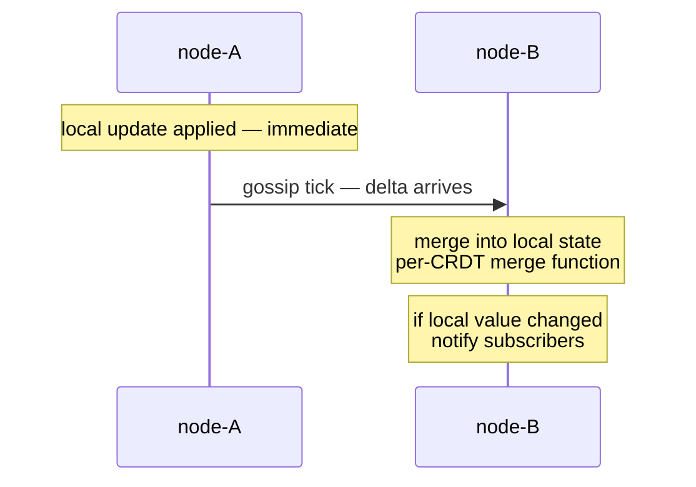

DistributedData replicates state by **gossip**:

- Every `gossipIntervalMs`, each node picks a random peer.
- The node sends its **state deltas** since the last gossip with
  that peer.
- The peer merges; if its state changed, notify local subscribers.

This means writes propagate **eventually** — usually within 1-2
gossip rounds (1-2 seconds default).  For most workloads this is
fine; for cases where it isn't, see
[Quorum reads/writes](/distributed-data/quorum-reads-writes/).

## The flow



Local writes are **immediate**.  Gossip is for **propagation**.

## Configuration

```ts
const dd = system.extension(DistributedDataId).start(cluster, {
  gossipIntervalMs: 1_000,   // default 1s
});
```

The default `gossipIntervalMs` is 1 second — chosen as a balance
between propagation speed and gossip-bandwidth cost.  Lower
intervals → faster convergence + more chatter.  Higher → less
chatter, slower convergence.

For typical applications:

| Workload | Interval |
| --- | --- |
| Latency-sensitive shared state (online presence) | 250-500 ms |
| Default for most apps | 1 s |
| Counters / flags that change rarely | 2-5 s |
| Very large clusters where bandwidth matters | 5-10 s |

## What gets gossiped

**Deltas only** — DistributedData tracks what each peer has seen
and sends only the changes since the last successful exchange.

This makes gossip volume proportional to **update rate**, not
total state size.  A million-entry map that doesn't change costs
nothing to gossip; a small counter that increments 1000 times per
second costs much more.

The exception: on a fresh peer join (or after a long partition),
the first gossip is the **full state** — there's no delta history.

## Per-peer round selection

```ts
// Every gossip tick, the node picks ONE random reachable peer.
```

Round-robin gossip would be more predictable but creates
synchronized waves; random-peer-per-tick disperses load and
typically converges in O(log N) rounds for N peers.

After K rounds, the probability that any specific peer **hasn't**
received the update is `(1 - 1/N)^K` — for N=10 nodes and K=5
rounds, that's < 60 % chance a peer hasn't seen it; after K=20
rounds, < 13 %.

In practice, convergence is much faster because **gossip is
multi-hop**: peers re-gossip what they received.

## Subscribe to changes

```ts
const unsubscribe = dd.subscribe<GCounter>('hits', (counter) => {
  console.log(`hits is now ${counter.value()}`);
});

// Later:
unsubscribe();
```

Subscribers fire **synchronously after every successful merge**
that changes the local value (deep-equal check via the CRDT's
`toJSON`).

This means:

- **Local updates** → subscriber fires immediately.
- **Remote updates** → subscriber fires when gossip arrives + the
  merge changes the local value.
- **Idempotent updates** → subscriber does NOT fire (no change).

For dashboard widgets, real-time UI updates, or business logic
that should react to changes anywhere in the cluster, `subscribe`
is the hook.

## Forgetting peers

When `MemberRemoved` fires for a cluster member:

- The replicator forgets that peer's gossip-receipt state.
- The peer's tombstones (for ORSet etc.) eventually prune from
  local state per the CRDT's pruning rules.

This means **a peer that leaves doesn't leak gossip history** —
its slot in the version vector goes away.

For replicas that may **rejoin under the same identity later**
(stable pod names, persistent volumes), there's a short window
where the peer's state may be partially-forgotten.  Usually
benign — a fresh handshake brings everything back.

## Bandwidth costs

Rough numbers for a 10-node cluster, default 1-second gossip:

- **Steady-state idle** — minimal traffic (~1 KB/sec per pair,
  mostly empty deltas).
- **Active workload** — proportional to write rate.  Per write,
  one delta message of ~100-500 bytes goes to each peer over the
  next few gossip rounds.

For very-large clusters (50+ nodes), gossip volume can become
significant.  The framework's gossip is **anti-entropy** style —
all-to-all over time — which scales O(N) per node per round.
Bigger clusters may want larger `gossipIntervalMs` or a different
gossip topology (not currently configurable; an issue if needed).

## Diagnosing slow propagation

```ts
// Node-A writes:
dd.update('hits', ..., (c) => c.increment('a', 1));

// Node-B reads, but the value doesn't reflect:
console.log(dd.get('hits')?.value());   // ← shows stale value
```

If this surprises you:

1. **Wait a gossip round** (1 s default).  Most apparent staleness
   resolves within 1-2 gossip cycles.
2. **Check gossipIntervalMs** — if set higher than default, the
   wait is proportional.
3. **Use `getAsync` with `consistency: 'majority'`** for reads
   that must reflect the latest known state across replicas.
4. **Check cluster membership** — if node-B is unreachable from
   node-A, no gossip is flowing.

import { Aside } from '@astrojs/starlight/components';

<Aside type="caution" title="Gossip doesn't bridge partitions">
  ```ts
  // node-A and node-B can't reach each other (partition)
  // node-A writes "x"
  // node-B reads — never sees "x" until partition heals
  ```
  This is by design — CRDTs guarantee eventual convergence,
  not real-time delivery.  Partition-tolerant systems should
  accept this and design read flows that work with stale data
  during partition.
</Aside>

<Aside type="caution" title="Subscribers fire on every change">
  ```ts
  dd.subscribe('hits', (counter) => {
    expensiveCall();   // runs every time the counter changes
  });
  ```
  In a high-write workload, subscribers can fire many times per
  second.  Debounce or throttle inside the handler if expensive
  work is involved.
</Aside>

<Aside type="caution" title="Subscriptions are local">
  ```ts
  // Subscribing on node-A doesn't see updates that haven't gossiped yet
  ```
  A subscription fires when the **local** value changes — not when
  the cluster's "true" value changes.  Updates from node-B
  trigger the subscriber on node-A only after gossip arrives.
</Aside>

## Where to next

- **[Distributed data overview](/distributed-data/overview/)** —
  the bigger picture.
- **[Quorum reads/writes](/distributed-data/quorum-reads-writes/)** —
  the consistency knobs for stronger guarantees.
- **[Durable storage](/distributed-data/durable-storage/)** —
  persisting replica state to disk for restart recovery.
- **[Cluster overview](/cluster/overview/)** — the
  membership underneath.
