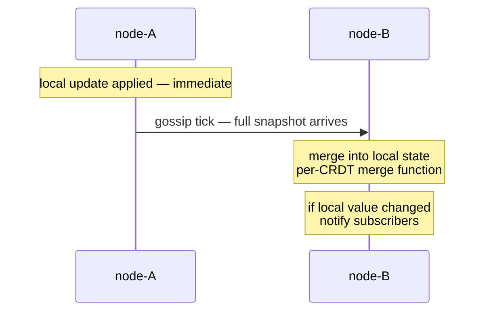

DistributedData replicates state by **gossip**:

- Every `gossipIntervalMs`, each node picks one random peer.
- The node sends a **full snapshot** of every key it currently
  holds.
- The peer merges each entry; if its state changed, notify local
  subscribers.

This means writes propagate **eventually** — usually within 1-2
gossip rounds (1-2 seconds default).  For most workloads this is
fine; for cases where it isn't, see
[Quorum reads/writes](/distributed-data/quorum-reads-writes/).

## The flow


```mermaid
sequenceDiagram
  participant A as node-A
  participant B as node-B
  Note over A: local update applied — immediate
  A->>B: gossip tick — full snapshot arrives
  Note over B: merge into local state<br/>per-CRDT merge function
  Note over B: if local value changed<br/>notify subscribers
```

Local writes are **immediate**.  Gossip is for **propagation**.

## Configuration

```ts
const distributedDataOptions = DistributedDataOptions.create().withGossipInterval(1_000);
const dd = system.extension(DistributedDataId).start(
  cluster,
  distributedDataOptions,   // default 1s
);
```

The default `gossipIntervalMs` is 1 second — chosen as a balance
between propagation speed and gossip-bandwidth cost.  Lower
intervals → faster convergence + more chatter.  Higher → less
chatter, slower convergence.

For typical applications:

| Workload | Interval |
| --- | --- |
| Latency-sensitive shared state (online presence) | 250-500 ms |
| Default for most apps | 1 s |
| Counters / flags that change rarely | 2-5 s |
| Very large clusters where bandwidth matters | 5-10 s |

## What gets gossiped

**The full state** — each tick, DistributedData serializes every
key in its local replica and pushes the whole snapshot to one
random peer.  There's no delta tracking and no per-peer receipt
history; every gossip carries the complete set.

This makes gossip volume proportional to **total state size**, not
update rate.  A million-entry map costs its full serialized size
every time it's gossiped, whether or not it changed; a small
counter costs almost nothing no matter how often it increments.

It's deliberately simple — no digest, no delta — which is cheap to
implement and good enough for the small-to-medium stores
DistributedData is meant for.  If your store grows large, raise
`gossipIntervalMs` to spread the cost over time.

## Per-peer round selection

```ts
// Every gossip tick, the node picks ONE random reachable peer.
```

Round-robin gossip would be more predictable but creates
synchronized waves; random-peer-per-tick disperses load and
typically converges in O(log N) rounds for N peers.

After K rounds, the probability that any specific peer **hasn't**
received the update is `(1 - 1/N)^K` — for N=10 nodes and K=5
rounds, that's < 60 % chance a peer hasn't seen it; after K=20
rounds, < 13 %.

In practice, convergence is much faster because **gossip is
multi-hop**: peers re-gossip what they received.

## Subscribe to changes

```ts
const unsubscribe = dd.subscribe<GCounter>('hits', (counter) => {
  console.log(`hits is now ${counter.value()}`);
});

// Later:
unsubscribe();
```

Subscribers fire **synchronously after every successful merge**
that changes the local value (deep-equal check via the CRDT's
`toJSON`).

This means:

- **Local updates** → subscriber fires immediately.
- **Remote updates** → subscriber fires when gossip arrives + the
  merge changes the local value.
- **Idempotent updates** → subscriber does NOT fire (no change).

For dashboard widgets, real-time UI updates, or business logic
that should react to changes anywhere in the cluster, `subscribe`
is the hook.

## When a peer leaves

When `MemberRemoved` fires for a cluster member, DistributedData
does **nothing** — there's no per-peer state to clean up.  Gossip
holds no version vector and no per-peer receipt history; each tick
just picks a random peer from the *current* up-members, so a
departed node simply stops being a gossip target.

State the peer contributed stays in the local replica, merged in
like any other update.  CRDT tombstones (a removed `ORSet`
element, a `null` register in an `LWWMap`) are **never garbage
collected** — they're kept permanently so a stale gossip can't
resurrect a removed key.  Over a long-lived store with heavy
churn, tombstone accumulation is the practical cost to watch.

A replica that **rejoins under the same identity later** (stable
pod names, persistent volumes) needs no special handling — it's
just another up-member again, and gossip reconverges its state
over the next few ticks.

## Bandwidth costs

Rough shape for a 10-node cluster, default 1-second gossip:

- **Per tick, per node** — one message carrying the full
  serialized store goes to a single random peer.  Its size is set
  by **total state**, not by how much changed since the last tick,
  so an idle store still pays this each tick; the cost just doesn't
  grow with write rate.
- **Scaling knobs** — store size drives the per-message cost and
  `gossipIntervalMs` drives how often you pay it.  A large store on
  a fast interval is the expensive combination.

For very-large clusters (50+ nodes), gossip volume can become
significant.  The framework's gossip is **anti-entropy** style —
all-to-all over time — which scales O(N) per node per round.
Bigger clusters may want larger `gossipIntervalMs` or a different
gossip topology (not currently configurable; an issue if needed).

## Diagnosing slow propagation

```ts
// Node-A writes:
dd.update('hits', ..., (c) => c.increment('a', 1));

// Node-B reads, but the value doesn't reflect:
console.log(dd.get('hits')?.value());   // ← shows stale value
```

If this surprises you:

1. **Wait a gossip round** (1 s default).  Most apparent staleness
   resolves within 1-2 gossip cycles.
2. **Check gossipIntervalMs** — if set higher than default, the
   wait is proportional.
3. **Use `getAsync` with `consistency: 'majority'`** for reads
   that must reflect the latest known state across replicas.
4. **Check cluster membership** — if node-B is unreachable from
   node-A, no gossip is flowing.

import { Aside } from '@astrojs/starlight/components';

<Aside type="caution" title="Gossip doesn't bridge partitions">
  ```ts
  // node-A and node-B can't reach each other (partition)
  // node-A writes "x"
  // node-B reads — never sees "x" until partition heals
  ```
  This is by design — CRDTs guarantee eventual convergence,
  not real-time delivery.  Partition-tolerant systems should
  accept this and design read flows that work with stale data
  during partition.
</Aside>

<Aside type="caution" title="Subscribers fire on every change">
  ```ts
  dd.subscribe('hits', (counter) => {
    expensiveCall();   // runs every time the counter changes
  });
  ```
  In a high-write workload, subscribers can fire many times per
  second.  Debounce or throttle inside the handler if expensive
  work is involved.
</Aside>

<Aside type="caution" title="Subscriptions are local">
  ```ts
  // Subscribing on node-A doesn't see updates that haven't gossiped yet
  ```
  A subscription fires when the **local** value changes — not when
  the cluster's "true" value changes.  Updates from node-B
  trigger the subscriber on node-A only after gossip arrives.
</Aside>

## Where to next

- **[Distributed data overview](/distributed-data/overview/)** —
  the bigger picture.
- **[Quorum reads/writes](/distributed-data/quorum-reads-writes/)** —
  the consistency knobs for stronger guarantees.
- **[Durable storage](/distributed-data/durable-storage/)** —
  persisting replica state to disk for restart recovery.
- **[Cluster overview](/cluster/overview/)** — the
  membership underneath.
