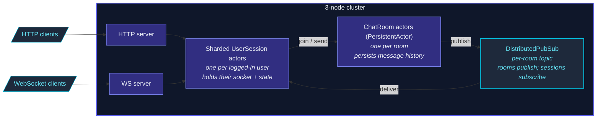

The chat sample is a **complete demo app** showing how the
framework's pieces compose:

- **Cluster** of 3 nodes (via Docker Compose).
- **Sharded user-session actors** — one per logged-in user.
- **DistributedPubSub** for cross-node chat-room broadcasts.
- **PersistentActor** for chat-room history.
- **HTTP + WebSocket** for the client interface.

Find it under [`examples/chat/`](https://github.com/pathosDev/actor-ts/tree/main/examples/chat)
in the repo.

## Architecture



The full path of a "user sends message" flow:

```
1. User's WS client sends "send-message" to their HTTP server.
2. WS handler forwards to that user's UserSession actor (sharded).
3. UserSession asks the relevant ChatRoom actor (sharded by room ID).
4. ChatRoom persists the message via PersistentActor.persist().
5. ChatRoom publishes to DistributedPubSub on "room.<roomId>" topic.
6. Every UserSession subscribed to that topic receives the message.
7. UserSessions push to their respective WS clients.
```

Cluster + persistence + pubsub + websocket — all working
together.

## Running it

```bash
# Clone repo:
git clone https://github.com/pathosDev/actor-ts.git
cd actor-ts/examples/chat

# Start everything (cluster + Cassandra + WS):
docker compose up -d

# Verify cluster:
curl http://localhost:8551/cluster/members
# → 3 members "up"

# Open the chat UI:
open http://localhost:3000
```

The Docker Compose spins up:

- 3 actor-ts pods.
- 1 Cassandra node (shared journal for persistent rooms).
- 1 Nginx in front of the HTTP+WS endpoints.

## Key patterns demonstrated

### Sharded sessions

```ts
const startShardingOptions = StartShardingOptions.create<SessionMsg>()
  .withTypeName('session')
  .withEntityProps(Props.create(() => new UserSessionActor()))
  .withExtractEntityId((msg) => msg.userId)
  .withRememberEntities(true);
const sessionRegion = cluster.sharding.start(startShardingOptions);
```

One actor per logged-in user, distributed across nodes.
`rememberEntities` keeps the registry across failover.

### PersistentActor for rooms

```ts
class ChatRoomActor extends PersistentActor<RoomCmd, RoomEvent, RoomState> {
  readonly persistenceId = `room-${this.roomId}`;
  // ... onCommand persists; onEvent updates state ...
}
```

Each room actor records every message; recovery replays.

### Distributed pub/sub for fan-out

```ts
// ChatRoom publishes after persisting:
ps.mediator.tell(new Publish(`room.${roomId}`, message));

// UserSession subscribes when user joins a room:
ps.mediator.tell(new Subscribe(`room.${roomId}`, this.self));
```

Sessions on any node receive room messages regardless of which
node's ChatRoom is publishing.

### WebSocket per user

```ts
class UserSessionActor extends Actor<SessionMsg> {
  private ws: WebSocket | null = null;

  override onReceive(msg: SessionMsg): void {
    if (msg.kind === 'connect-ws') this.ws = msg.socket;
    if (msg.kind === 'inbound')    this.ws?.send(JSON.stringify(msg.payload));
  }
}
```

Each session holds its user's WebSocket; sends pushes
straight to the client.

## What it doesn't demonstrate

- **Sharded daemon processes** — the chat sample doesn't need
  fixed background workers.
- **DistributedData CRDTs** — chat data goes through
  PersistentActor, not DD.
- **Replicated event sourcing** — single-writer per room is
  sufficient.

For those, see the
[stand-alone snippets](/examples/stand-alone-snippets/)
or the [voice sample](/examples/voice-sample/).

## File layout

```
examples/chat/
├── docker-compose.yml
├── README.md
├── package.json
├── src/
│   ├── main.ts                  # entry: cluster join + HTTP/WS bind
│   ├── actors/
│   │   ├── UserSessionActor.ts
│   │   └── ChatRoomActor.ts
│   ├── messages.ts              # shared message types
│   └── handlers/
│       ├── httpRoutes.ts
│       └── wsHandlers.ts
└── ui/                          # minimal HTML/JS chat UI
```

~500 lines of TypeScript total.  Good size for reading
end-to-end.

## Where to next

- **[Voice sample](/examples/voice-sample/)** — broker
  integration + projections.
- **[Sharding overview](/cluster/sharding/overview/)** —
  the per-entity actor pattern.
- **[DistributedPubSub](/cluster/pubsub/)** — cluster
  pub/sub.
- **[PersistentActor](/persistence/persistent-actor/)** —
  event-sourced rooms.
