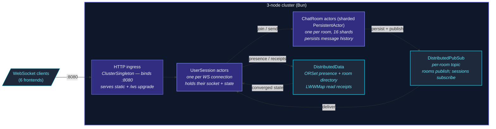

The chat sample is a **complete demo app** showing how the
framework's pieces compose:

- **TCP cluster** of 3 Bun processes, joined via gossip.
- **Sharded chat-room actors** — one `ChatRoomActor` per room,
  spread across the cluster as 16 shards.
- **DistributedPubSub** for cross-node chat-room broadcasts.
- **PersistentActor** for chat-room history (SQLite journal +
  snapshots).
- **DistributedData** for presence, the runtime room directory,
  and read receipts.
- **ClusterSingleton** HTTP front door — one node binds `:8080`;
  a survivor re-binds it on failover.
- **WebSocket-only** client protocol — a single `/ws` endpoint
  carries login, rooms, history, presence, and messages.

Find it under [`examples/chat/`](https://github.com/pathosDev/actor-ts/tree/main/examples/chat)
in the repo.

## Architecture


```mermaid
flowchart LR
  WS[/"WebSocket clients<br/>(6 frontends)"/]
  subgraph CLUSTER["3-node cluster (Bun)"]
    direction TB
    ING["HTTP ingress<br/><i>ClusterSingleton — binds :8080<br/>serves static + /ws upgrade</i>"]
    US["UserSession actors<br/><i>one per WS connection<br/>holds their socket + state</i>"]
    ROOM["ChatRoom actors (sharded PersistentActor)<br/><i>one per room, 16 shards<br/>persists message history</i>"]
    PUB["DistributedPubSub<br/><i>per-room topic<br/>rooms publish; sessions subscribe</i>"]
    DD["DistributedData<br/><i>ORSet presence + room directory<br/>LWWMap read receipts</i>"]
    ING --> US
    US -- "join / send" --> ROOM
    ROOM -- "persist + publish" --> PUB
    PUB -- "deliver" --> US
    US -- "presence / receipts" --> DD
    DD -- "converged state" --> US
  end
  WS -- ":8080" --> ING
  classDef client  fill:#1e293b,stroke:#06b6d4,color:#67e8f9;
  classDef cluster fill:#0f172a,stroke:#6366f1,stroke-width:2px,color:#f1f5f9;
  classDef edge    fill:#312e81,stroke:#818cf8,color:#f1f5f9;
  classDef actor   fill:#312e81,stroke:#818cf8,stroke-width:1.5px,color:#f1f5f9;
  classDef bus     fill:#1e293b,stroke:#06b6d4,stroke-width:2px,color:#67e8f9;
  class WS client
  class CLUSTER cluster
  class ING edge
  class US,ROOM actor
  class PUB,DD bus
```

The full path of a "user sends message" flow:

```
1. The WS client sends a "send" frame over /ws to the ingress singleton.
2. The ingress routes it to that connection's UserSession actor (one per socket).
3. UserSession tells the relevant ChatRoom entity (sharded by room name).
4. ChatRoom persists the message via PersistentActor.persist().
5. ChatRoom publishes to DistributedPubSub on the room's topic.
6. Every UserSession subscribed to that topic receives the message.
7. Each UserSession pushes it to its own WS client.
```

Cluster + persistence + pubsub + websocket — all working
together.

## Running it

```bash
# Clone the repo and install dev deps:
git clone https://github.com/pathosDev/actor-ts.git
cd actor-ts
bun install

# Start a 3-node cluster — three terminals, same command, no flags:
bun examples/chat/backend/main.ts
bun examples/chat/backend/main.ts
bun examples/chat/backend/main.ts

# Open the chat UI (one URL, whichever node holds the singleton):
open http://localhost:8080/
```

Each node runs the same binary. They discover each other by
scanning the cluster-port range from `2551`, so the three
terminals settle on `2551 / 2552 / 2553` with no seeds to
configure. The cluster then elects one node to run the
HTTP-ingress `ClusterSingleton`, which binds `:8080` and serves
the frontend selector plus the `/ws` endpoint. Persistence is a
local SQLite journal + snapshot store under `./data/` — no
external database. Kill the node holding the singleton and a
survivor re-binds `:8080` within a few seconds; the persisted
history survives.

### Verifying the round-trip

`smoke-test.ts` logs Alice in, sends three messages, waits for the
broadcast echoes, then logs Bob in on a fresh connection and checks
that he sees Alice's history — plus direct messages, typing
indicators, read receipts and the auth hardening.

```bash
# Against the cluster you already have up:
bun examples/chat/smoke-test.ts

# Or let it bring its own node up, on ports of its own:
bun examples/chat/smoke-test.ts --spawn-backend
```

`--spawn-backend` starts a single node on `:8090` (cluster `:2590`)
against a scratch journal, and stops it afterwards. Those ports sit
outside the backend's auto-discovery window, so a self-spawned run
neither joins nor collides with a cluster you already have running.

That flag is what lets CI run this file unattended: it is part of
the [example gate](/examples/overview/#verified-in-ci), so a
framework change that breaks the chat protocol round-trip shows up
as a red check.

`failover-test.ts`, the sibling that kills the singleton holder and
waits for a survivor to re-bind `:8080`, stays a manual step — two
of its three backends were seen outliving a clean exit and holding
their cluster ports against whatever ran next.

## Key patterns demonstrated

### Sharded chat rooms

```ts
const chatRoomRegion = cluster.sharding.start('ChatRoom', ChatRoomActor,
  StartShardingOptions.create<ChatRoomCommand>()
    .withExtractEntityId((message) => message.room)
    .withNumShards(16));
```

One `ChatRoomActor` per room, spread across the cluster as 16
shards — kill any node and the survivors take over its rooms.
Direct-message channels use the same pattern in a separate
region, keyed on the canonical DM pair-id.

### PersistentActor for rooms

```ts
class ChatRoomActor extends PersistentActor<ChatRoomCommand, ChatEvent, ChatState> {
  readonly persistenceId = `room-${this.roomName}`;
  // ... onCommand persists; onEvent updates state ...
}
```

Each room actor records every message; recovery replays.

### Distributed pub/sub for fan-out

```ts
// ChatRoom publishes after persisting:
ps.mediator.tell(new Publish(`room.${roomId}`, message));

// UserSession subscribes when user joins a room:
ps.mediator.tell(new Subscribe(`room.${roomId}`, this.self));
```

Sessions on any node receive room messages regardless of which
node's ChatRoom is publishing.

### WebSocket per user

```ts
class UserSessionActor extends Actor<SessionMessage> {
  private ws: WebSocket | null = null;

  override onReceive(message: SessionMessage): void {
    match(message)
      .with({ kind: 'connect-ws' }, (m) => this.onConnectWs(m))
      .with({ kind: 'inbound' }, (m) => this.onInbound(m))
      .exhaustive();
  }

  private onConnectWs(message: ConnectWsMessage): void {
    this.ws = message.socket;
  }

  private onInbound(message: InboundMessage): void {
    this.ws?.send(JSON.stringify(message.payload));
  }
}
```

Each session holds its user's WebSocket; sends pushes
straight to the client.

## What it doesn't demonstrate

- **Sharded daemon processes** — the chat sample doesn't need
  fixed background workers.
- **Replicated event sourcing** — single-writer per room is
  sufficient.

For those, see the
[stand-alone snippets](/examples/stand-alone-snippets/)
or the [voice sample](/examples/voice-sample/).

## File layout

```
examples/chat/
├── README.md
├── application.conf            # HOCON: log level, gossip cadence
├── data/                       # SQLite journal + snapshots (gitignored)
├── backend/
│   ├── main.ts                 # entry: wiring only (cluster, persistence, sharding, singleton)
│   ├── config.ts               # CLI-argument parsing
│   ├── routes.ts               # HTTP-DSL route (frontend selector)
│   ├── auth/                   # scrypt password verify + HMAC session tokens
│   ├── discovery/              # same-host port-scan seed provider
│   └── actors/
│       ├── ChatRoomActor.ts             # sharded PersistentActor (per room)
│       ├── ChatRoomDirectoryActor.ts    # DistributedData ORSet (runtime rooms)
│       ├── DirectMessageChannelActor.ts # sharded PersistentActor (per DM pair)
│       ├── UserSessionActor.ts          # per-WS-connection session
│       ├── OnlineUsersActor.ts          # DistributedData ORSet (presence)
│       ├── ReadReceiptsActor.ts         # DistributedData LWWMap (read pointers)
│       ├── HttpIngressActor.ts          # ClusterSingleton: owns the :8080 bind
│       └── WebsocketIngressActor.ts     # per-connection WS plumbing
├── shared/
│   ├── protocol.ts             # shared WS message types
│   ├── rooms.ts                # default room list
│   ├── users.ts                # test credentials
│   └── directMessage.ts        # DM pair-id canonicalization
├── static/                     # built frontend assets (@fastify/static)
├── frontend-{plain,angular,react,next,svelte,lit}/   # six UI variants
├── smoke-test.ts               # single-node messaging round-trip
└── failover-test.ts            # HTTP-singleton fail-over
```

Every actor lives in its own file under `backend/actors/`;
`main.ts` is pure wiring. Six frontends share one WebSocket
protocol, so you can compare them side-by-side.

## Where to next

- **[Voice sample](/examples/voice-sample/)** — broker
  integration + projections.
- **[Sharding overview](/cluster/sharding/overview/)** —
  the per-entity actor pattern.
- **[DistributedPubSub](/cluster/pubsub/)** — cluster
  pub/sub.
- **[PersistentActor](/persistence/persistent-actor/)** —
  event-sourced rooms.
