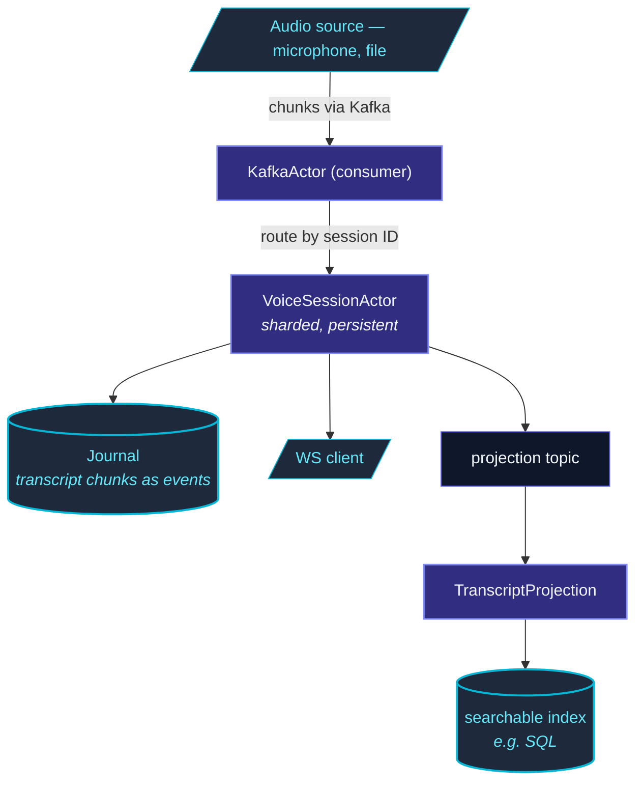

The voice sample is a **streaming-audio app** showing:

- **Kafka integration** — audio chunks flow in via Kafka topic.
- **Sharded session actors** — one per active voice session.
- **PersistentActor** — transcript persisted as events.
- **Projection** — read-side view for transcript search.
- **WebSocket** — live transcript streaming to the client.

Find it under [`examples/voice/`](https://github.com/pathosDev/actor-ts/tree/main/examples/voice)
in the repo.

## Architecture



## Running it

```bash
git clone https://github.com/pathosDev/actor-ts.git
cd actor-ts/examples/voice

docker compose up -d
# Spins up: 3 actor-ts nodes, Kafka, Zookeeper, Cassandra, Nginx

# Stream audio (mock client):
bun run client/mock-stream.ts ./test-audio.wav

# Watch transcripts:
open http://localhost:3000
```

The transcripts appear live in the UI as audio chunks process.

## Key patterns demonstrated

### Broker integration

```ts
const kafka = system.spawn(
  Props.create(() => new KafkaActor(KafkaOptions.create()
    .withBrokers(['kafka:9092'])
    .withConsumer({ groupId: 'voice-processor', topics: ['audio-chunks'] }))),
);

kafka.tell({ kind: 'subscribe', subscriber: dispatchActor });
```

A broker actor consumes audio chunks; a dispatch actor routes
them to the right sharded session.

### Sharded + persistent session

```ts
class VoiceSessionActor extends PersistentActor<SessionCmd, SessionEvent, SessionState> {
  readonly persistenceId = `voice-${this.sessionId}`;

  override onEvent(state, event) {
    if (event.kind === 'chunk-transcribed') {
      return { ...state, transcript: state.transcript + event.text };
    }
    return state;
  }

  async onCommand(state, cmd: SessionCmd) {
    if (cmd.kind === 'audio-chunk') {
      const text = await transcribe(cmd.audioBytes);
      this.persist({ kind: 'chunk-transcribed', text, ts: Date.now() }, () => {
        // Push to WS client
        this.context.system.eventStream.publish(new TranscriptUpdate(this.sessionId, text));
      });
    }
  }

  override tagsFor(event: SessionEvent) {
    return event.kind === 'chunk-transcribed' ? ['transcript'] : undefined;
  }
}
```

Notice:

- **Sharded** — one actor per session ID, distributed
  across nodes.
- **Persistent** — transcripts survive restart + failover.
- **Tagged** — `'transcript'` events feed the projection.

### Projection for search

```ts
const projection = ProjectionActor.byTag<SessionEvent>(system, ByTagProjectionOptions.create<SessionEvent>()
  .withName('transcript-search')
  .withTag('transcript')
  .withQuery(new CassandraQuery({ /* ... */ }))
  .withOffsetStore(new SqliteOffsetStore({ path: '/var/lib/offsets.db' }))
  .withHandle(async (event) => {
    if (event.event.kind === 'chunk-transcribed') {
      await searchDb.execute(
        `INSERT INTO transcripts (sessionId, text, ts) VALUES (?, ?, ?)
         ON CONFLICT (sessionId, ts) DO NOTHING`,
        [event.persistenceId, event.event.text, event.event.ts],
      );
    }
  }));

system.spawnAnonymous(Props.create(() => projection));
```

The projection reads the journal's `'transcript'`-tagged events
and writes to a search-optimized table — separate from the
session journal.

### WebSocket pushes

```ts
// In the HTTP server, on WS upgrade:
const session = sharding.entityRefFor('voice', sessionId);
session.tell({ kind: 'subscribe-ws', subscriber: wsBridge });
```

The session actor pushes transcript updates to subscribed WS
clients — multiple clients can subscribe (multiple devices
watching the same call).

## What it doesn't demonstrate

- **Cluster-singleton coordinators** — voice sessions don't
  need a leader; they're per-session sharded.
- **DistributedData** — transcript state belongs to a single
  session; no replicated state needed.
- **Complex routing** — straightforward 1:1 audio chunk →
  session routing.

For those see the
[stand-alone snippets](/examples/stand-alone-snippets/)
or the [chat sample](/examples/chat-sample/).

## File layout

```
examples/voice/
├── docker-compose.yml
├── README.md
├── package.json
├── src/
│   ├── main.ts                       # entry
│   ├── actors/
│   │   ├── VoiceSessionActor.ts     # sharded + persistent
│   │   ├── DispatchActor.ts          # routes Kafka msgs
│   │   └── TranscriptProjection.ts   # read-side
│   ├── messages.ts
│   ├── transcribe.ts                 # mock transcription
│   └── handlers/
│       └── wsBridge.ts
├── client/
│   └── mock-stream.ts
└── ui/
```

~700 lines.  Slightly larger than chat; the broker integration
adds setup.

## Real-world adaptation

For a production voice-pipeline app:

- Replace mock `transcribe()` with a real ASR (Whisper, Deepgram).
- Add the management endpoint + metrics for ops visibility.
- Replace the search projection's SQL with your actual search
  backend (Elasticsearch, OpenSearch).
- Add auth (the mock skips it).

The skeleton is reusable for any **streaming-input + per-stream
state + read-side index** workload — payments, IoT, log
ingestion, etc.

## Where to next

- **[Chat sample](/examples/chat-sample/)** — cluster
  + pubsub.
- **[Stand-alone snippets](/examples/stand-alone-snippets/)** —
  bite-sized examples.
- **[Kafka](/io/kafka/)** — the broker actor.
- **[PersistentActor](/persistence/persistent-actor/)** —
  event-sourced sessions.
- **[Projections](/persistence/projections/)** —
  read-side views.
