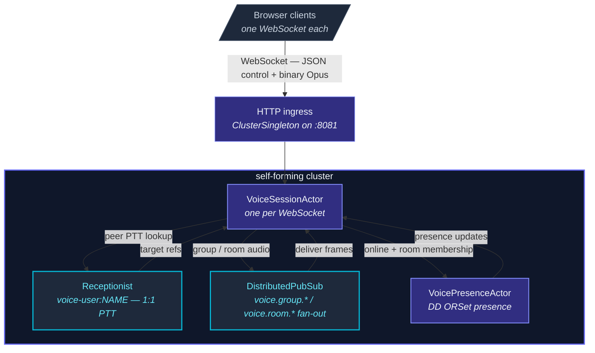

The voice sample is a **distributed walkie-talkie**: three voice modes
(1:1 push-to-talk, 1:N group megaphone, N:N Teams-style rooms) over one
WebSocket per client, served by a self-forming cluster. It is the
sibling of the [chat sample](/examples/chat-sample/), deliberately
built to exercise the framework primitives chat *doesn't*:

- **Receptionist** — 1:1 push-to-talk: look a user's session up by the
  `voice-user:<name>` key and direct-tell their audio.
- **DistributedPubSub** — 1:N group megaphone and N:N room fan-out over
  `voice.group.<name>` / `voice.room.<name>` topics.
- **DistributedData ORSets** — global online presence
  (`voice.online-users`) and per-room membership
  (`voice.room-users.<name>`).
- **ClusterSingleton** — a single HTTP + WebSocket front door that
  fails over between nodes.
- **No `ClusterSharding`, no `PersistenceExtension`** — voice is
  ephemeral by design. The server is a dumb audio relay; there is no
  journal, no transcription, no stored state. This is the deliberate
  teaching contrast with chat.

Audio rides the existing per-client WebSocket as **binary** frames — no
WebRTC, no SFU, no transcoding — so the PubSub fan-out, Receptionist
lookup, and DD-ORSet presence are visibly the load-bearing parts.

Find it under [`examples/voice/`](https://github.com/pathosDev/actor-ts/tree/main/examples/voice)
in the repo.

## Architecture


```mermaid
flowchart TB
  CLIENTS[/"Browser clients<br/><i>one WebSocket each</i>"/]
  SINGLETON["HTTP ingress<br/><i>ClusterSingleton on :8081</i>"]
  subgraph CLUSTER["self-forming cluster"]
    direction TB
    SESSION["VoiceSessionActor<br/><i>one per WebSocket</i>"]
    RECEPTIONIST["Receptionist<br/><i>voice-user:NAME — 1:1 PTT</i>"]
    PUBSUB["DistributedPubSub<br/><i>voice.group.* / voice.room.* fan-out</i>"]
    PRESENCE["VoicePresenceActor<br/><i>DD ORSet presence</i>"]
    SESSION -- "peer PTT lookup" --> RECEPTIONIST
    SESSION -- "group / room audio" --> PUBSUB
    SESSION -- "online + room membership" --> PRESENCE
    RECEPTIONIST -- "target refs" --> SESSION
    PUBSUB -- "deliver frames" --> SESSION
    PRESENCE -- "presence updates" --> SESSION
  end
  CLIENTS -- "WebSocket — JSON control + binary Opus" --> SINGLETON
  SINGLETON --> SESSION
  classDef client  fill:#1e293b,stroke:#475569,color:#cbd5e1;
  classDef cluster fill:#0f172a,stroke:#6366f1,stroke-width:2px,color:#f1f5f9;
  classDef edge    fill:#312e81,stroke:#818cf8,color:#f1f5f9;
  classDef actor   fill:#312e81,stroke:#818cf8,stroke-width:1.5px,color:#f1f5f9;
  classDef bus     fill:#1e293b,stroke:#06b6d4,stroke-width:2px,color:#67e8f9;
  class CLIENTS client
  class CLUSTER cluster
  class SINGLETON edge
  class SESSION,PRESENCE actor
  class RECEPTIONIST,PUBSUB bus
```

The full path of a "hold the group PTT button" flow:

```
1. Alice holds a group card's PTT button.
2. Her browser sends voice-target { mode: 'group', group: 'engineering' }.
3. Alice's VoiceSessionActor sets its current target to the group topic.
4. Each ~100 ms audio chunk arrives as a binary WS frame.
5. The session publishes it to DistributedPubSub on voice.group.engineering.
6. Every session subscribed to that topic receives the frame...
7. ...and writes a length-prefixed [nameLen][name][opus] envelope to its WebSocket.
8. On PTT-up, voice-stop publishes a final end marker so receivers flush.
```

Receptionist + pubsub + CRDT presence + websocket — all working
together, with no database on the hot path.

## Running it

```bash
# Clone repo:
git clone https://github.com/pathosDev/actor-ts.git
cd actor-ts

# Three terminals, no flags — a self-forming TCP cluster:
bun examples/voice/backend/main.ts
bun examples/voice/backend/main.ts
bun examples/voice/backend/main.ts

# Open the UI (served by whichever node holds the singleton):
open http://localhost:8081/
```

Pick a frontend, click "Enable mic" once (the browser permission prompt
and `AudioContext` unlock both need a user gesture), then log in with a
demo account:

```
alice / wonderland
bob / builder
charlie / chaplin
diana / prince
```

Try the modes: hold the PTT button next to another user's name (1:1),
hold a group card's button (1:N group), or enter a room and toggle
"Talk" (N:N room). Kill the node currently holding the `http-ingress`
singleton and a survivor rebinds `:8081` within ~5-10 s.

## Key patterns demonstrated

### 1:1 push-to-talk via the Receptionist

```ts
// Each session registers itself under a per-user key at login:
const userServiceKey = (username: string) =>
  ServiceKey.of<BinaryFrame | BinaryStreamEnd>(`voice-user:${username}`);

this.deps.receptionist.tell(new Register(userServiceKey(username), this.self, null));

// On PTT-down (peer mode) the sender Finds the target:
this.deps.receptionist.tell(new Find(userServiceKey(target), this.self));

// On the Listing reply, cache the refs and direct-tell each chunk:
for (const ref of cachedRefs) ref.tell(binaryFrame);
```

The refs are cached for the duration of the press — no registry lookup
per audio frame.

### Group + room fan-out via DistributedPubSub

```ts
// Groups are subscribed eagerly at login; rooms lazily on room-enter:
this.deps.mediator.tell(new Subscribe(groupTopic(group), this.self));

// Each audio chunk during a group/room press is published to the topic:
this.deps.mediator.tell(new Publish(topic, binaryFrame));
```

`groupTopic(g)` is `voice.group.${g}` and `roomTopic(r)` is
`voice.room.${r}`. The topic fans out to **every** subscriber including
the sender, so receivers drop their own frames (a self-filter on
`senderUsername`).

### Presence via DistributedData ORSets

```ts
// VoicePresenceActor mutates an ORSet per key:
this.dd.update<ORSet<string>>(
  key, // 'voice.online-users' or 'voice.room-users.<room>'
  () => ORSet.empty<string>(),
  (current) => current.add(this.replicaId, username),
);

// ...and fans DD changes out to subscribed sessions:
this.dd.subscribe<ORSet<string>>(key, (next) => {
  const users = [...next.value()];
  // push a PresenceChanged to each local subscriber
});
```

One global set tracks who's online; one set per room tracks who's in it.
No sharded entity owns room state — it's pure CRDT membership plus a
pubsub topic.

### HTTP front door as a ClusterSingleton

```ts
const singletonOptions = StartSingletonOptions.create()
  .withTypeName('http-ingress')
  .withProps(httpIngressProps({ host, httpPort, staticDir, /* ...deps */ }));
cluster.singleton.start(singletonOptions);
```

Exactly one node binds `:8081` at a time; the `HttpIngressActor` binds
in `preStart` and unbinds in `postStop`, so failover moves the port to a
survivor automatically.

## What it doesn't demonstrate

- **`ClusterSharding`** — there is no sharded entity. Rooms are pure
  DD-ORSet membership plus a PubSub topic; sessions are one plain
  `Actor` per WebSocket. (This is the deliberate contrast with the
  [chat sample](/examples/chat-sample/), which shards its rooms.)
- **Persistence / event sourcing** — no journal, no `PersistentActor`,
  nothing stored. Voice is ephemeral; a dropped session simply vanishes
  from the ORSets.
- **WebRTC / SFU / transcoding** — the server is a dumb relay and audio
  rides the existing WebSocket. Media processing is out of scope.

For sharding and persistence, see the [chat sample](/examples/chat-sample/)
or the [stand-alone snippets](/examples/stand-alone-snippets/).

## File layout

```
examples/voice/
├── application.conf
├── README.md
├── smoke-test.ts                    # one-node, two-client relay test
├── backend/
│   ├── main.ts                      # entry: cluster join + extensions + singleton
│   ├── config.ts                    # argument / port parsing
│   ├── routes.ts
│   ├── actors/
│   │   ├── HttpIngressActor.ts      # ClusterSingleton HTTP front door
│   │   ├── WebsocketIngressActor.ts # spawns a session per WS connection
│   │   ├── VoiceSessionActor.ts     # one per WebSocket — the relay pivot
│   │   └── VoicePresenceActor.ts    # DD ORSet presence
│   ├── auth/                        # demo credentials + session tokens
│   ├── discovery/                   # same-host seed scan
│   └── plugins/                     # static-file serving
├── shared/                          # protocol, frameCodec, groups, rooms, users
├── frontend-{plain,lit,svelte,react,next,angular}/
└── static/                          # built frontend artefacts served at /
```

`backend/main.ts` is wiring only; the interesting logic lives in
`VoiceSessionActor.ts` (the relay pivot) and `VoicePresenceActor.ts`
(the CRDT presence). Six frontends — plain JS, Lit, Svelte, React,
Next, Angular — all speak the same wire protocol.

## Real-world adaptation

For a production voice app:

- **Reliability** — `DistributedPubSub` is at-most-once; lost frames
  cause audible pops. Add adaptive jitter buffers and a retransmission
  layer above the relay.
- **Playback** — swap the receiver's `MediaSource` pipeline for
  `WebCodecs` + a ring buffer for tighter control over latency and
  buffering.
- **Scale** — N concurrent speakers means N `MediaSource` instances in
  each listener's browser; add server-side mixing for large rooms.
- **Security** — replace the plaintext demo credentials with hashed
  passwords and token rotation, and put the whole thing behind TLS/WSS.
- **Topology** — for peer-to-peer media, add WebRTC or an SFU on the
  media path and keep actor-ts for signaling, discovery, and presence.

The pattern generalises to any **ephemeral fan-out** workload — live
cursors, presence, telemetry broadcast, multiplayer input — where
Receptionist + DistributedPubSub + DistributedData replace a database
on the hot path.

## Where to next

- **[Chat sample](/examples/chat-sample/)** — the sharded +
  persistent sibling.
- **[Receptionist](/discovery/receptionist/)** — cluster-wide
  actor-ref lookup by key.
- **[DistributedPubSub](/cluster/pubsub/)** — topic fan-out across
  nodes.
- **[Sets (ORSet)](/distributed-data/crdt-types/sets/)** — the CRDT
  behind presence.
- **[ClusterSingleton](/cluster/singleton/overview/)** — the
  single-instance front door.
