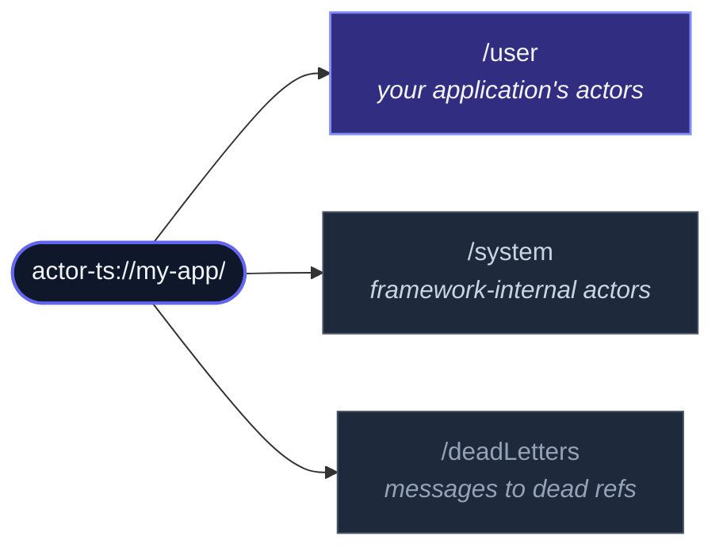

The `ActorSystem` is the **top-level container** for actors.  One per
logical application — sometimes one per process, sometimes a couple
running side-by-side (e.g. a worker-thread-isolation setup).  Every
actor lives inside a system; the system owns the dispatcher (which
schedules message processing), the scheduler (which runs timers), the
supervisor tree (which catches actor failures), the event stream, and
any extensions you've registered.

## Creating one

```ts
import { ActorSystem } from 'actor-ts';

const system = ActorSystem.create('my-app');
```

The string is the system **name** — it appears in actor paths
(`actor-ts://my-app/user/...`), log lines, and cluster identification.
Different systems can coexist with different names; same name in a
clustered setup means "I'm joining the existing cluster", different
name means "I'm a separate cluster".

`create` returns synchronously.  The system's root guardians are
spawned eagerly; user actors don't exist yet — you spawn them via
`spawn` (covered below).

## Configuration

`ActorSystem.create` takes an optional settings object as the second
argument:

```ts
const actorSystemOptions = ActorSystemOptions.create()
  .withLogLevel('info')
  .withConfigFile('./application.conf');
const system = ActorSystem.create('my-app', actorSystemOptions);
```

The full settings shape:

| Field | Purpose |
| --- | --- |
| `logger` | Custom `Logger` instance.  Defaults to a console logger respecting `logLevel`. |
| `logLevel` | One of `debug` / `info` / `warn` / `error` / `silent`. |
| `dispatcher` | Custom `Dispatcher`.  Defaults to a microtask-based dispatcher; tests typically swap in an immediate or manual one. |
| `scheduler` | Custom `Scheduler`.  Defaults to a real-time scheduler; tests inject `ManualScheduler` to control time. |
| `config` | Either a prebuilt `Config` or a plain object of HOCON overrides.  Layered on top of reference defaults + any `application.conf`. |
| `configFile` | Explicit path to an `application.conf` file.  Overrides the `ACTOR_TS_CONFIG` env var and the CWD lookup. |

Constructor settings always win over anything in config — they're the
explicit code-level overrides.

### HOCON config files

For larger applications, prefer a `application.conf` file at the
project root:

```hocon
actor-ts {
  log-level = "info"
  dispatcher {
    throughput = 100
  }
  cluster {
    gossip-interval = 500ms
    failure-detector.unreachable-after = 1500ms
  }
}
```

The framework loads it automatically when present.  ENV substitution
(`${?ENV_NAME}`) works as the HOCON spec defines — values pulled
from the environment fall back to the default when unset.  See
[Configuration](/reference/configuration/) for every key
the framework reads.

## Spawning actors

Top-level actors are spawned via `system.spawn`:

```ts
import { Props } from 'actor-ts';

const root = system.spawn(
  Props.create(() => new MyRootActor()),
  'root',   // optional name; framework picks one if omitted
);
```

The returned `ActorRef` is a handle, not the instance.  Pass it
around, store it, hand it to other actors.

Inside an actor, **child actors** are spawned via `context.spawn`,
not `system.spawn`:

```ts
class Parent extends Actor<...> {
  override onReceive(message) {
    const child = this.context.spawn(
      Props.create(() => new Child()),
      'worker',
    );
  }
}
```

Children are tied to the parent's lifecycle — when the parent stops,
all children stop first.  Children's failures escalate to the
parent's [supervisor strategy](/fundamentals/supervision/).
Top-level actors (from `system.spawn`) escalate to the system's
root guardian instead.

## The guardian hierarchy

Every actor has a path under the system root.  Three top-level
"guardian" actors sit just below the root:



When you call `system.spawnAnonymous(props)`, the actor is created under
`/user`.  When the system terminates, the guardians cascade-stop in
reverse order: user actors first (so they get to finish their work),
then system internals.

The `/deadLetters` "actor" is special — messages to a `tell` on a
stopped ref, or to a ref that never existed, route there.  By
default the system logs dead letters at `debug` level; subscribe to
the event stream if you want to react programmatically.

## Extensions

**Extensions** are the framework's plugin system.  Cluster, persistence,
DistributedData, DistributedPubSub, HTTP — they're all extensions.
You register them once at the system level, then reach them via
`system.extension(...)`:

```ts
import { Cluster, ClusterOptions, DistributedDataId } from 'actor-ts';

const cluster = await Cluster.join(system, ClusterOptions.create() /* ... */);
const dd = system.extension(DistributedDataId).start(cluster);
```

Extensions are **lazy**: they don't initialize until you reach for
them.  An app that never calls `system.extension(DistributedDataId)`
never starts a DD replicator.  This keeps single-process apps small;
adopt features by reaching for them, drop them by stopping reaching.

### Writing your own extension

```ts
import { type Extension, type ExtensionId } from 'actor-ts';

class MetricsCollector implements Extension {
  constructor(private readonly system: ActorSystem) {}
  incCounter(name: string): void { /* ... */ }
}

const MetricsCollectorId: ExtensionId<MetricsCollector> = {
  name: 'MetricsCollector',
  create: (system) => new MetricsCollector(system),
};

// Lookup is idempotent — first call creates, subsequent calls return
// the cached instance.
const metrics = system.extension(MetricsCollectorId);
metrics.incCounter('login.success');
```

Extensions are useful when:

- You need cross-cutting state shared by many actors (a connection
  pool, a metrics collector).
- The state is expensive to initialize and shouldn't exist if
  nothing reaches for it (a cluster join, a DD replicator).
- You want a clean way to inject test-doubles in unit tests
  (override the `ExtensionId` resolver).

## Terminating

```ts
await system.terminate();
```

`terminate` performs an ordered shutdown:

1. Notify the cluster (if joined) — gossip "I'm leaving" so peers
   stop routing to this node.
2. Stop `/user` recursively — your actors get `postStop`, children
   first.  Actors with in-flight async `onReceive`s finish their
   current message before stopping.
3. Stop `/system` — framework internals unwind.
4. Close the dispatcher and scheduler — no new messages, no new
   timers.
5. Resolve the returned promise.

For production apps you typically wrap this in a SIGTERM handler:

```ts
process.on('SIGTERM', async () => {
  await system.terminate();
  process.exit(0);
});
```

…but the framework provides a richer pattern for that — see
[Coordinated shutdown](/fundamentals/coordinated-shutdown/)
for the 12-phase ordered-shutdown DSL, which handles K8s PreStop
hooks, in-flight HTTP requests, draining brokers, etc.

import { Aside } from '@astrojs/starlight/components';

<Aside type="caution" title="Don't call `terminate` from inside an actor">
  Inside an `onReceive`, `await system.terminate()` self-deadlocks:
  the actor's mailbox can't process the next message until `onReceive`
  returns, but `terminate` waits for the actor to stop, which won't
  happen until `onReceive` returns.  If an actor wants to trigger
  shutdown, send a message to a top-level supervisor that calls
  `terminate` on the system from outside the actor world (e.g. a
  CoordinatedShutdown task, or `setImmediate`).
</Aside>

## How many systems per process?

The common answer is **one**.  A second system in the same process
means a separate cluster, a separate dispatcher, a separate
supervisor tree — typically more overhead than the use case
justifies.

Two situations where a second system makes sense:

- **Worker-thread isolation**: the main thread runs one system, a
  worker thread runs another, both spanning the same cluster via
  the `MessageChannelTransport`.  This is the
  [Worker mesh](/cluster/worker-mesh/) pattern — multiple
  systems per OS process, all participating in the same cluster.
- **Test fixtures**: a `TestActorSystem` per test case so cleanup is
  guaranteed.  See [TestKit](/testing/testkit/).

## Common pitfalls

<Aside type="caution" title="Spawning before `await system.extension(...).start(...)` resolves">
  Cluster + DistributedData + DistributedPubSub all need a brief
  warm-up before they're usable.  If you `system.spawnAnonymous(...)` an
  actor that immediately publishes on `chat.room.general` while the
  PubSub mediator is still initializing, the publish goes to dead
  letters.  Either await the extension's `start(...)` first, or
  buffer outgoing messages until you observe the cluster's `MemberUp`
  event.
</Aside>

<Aside type="caution" title="Sharing actor refs across system instances">
  An `ActorRef` points at an actor inside **one specific** ActorSystem.
  Passing it to an actor in a different system (e.g. across a
  worker-thread boundary without the cluster transport) doesn't work
  — the receiving system has no way to deliver to the foreign actor.
  Cross-system communication goes through the cluster transport, which
  serializes refs into a wire format that the receiving system can
  resolve.
</Aside>

<Aside type="caution" title="Forgetting `await` on `terminate`">
  `system.terminate()` returns a promise.  Without `await` (or
  `.then`), the process can exit before the shutdown sequence has
  finished — actors don't get their `postStop`, journals don't get
  flushed, brokers don't get drained.  Always `await` it.
</Aside>

## Where to next

- **[Actor](/fundamentals/actor/)** — the class you'll
  spawn into the system.
- **[Coordinated shutdown](/fundamentals/coordinated-shutdown/)** —
  graceful-shutdown DSL beyond a plain `terminate`.
- **[Cluster overview](/cluster/overview/)** — when you go
  from one system per process to many systems in a cluster.
- **[Configuration](/reference/configuration/)** — every
  HOCON key the framework reads, grouped by extension.

The [`ActorSystem` class API reference](/api/classes/actorsystem/)
documents every public method discussed here.
