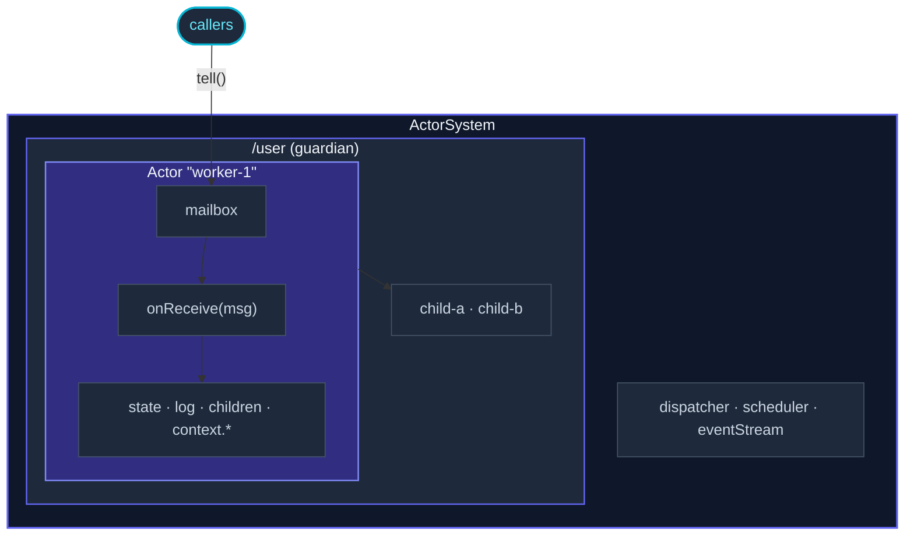

The **fundamentals** section covers everything you need to write
single-node actor systems.  All twenty-something pages exist
because they build on one mental picture: an *actor* is a thing
with state and behavior that processes messages one at a time.
Different pages zoom in on different parts of that picture.

This page is the map.

## The picture

Each box maps to one or two pages:

- The **ActorSystem** box itself —
  [Actor system](/actor-ts/fundamentals/actor-system/).
- Every **Actor** —
  [Actor](/actor-ts/fundamentals/actor/) (the class) +
  [Props](/actor-ts/fundamentals/props/) (how to construct it).
- The **mailbox** —
  [Mailboxes](/actor-ts/fundamentals/mailboxes/).
- The **tell** arrow —
  [Messages](/actor-ts/fundamentals/messages/).
- The **onReceive** loop's scheduling —
  [Dispatchers](/actor-ts/fundamentals/dispatchers/).
- The **context.*** that the actor uses —
  [Become and stash](/actor-ts/fundamentals/become-and-stash/),
  [Death watch](/actor-ts/fundamentals/death-watch/),
  [Timers and scheduling](/actor-ts/fundamentals/timers-and-scheduling/),
  [Receive timeout](/actor-ts/fundamentals/receive-timeout/),
  [Logging](/actor-ts/fundamentals/logging/).
- The **parent-child** relationship's failure handling —
  [Supervision](/actor-ts/fundamentals/supervision/).
- The **path** that names every actor —
  [Actor paths](/actor-ts/fundamentals/actor-paths/).
- System-wide pub/sub on the side —
  [Event stream](/actor-ts/fundamentals/event-stream/).
- Termination signals from outside —
  [Poison pill and Kill](/actor-ts/fundamentals/poison-pill-and-kill/).
- Whole-system graceful shutdown —
  [Coordinated shutdown](/actor-ts/fundamentals/coordinated-shutdown/).
- Request/reply on top of `tell` —
  [Ask pattern](/actor-ts/fundamentals/ask-pattern/).
- The match-on-`kind` idiom every page uses —
  [Pattern matching](/actor-ts/fundamentals/pattern-matching/).

That's the lot.  About twenty pages, each ~250-400 lines, each
zooming in on one slice.

## A reading order

Three reasonable paths:

### Fastest path to "I can write an actor"

For developers who want to start coding immediately:

1. [Actor](/actor-ts/fundamentals/actor/) — the class.
2. [Messages](/actor-ts/fundamentals/messages/) — the
   discriminated-union convention.
3. [Pattern matching](/actor-ts/fundamentals/pattern-matching/) —
   the `match().exhaustive()` idiom.
4. [Actor system](/actor-ts/fundamentals/actor-system/) — how to
   spawn the actor.
5. [Ask pattern](/actor-ts/fundamentals/ask-pattern/) — how to
   read replies.

That's ~1 hour of reading, after which you can write a working
toy app.

### Path to "I understand the model"

For developers wanting the conceptual picture before writing code:

1. [Actor system](/actor-ts/fundamentals/actor-system/) — the
   container.
2. [Actor](/actor-ts/fundamentals/actor/) — the entity.
3. [Mailboxes](/actor-ts/fundamentals/mailboxes/) +
   [Dispatchers](/actor-ts/fundamentals/dispatchers/) — what makes
   one-at-a-time work.
4. [Supervision](/actor-ts/fundamentals/supervision/) +
   [Death watch](/actor-ts/fundamentals/death-watch/) — the
   "let it crash" philosophy.
5. [Coordinated shutdown](/actor-ts/fundamentals/coordinated-shutdown/) —
   how systems end gracefully.

After this, the rest is filling in details.

### Path to "I'm porting an existing system"

For developers migrating from another runtime model
(Promise/await soup, worker threads, BullMQ-style queues):

1. [Why actors](/actor-ts/intro/why-actors/) — the rationale.
2. [Messages](/actor-ts/fundamentals/messages/) — replacing
   methods.
3. [Actor](/actor-ts/fundamentals/actor/) — replacing classes
   with shared state.
4. [Supervision](/actor-ts/fundamentals/supervision/) — replacing
   try/catch with let-it-crash.
5. [Ask pattern](/actor-ts/fundamentals/ask-pattern/) — bridging
   `await` callers with actor-internal flows.

And then on to the [Migration guides](/actor-ts/migration/overview/)
for the specific framework comparison.

## The shape every concept-page follows

Every fundamentals page is laid out the same way:

1. **What it is** — one sentence, in the page title's description.
2. **A minimal example** — runnable code, ~15-30 lines, imports
   included.
3. **How it works** — the technical detail, in prose.
4. **When (not) to apply** — concrete situations + alternatives.
5. **Common pitfalls** — Asides that flag the most common mistakes.
6. **Where to next** — 3-5 internal links.

The point isn't to memorize each page; it's to know the *shape* so
you can skim to the section you need.  The "Common pitfalls" set
across all pages is the single best resource if you're debugging.

## Beyond fundamentals

Once these pages are familiar, the rest of the site builds on
them:

- **[Typed](/actor-ts/typed/overview/)** — a stricter, typed-by-default
  API for the same model.
- **[Routing](/actor-ts/routing/overview/)** — fan-out across
  multiple actors with load-balancing strategies.
- **[Patterns](/actor-ts/patterns/circuit-breaker/)** — reusable
  building blocks (circuit breakers, retry helpers, backoff
  supervisors).
- **[Cluster](/actor-ts/cluster/overview/)** — going from one node
  to many.
- **[Persistence](/actor-ts/persistence/overview/)** — making actor
  state survive restarts.

Each of those sections has its own overview page following the
same pattern.

## Where to start

If you've read this far and just want to write something:

- **[Quickstart](/actor-ts/intro/quickstart/)** — a working hello-actor
  in 5 minutes.
- **[Actor](/actor-ts/fundamentals/actor/)** — the foundational
  page for everything else.
