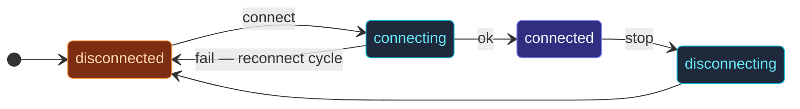

Every protocol actor in `actor-ts/io/broker` — `KafkaActor`,
`MqttActor`, `NatsActor`, etc. — extends `BrokerActor`.  The base
class owns the **shared lifecycle**: connection state machine,
reconnect-with-backoff, outbound buffer, subscriber fan-out,
lifecycle event publishing.

`BrokerActor` (the abstract base) owns:

- **Lifecycle state machine** — `disconnected ↔ connecting ↔ connected ↔ disconnecting`.
- **Outbound buffer** — messages sent before the connection is up.
- **Reconnect loop** — exponential backoff on connection loss.
- **Subscriber tracking** — fan-out for incoming events.

Subclasses implement three protocol hooks:

| Hook | When called |
| --- | --- |
| `connectImpl` | Open the protocol-specific connection. |
| `disconnectImpl` | Close it cleanly. |
| `dispatchOutgoing(envelope)` | Send a single buffered message on the wire. |

Subclasses implement the three protocol hooks; the base handles
the rest.  This page documents what's **shared**.  For
per-protocol specifics, see the
[per-protocol pages](/io/overview/).

## The state machine



Four states:

- **`disconnected`** — initial; not currently connected.
- **`connecting`** — `connectImpl` is running.
- **`connected`** — connection up; messages flow.
- **`disconnecting`** — `disconnectImpl` is running.

A `disconnected` → `connecting` → failure triggers a **reconnect
loop**: backoff + retry until success or `maxAttempts`
exhausted.

## Subclass contract

```ts
abstract class BrokerActor<S, Command, P> extends Actor<Command> {
  // Subclasses implement:
  protected abstract configKey(): string;
  protected abstract builtInDefaultOptions(): Partial<S>;
  protected abstract readOptionsFromConfig(config: Config): Partial<S>;
  protected abstract requiredOptions(): ReadonlyArray<keyof S>;
  protected abstract endpointLabel(): string;

  protected abstract connectImpl(): Promise<void>;
  protected abstract disconnectImpl(): Promise<void>;
  protected abstract dispatchOutgoing(envelope: OutboundEnvelope<P>): Promise<void>;
}
```

Three categories:

- **Settings glue** (`configKey`, `builtInDefaultOptions`,
  `readOptionsFromConfig`, `requiredOptions`,
  `endpointLabel`) — describes how to assemble settings from
  the three layers (constructor + HOCON + defaults) and how to
  validate.
- **Protocol hooks** (`connectImpl`, `disconnectImpl`,
  `dispatchOutgoing`) — the protocol-specific work.

`endpointLabel` is the human-readable connection identity
("amqp://localhost:5672", "kafka-cluster-1") used in log lines
and lifecycle events.

## What the base does for you

### Outbound buffering

```ts
this.outbound({ topic: 'orders', payload: ... });
```

Subclasses call `this.outbound(envelope)` to send.  The base
class:

- If **connected** — calls `dispatchOutgoing(envelope)`
  immediately.
- If **disconnected** — buffers up to `outboundBuffer.capacity`
  envelopes.  On reconnect, drains the buffer.

Overflow per policy: `'drop-oldest'` / `'drop-new'` / `'reject'`
(throw `BrokerBufferOverflow`).

### Subscriber tracking

```ts
this.onReceive(msg) {
  if (msg.kind === 'subscribe') {
    this.subscribe(msg.topic, msg.subscriber);
  }
  if (msg.kind === 'unsubscribe') {
    this.unsubscribe(msg.topic, msg.subscriber);
  }
}
```

`subscribe(topic, ref)` registers `ref` as interested in
`topic`'s inbound messages.  The base **death-watches** the
ref — when it stops, the subscription is removed automatically.
No leaks.

When the protocol pushes an inbound message, the subclass calls:

```ts
this.fanOut(topic, inboundMessage);
```

The base delivers to every subscriber for that topic.

### Reconnect-with-backoff

```ts
reconnect: {
  minBackoffMs:   500,
  maxBackoffMs:   30_000,
  randomFactor:   0.2,
  maxAttempts:    -1,    // -1 = unlimited
}
```

Configurable per actor.  The base uses the same exponential-backoff
math as
[BackoffPolicy](/patterns/backoff-policy/), with jitter
to avoid synchronized retries across clients.

Each attempt fires `BrokerReconnectAttempt` on the event stream;
after `maxAttempts` exhausted (if finite), `BrokerReconnectFailed`
fires and the actor stays disconnected.

### Lifecycle events

Published on `system.eventStream`:

| Event | When |
| --- | --- |
| `BrokerConnected` | A `connectImpl` succeeded. |
| `BrokerDisconnected` | A `disconnectImpl` ran or a connection failed. |
| `BrokerReconnectAttempt` | A reconnect attempt is starting. |
| `BrokerReconnectFailed` | `maxAttempts` exhausted. |
| `BrokerBufferOverflow` | The outbound buffer dropped an envelope. |
| `BrokerNotConnected` | Sent without a connection. |

Subscribe to monitor every broker actor uniformly:

```ts
system.eventStream.subscribe(monitorRef, BrokerConnected);
system.eventStream.subscribe(monitorRef, BrokerDisconnected);
```

The events include `actorPath` — distinguish events from
different broker actors in the system.

## Settings resolution

```
1. builtInDefaultOptions()           ← lowest priority (always applied)
2. readOptionsFromConfig()    ← HOCON overrides
3. Constructor argument        ← highest priority (per-instance)
```

`preStart` merges the three layers, validates against
`requiredOptions()`, and stashes the result for the rest of the
actor's life via `this.settings`.

Missing required settings cause an early-error throw on
`preStart` — the actor goes through the supervisor's failure
path before it ever attempts to connect.

## Writing a custom protocol actor

```ts
import { BrokerActor, type OutboundEnvelope, type BrokerCommonOptionsType } from 'actor-ts';

interface MyProtocolOptionsType extends BrokerCommonOptionsType {
  readonly url: string;
}

class MyProtocolActor extends BrokerActor<MyProtocolOptionsType, Command, MyPayload> {
  private conn: MyClient | null = null;

  protected configKey() { return 'actor-ts.io.broker.my-protocol'; }
  protected builtInDefaultOptions() { return { /* ... */ }; }
  protected readOptionsFromConfig(c) { /* parse HOCON */ return {}; }
  protected requiredOptions() { return ['url'] as const; }
  protected endpointLabel() { return this.settings.url; }

  protected async connectImpl(): Promise<void> {
    this.conn = await MyClient.connect(this.settings.url);
    this.conn.onMessage((m) => this.fanOut(m.topic, m));
  }

  protected async disconnectImpl(): Promise<void> {
    await this.conn?.close();
    this.conn = null;
  }

  protected async dispatchOutgoing(env: OutboundEnvelope<MyPayload>): Promise<void> {
    await this.conn!.send(env.payload);
  }
}
```

The base handles the rest.  Most third-party clients (kafkajs,
nats.js, etc.) have an event-based message-receive API that
maps cleanly to `this.fanOut(...)`.

## Where to next

- **[I/O overview](/io/overview/)** — the bigger
  picture: which protocols ship.
- **[Kafka](/io/kafka/)** / **[MQTT](/io/mqtt/)** /
  **[NATS](/io/nats/)** / etc. — per-protocol pages.
- **[Event stream](/fundamentals/event-stream/)** —
  where lifecycle events are published.
- **[Backoff policy](/patterns/backoff-policy/)** —
  the math behind the reconnect loop.
