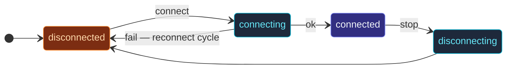

Every protocol actor in `actor-ts/io/broker` — `KafkaActor`,
`MqttActor`, `NatsActor`, etc. — extends `BrokerActor`.  The base
class owns the **shared lifecycle**: connection state machine,
reconnect-with-backoff, outbound buffer, subscriber fan-out,
lifecycle event publishing.

`BrokerActor` (the abstract base) owns:

- **Lifecycle state machine** — `disconnected ↔ connecting ↔ connected ↔ disconnecting`.
- **Outbound buffer** — messages sent before the connection is up.
- **Reconnect loop** — exponential backoff on connection loss.
- **Subscriber tracking** — fan-out for incoming events.
- **Desired subscriptions** — protocol subscriptions that outlive any one
  connection and are re-established on every reconnect.

Subclasses implement three protocol hooks:

| Hook | When called |
| --- | --- |
| `connectImplementation` | Open the protocol-specific connection. |
| `disconnectImplementation` | Close it — on stop **and before every re-connect attempt**. |
| `dispatchOutgoing(envelope)` | Send a single buffered message on the wire. |

Subclasses implement the three protocol hooks; the base handles
the rest.  This page documents what's **shared**.  For
per-protocol specifics, see the
[per-protocol pages](/io/overview/).

## The state machine


```mermaid
stateDiagram-v2
  direction LR
  [*] --> disconnected
  disconnected --> connecting: connect
  connecting --> connected: ok
  connecting --> disconnected: fail — reconnect cycle
  connected --> disconnecting: stop
  disconnecting --> disconnected
  classDef ok    fill:#312e81,stroke:#818cf8,color:#f1f5f9;
  classDef warn  fill:#7c2d12,stroke:#fb923c,color:#fed7aa;
  classDef step  fill:#1e293b,stroke:#06b6d4,color:#67e8f9;
  class connected ok
  class disconnected warn
  class connecting,disconnecting step
```

Four states:

- **`disconnected`** — initial; not currently connected.
- **`connecting`** — `connectImplementation` is running.
- **`connected`** — connection up; messages flow.
- **`disconnecting`** — `disconnectImplementation` is running.

A `disconnected` → `connecting` → failure triggers a **reconnect
loop**: backoff + retry until success or `maxAttempts`
exhausted.

Every re-connect attempt starts from a clean slate: the base calls
`disconnectImplementation` first whenever a previous attempt opened
anything, so a subclass never builds a new connection on top of the dead
one's handles.  That makes `disconnectImplementation` an **idempotent**
contract — it may be called on an already-dead connection, and it must
drop only the live handles, never the desired subscriptions below.

Stopping the actor while a reconnect attempt is in flight **abandons** that
connection rather than adopting it.  Reconnect runs on the system scheduler,
detached from the mailbox, so an attempt already inside
`connectImplementation` cannot be cancelled — it resumes after `postStop`
has returned.  The base class therefore re-checks liveness on the way out of
the handshake and, if the actor is gone, calls `disconnectImplementation`
once more and stays `disconnected`: no `BrokerConnected`, no buffer drain,
no further retry.  Without that check a handshake that *completed* installed
live handles on a terminated actor, and one that *failed* re-armed the
backoff timer and reconnected forever, since `maxAttempts` defaults to
`Infinity` (#708).

## Subclass contract

```ts
abstract class BrokerActor<S, Command, P, Subscription = never> extends Actor<Command> {
  // Subclasses implement:
  protected abstract configKey(): string;
  protected abstract builtInDefaultOptions(): Partial<S>;
  protected abstract readOptionsFromConfig(config: Config): Partial<S>;
  protected abstract requiredOptions(): ReadonlyArray<keyof S>;
  protected abstract endpointLabel(): string;

  protected abstract connectImplementation(): Promise<void>;
  protected abstract disconnectImplementation(): Promise<void>;
  protected abstract dispatchOutgoing(envelope: OutboundEnvelope<P>): Promise<void>;
}
```

Three categories:

- **Settings glue** (`configKey`, `builtInDefaultOptions`,
  `readOptionsFromConfig`, `requiredOptions`,
  `endpointLabel`) — describes how to assemble settings from
  the three layers (constructor + HOCON + defaults) and how to
  validate.
- **Protocol hooks** (`connectImplementation`, `disconnectImplementation`,
  `dispatchOutgoing`) — the protocol-specific work.

`endpointLabel` is the human-readable connection identity
("amqp://localhost:5672", "kafka-cluster-1") used in log lines
and lifecycle events.

## What the base does for you

### Outbound buffering

```ts
this.enqueueOutbound(payload);
```

Subclasses call `this.enqueueOutbound(payload)` to send; it
returns `true` if the message was sent or buffered, `false` if it
was dropped.  The base class:

- If **connected** — wraps `payload` in an `OutboundEnvelope` and
  calls `dispatchOutgoing(envelope)` immediately.
- If **disconnected** (or `connecting`) — buffers up to
  `outboundBuffer` envelopes (default `1000`).  On reconnect,
  drains the buffer in order.

On overflow the base always evicts the **oldest** buffered
envelope (FIFO) and publishes a `BrokerBufferOverflow` event on
the event stream — it is never thrown.  With `outboundBuffer: 0`
buffering is disabled: the message is dropped and a
`BrokerNotConnected` event is published.

### Subscriber tracking

```ts
import { Terminated } from 'actor-ts';
import { match, P } from 'ts-pattern';

override onReceive(message: MyCommand): void {
  // `Terminated` reaches onReceive but is not part of the typed command
  // union, so the *match input* is widened to admit it — see the note below.
  match<MyCommand | Terminated>(message)
    .with(P.instanceOf(Terminated), (m) => this.onTerminated(m))
    .with({ kind: 'subscribe' }, (m) => this.onSubscribe(m))
    .with({ kind: 'unsubscribe' }, (m) => this.onUnsubscribe(m))
    .exhaustive();
}

private onTerminated(signal: Terminated): void {
  this.pruneTerminatedSubscriber(signal.actor);
}

private onSubscribe(message: SubscribeCommand): void {
  this.subscribeRef(message.topic, message.subscriber);
}

private onUnsubscribe(message: UnsubscribeCommand): void {
  this.unsubscribeRef(message.topic, message.subscriber);
}
```

`subscribeRef(topic, ref)` registers `ref` as interested in
`topic`'s inbound messages, and **death-watches** it — for a local ref;
see the caveat below.

import { Aside } from '@astrojs/starlight/components';

<Aside type="caution" title="The Terminated arm is not optional">
  `subscribeRef` starts the watch, but the base class cannot act on it for
  you: `onReceive` is abstract, so every subclass owns its own dispatch and
  the base never sees a message.  Without the arm above, a subscriber that
  stops stays in every topic it held and costs a dead-lettered `tell` on each
  fan-out — this was a real defect (#1111), not a hypothetical — and the
  `.exhaustive()` call *throws* on the unmatched signal, which the default
  supervisor answers with a restart, i.e. a full broker reconnect per
  subscriber death.

  Write it exactly as above and neither can happen: widening the **match
  input** to `MyCommand | Terminated` makes `.exhaustive()` refuse to compile
  without the arm (`NonExhaustiveError<Terminated>`), so the omission is a
  build failure rather than a runtime one.  The *parameter* stays
  `MyCommand` — `Actor<Command>` fixes the mailbox type — and the widening
  is load-bearing rather than cosmetic: `P.instanceOf(Terminated)` does not
  typecheck against an un-widened union.

  `pruneTerminatedSubscriber(ref)` removes the subscriber from every topic
  and returns whether it removed anything, so you can tell a subscriber's
  death from any other watched actor's.  It does **not** `unwatch`: the cell
  already dropped the watch when it delivered `Terminated`.
</Aside>

<Aside type="caution" title="The watch only fires for a local subscriber">
  `context.watch` installs a watcher when the ref is a `LocalActorRef` and is
  a silent no-op otherwise, so a **remote** subscriber never produces a
  `Terminated`: it stays in every topic it held until the broker actor itself
  stops, and keeps costing a cross-node `tell` on each fan-out.  Nothing in
  the arm above can help — the signal never arrives.  Tracked as #918.
</Aside>

`unsubscribeRef` matches on the ref's path rather than the ref object, so
holding a different ref for the same actor still unsubscribes.

When the protocol pushes an inbound message, the subclass calls:

```ts
this.fanOutToTopic(topic, inboundMessage);
```

The base delivers to every subscriber for that topic.

### Desired subscriptions

Subscriber tracking above is *inside* the actor system — which local
refs want which topic.  A **desired subscription** is the other half:
the subscription the actor holds *on the broker*, which has to be
re-established every time the connection is rebuilt.

The base keeps that set separate from the live handles, so it outlives
any one connection:

```ts
// Record it (and establish it now, if connected).
await this.rememberSubscription('orders.new', target);
// Drop it, from the broker and from the desired set.
await this.forgetSubscription('orders.new');
```

Subclasses provide three hooks:

| Hook | Purpose |
| --- | --- |
| `initialSubscriptions()` | Subscriptions declared in the options.  Folded into the desired set **once**, before the first connect. |
| `applySubscription(key, subscription)` | Establish one subscription on the live connection.  Must tolerate a key that is already live. |
| `revokeSubscription(key)` | Tear one down.  Optional — several protocols can only drop a subscription by dropping the whole consumer. |

and replay the whole set from inside `connectImplementation`:

```ts
protected async connectImplementation(): Promise<void> {
  this.connection = await MyClient.connect(this.options.url);
  await this.applyDesiredSubscriptions();   // configured + runtime
}
```

The replay is driven by the subclass rather than by the base class
because the right point in the handshake is protocol-specific —
kafkajs, for one, wants every `subscribe` in before `consumer.run`.

What this buys you:

- A subscription added at runtime **survives a reconnect** — it is not
  just a call on a connection that is about to die.
- A `subscribe` that arrives **while the actor is disconnected** is
  remembered and applied on the next connect, instead of being dropped.
- Seeding from the options is **once-only**, so a runtime `unsubscribe`
  is not resurrected by the next reconnect.
- Re-remembering a live key revokes it first, so a changed payload (a
  different target actor, say) actually takes effect.
- A subscription that **cannot** be established is logged as a warning
  and the rest of the set still goes through.  One bad subject does not
  take the connection down — and it does not silently leave you
  connected-but-deaf either.

`MqttActor` predates this mechanism and keeps its own richer registry
(per-topic QoS, several targets per pattern, deathwatch on each), with
the same reconnect guarantees.

### Reconnect-with-backoff

```ts
reconnect: {
  initialDelayMs: 200,
  maxDelayMs:     30_000,
  factor:         2,
  maxAttempts:    Infinity,   // the default — retry forever
  randomFactor:   0.2,        // the default — ±20 % jitter
}
```

Configurable per actor (or `reconnect: false` to disable
auto-reconnect entirely).  Each attempt waits
`min(initialDelayMs * factor^(attempt - 1), maxDelayMs)`, multiplied
by a random `1 ± randomFactor`.

The jitter is what keeps a **fleet** from retrying in lockstep.  Without
it the delay is a pure function of the attempt counter and these options,
so every broker actor that lost the same broker in the same instant wakes
in the same millisecond, wave after wave — and the herd can hold the
recovering broker down.  Set `randomFactor: 0` for a fully deterministic
schedule.

The same spread applies to the **circuit breaker**: when the breaker is
open the actor re-checks somewhere in
`[resetMs, resetMs × (1 + randomFactor)]` rather than exactly on the
deadline.  That jitter is one-sided — a breaker is never re-tried early.

Each attempt fires `BrokerReconnectAttempt` on the event stream (its
`delayMs` is the jittered value actually scheduled); after `maxAttempts`
exhausted (if finite), `BrokerReconnectFailed` fires and the actor stays
disconnected.

For a deterministic test, inject the randomness source — `random: () =>
0.5` pins every delay to its un-jittered value:

```ts
reconnect: { initialDelayMs: 100, random: () => 0.5 }
```

### Liveness deadlines

Everything above is triggered by `handleConnectionLost`, and that is
only ever called when the transport **says** something ended — a
`close` event, an `error`, a stream that reported `done`.  A peer that
vanishes without sending FIN or RST says none of them.  A dropped NAT
entry, a container killed with `SIGKILL`, a route that starts
black-holing: the socket stays open, the actor stays `connected`, and
the reconnect machinery never runs.

Two clocks close that gap.  Both are **opt-in per protocol**, because
only the application knows how quiet its peer is allowed to be:

- **`idleTimeoutMs`** — a **read** deadline.  If nothing arrives from
  the peer for that long, the connection is reported lost through the
  ordinary `handleConnectionLost` path, so everything on this page
  applies unchanged: `BrokerDisconnected`, backoff, buffer, breaker.
  It is reset by inbound bytes and *not* by outbound ones, deliberately:
  a client writing into a black hole is exactly the case that has to
  trip it.
- **`connectTimeoutMs`** — a deadline on one `connectImplementation`.
  Every protocol settles its connect on an event (`connect`, `open`,
  response headers) and none of them has a clock, so a peer that
  finishes the handshake and then stalls holds the actor in
  `connecting` indefinitely.  On expiry the attempt is aborted, and the
  failure travels the path a refused connect already takes.

`TcpSocketActor`, `SseActor` and `WebsocketClientActor` expose both.
Set `idleTimeoutMs` **above** whatever heartbeat the peer already
sends; below it, the deadline severs healthy connections in a loop.
`0` (the default) disables either one.

Protocols with their own protocol-level liveness do not need these:
`MqttActor` has MQTT `keepAlive`, and `KafkaActor` runs a consumer
heartbeat.

### Lifecycle events

Published on `system.eventStream`:

| Event | When |
| --- | --- |
| `BrokerConnected` | A `connectImplementation` succeeded. |
| `BrokerDisconnected` | A live connection was lost. Not published by a graceful stop. |
| `BrokerReconnectAttempt` | A reconnect attempt is starting. |
| `BrokerReconnectFailed` | `maxAttempts` exhausted. |
| `BrokerBufferOverflow` | The outbound buffer dropped an envelope. |
| `BrokerNotConnected` | Sent without a connection. |

Subscribe to monitor every broker actor uniformly:

```ts
system.eventStream.subscribe(monitorRef, BrokerConnected);
system.eventStream.subscribe(monitorRef, BrokerDisconnected);
```

The events include `actorPath` — distinguish events from
different broker actors in the system.

## Settings resolution

```
1. builtInDefaultOptions()           ← lowest priority (always applied)
2. readOptionsFromConfig()    ← HOCON overrides
3. Constructor argument        ← highest priority (per-instance)
```

`preStart` merges the three layers, validates against
`requiredOptions()`, and stashes the result for the rest of the
actor's life via `this.options`.

Missing required settings cause an early-error throw on
`preStart` — the actor goes through the supervisor's failure
path before it ever attempts to connect.

## Writing a custom protocol actor

```ts
import { BrokerActor, type OutboundEnvelope, type BrokerCommonOptionsType } from 'actor-ts/io';

interface MyProtocolOptionsType extends BrokerCommonOptionsType {
  readonly url: string;
}

class MyProtocolActor extends BrokerActor<MyProtocolOptionsType, Command, MyPayload> {
  private connection: MyClient | null = null;

  protected configKey() { return 'actor-ts.io.broker.my-protocol'; }
  protected builtInDefaultOptions() { return { /* ... */ }; }
  protected readOptionsFromConfig(c) { /* parse HOCON */ return {}; }
  protected requiredOptions() { return ['url'] as const; }
  protected endpointLabel() { return this.options.url; }

  protected async connectImplementation(): Promise<void> {
    this.connection = await MyClient.connect(this.options.url);
    this.connection.onMessage((m) => this.fanOutToTopic(m.topic, m));
  }

  // Called on stop AND before every re-connect attempt — idempotent,
  // and safe on a connection that is already dead.
  protected async disconnectImplementation(): Promise<void> {
    await this.connection?.close();
    this.connection = null;
  }

  protected async dispatchOutgoing(env: OutboundEnvelope<MyPayload>): Promise<void> {
    await this.connection!.send(env.payload);
  }
}
```

The base handles the rest.  Most third-party clients (kafkajs,
nats.js, etc.) have an event-based message-receive API that
maps cleanly to `this.fanOutToTopic(...)`.

## Where to next

- **[I/O overview](/io/overview/)** — the bigger
  picture: which protocols ship.
- **[Kafka](/io/kafka/)** / **[MQTT](/io/mqtt/)** /
  **[NATS](/io/nats/)** / etc. — per-protocol pages.
- **[Event stream](/fundamentals/event-stream/)** —
  where lifecycle events are published.
- **[Backoff policy](/patterns/backoff-policy/)** —
  a standalone backoff primitive (the reconnect loop rolls its own).
