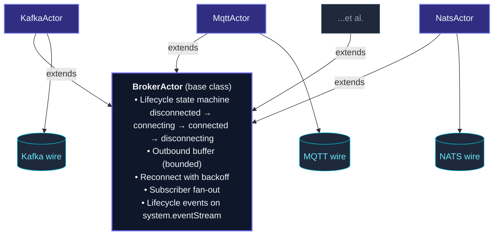
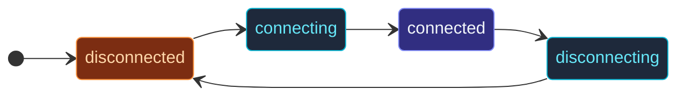

Actors handle in-process work cleanly; the **outside world** is
messier — sockets connect and disconnect, brokers go down, HTTP
clients pile up, payloads cross protocol boundaries.

The framework's I/O modules wrap each protocol in an **actor that
hides the protocol behind a uniform contract**: connect on
`preStart`, publish events to subscribers when messages arrive,
buffer outgoing messages while disconnected, reconnect with
backoff, surface lifecycle events on the event stream.



Subclasses implement three hooks (`connectImpl`, `disconnectImpl`,
`dispatchOutgoing`); the base handles the rest.

## The available brokers

| Module | Protocol | Common use |
| --- | --- | --- |
| `KafkaActor` | Apache Kafka | High-throughput durable log; consumer-group fan-out. |
| `MqttActor` | MQTT 3.1.1 / 5 | IoT, telemetry; QoS 0/1/2 + retained messages. |
| `AmqpActor` | RabbitMQ / AMQP 0.9.1 | Topic / queue routing, work queues. |
| `NatsActor` | NATS core | Lightweight pub/sub; request-reply. |
| `JetStreamActor` | NATS JetStream | Durable streaming on NATS. |
| `RedisStreamsActor` | Redis XADD/XREAD | Lightweight streaming + consumer groups. |
| `GrpcClientActor` / `GrpcServerActor` | gRPC | Typed RPC + streaming. |
| `WebsocketClientActor` | WebSocket | Outgoing connection (broker-based client). |
| `websocket()` route + `WebsocketServerActor` | WebSocket | Incoming connections — bound via the HTTP route DSL, not a broker. |
| `SseActor` | Server-Sent Events | Client that consumes a server's one-way event stream. |
| `TcpSocketActor` | Raw TCP | Custom protocols. |
| `UdpSocketActor` | Raw UDP | Telemetry, low-latency datagrams. |

Each has its own page in this section.  This overview covers the
**common pattern** they all share.

## The lifecycle state machine



Linear transitions during normal operation:

- **`disconnected`** — initial state; not currently connected.
- **`connecting`** — `connectImpl` is running.
- **`connected`** — connection is up; messages flow.
- **`disconnecting`** — `disconnectImpl` is running.

Failure during `connected` triggers a transition to `disconnected`
+ a reconnect loop.  Stop transitions through `disconnecting` from
any state.

Subscribe to the lifecycle events via the event stream:

```ts
import { BrokerConnected, BrokerDisconnected, BrokerReconnectAttempt } from 'actor-ts';

class Monitor extends Actor<BrokerConnected | BrokerDisconnected | BrokerReconnectAttempt> {
  override preStart(): void {
    this.system.eventStream.subscribe(this.self, BrokerConnected);
    this.system.eventStream.subscribe(this.self, BrokerDisconnected);
    this.system.eventStream.subscribe(this.self, BrokerReconnectAttempt);
  }
  override onReceive(event: BrokerConnected | BrokerDisconnected | BrokerReconnectAttempt): void {
    this.log.info(`broker event: ${event.constructor.name}`);
  }
}
```

The event payload includes which broker actor emitted it (by
`actorPath`), so a single monitor can watch all brokers in the
system.

## Reconnect with backoff

When a connected broker disconnects unexpectedly, the base class
schedules a reconnect with exponential backoff.  Configurable via
`BrokerCommonOptionsType`:

```ts
{
  reconnect: {
    minBackoffMs:  500,
    maxBackoffMs:  30_000,
    randomFactor:  0.2,
    maxAttempts:   -1,    // -1 = unlimited
  }
}
```

Each attempt fires a `BrokerReconnectAttempt` event.  When
`maxAttempts` is exceeded (if finite), the actor surfaces
`BrokerReconnectFailed` and stays disconnected; messages buffered
in the outbound queue are eventually dropped per the buffer policy.

## Outbound buffer

While disconnected, outgoing messages don't fail immediately —
they're enqueued in a bounded outbound buffer.  When the connection
restores, the buffer is drained.

Configurable size + overflow policy:

```ts
{
  outboundBuffer: {
    capacity: 1_000,
    overflow: 'drop-oldest',   // or 'drop-new' or 'reject'
  }
}
```

When the buffer overflows, the base publishes a `BrokerBufferOverflow`
event so you can wire it into metrics.

## Subscriber fan-out

For inbound messages (e.g., a Kafka message landing on a subscribed
topic), the broker actor publishes to **subscribers** — actor refs
registered as interested:

```ts
const kafkaOptions = KafkaOptions.create()
  .withBrokers('localhost:9092')
  .withConsumer({ groupId: 'my-app', topics: ['orders'] });
const kafka = system.spawn(
  Props.create(() => new KafkaActor(
    kafkaOptions,
  )),
);

const handler = system.spawnAnonymous(Props.create(() => new OrderHandler()));

kafka.tell({ kind: 'subscribe', subscriber: handler });
// Now every inbound order is told to `handler`.
```

Different broker actors have different subscription semantics (a
single topic for MQTT, a consumer-group + topic list for Kafka),
but the pattern is consistent: register a subscriber ref, receive
the protocol's inbound messages as actor messages.

## Settings precedence

Three layers, highest-first:

1. **Constructor argument** — what you passed when spawning the
   actor.
2. **HOCON config** under a protocol-specific key (e.g.
   `actor-ts.io.kafka { bootstrap-servers = "..." }`).
3. **Built-in defaults** — sensible production defaults the actor
   ships with.

This means you can set system-wide defaults in `application.conf`
and override per-instance via the constructor.  Per-broker subpages
spell out which keys each protocol reads.

## When to use a broker actor

Three good fits:

1. **Bridging an external broker** into the actor world — Kafka,
   MQTT, NATS messages need to become actor messages and vice
   versa.  Don't build the protocol yourself; use the
   provided actors.
2. **Long-lived connections** to a service that pushes data —
   gRPC streams, WebSocket clients, SSE consumers.  The broker
   actor manages reconnect and buffering.
3. **Mutually-exclusive resource ownership** — exactly one TCP
   connection to a legacy service.  The broker actor model
   serializes access naturally.

## What's NOT a broker actor

import { Aside } from '@astrojs/starlight/components';

<Aside type="caution" title="One-shot HTTP requests aren't broker actors">
  For "fetch this URL, get a JSON back," a plain `fetch()` call
  inside an actor's `onReceive` is the right shape — no long-lived
  connection, no reconnect logic, no buffering needed.  Broker
  actors are for connections that span many messages.
</Aside>

<Aside type="caution" title="HTTP servers are a separate module">
  The framework has a dedicated [HTTP](/http/overview/)
  module with a route DSL, marshalling, middleware, and three
  pluggable backends (Fastify, Express, Hono).  It's not built
  on `BrokerActor` — HTTP servers don't fit the
  "one-connection-many-messages" shape.
</Aside>

## Writing a custom broker actor

Implement the three abstract methods and wire up settings:

```ts
import { BrokerActor, type BrokerCommonOptionsType } from 'actor-ts';

class MyProtocolActor extends BrokerActor<MyOutbound> {
  protected configKey() { return 'actor-ts.io.my-protocol'; }
  protected builtInDefaultOptions(): BrokerCommonOptionsType { return { /* defaults */ }; }
  protected readOptionsFromConfig(c) { /* parse HOCON */ }
  protected requiredOptions() { return ['url']; }

  protected async connectImpl(): Promise<void> {
    // Establish the connection.  Throw on failure.
  }
  protected async disconnectImpl(): Promise<void> {
    // Clean up the connection.
  }
  protected async dispatchOutgoing(env: OutboundEnvelope<MyOutbound>): Promise<void> {
    // Send the payload over the connection.
  }
}
```

The base class handles state transitions, buffering, reconnect,
event publishing.  Subclasses only own the protocol-specific
parts.

## Where to next

- **Per-protocol pages** — [Kafka](/io/kafka/),
  [MQTT](/io/mqtt/), [AMQP](/io/amqp/),
  [NATS](/io/nats/), [Redis Streams](/io/redis-streams/),
  [gRPC](/io/grpc/), [WebSocket client](/io/websocket/),
  [WebSocket server](/http/websocket/),
  [SSE](/io/sse/), [TCP](/io/tcp/),
  [UDP](/io/udp/).
- **[BrokerActor base class](/io/broker-actor-base/)** —
  the shared lifecycle and configuration.
- **[HTTP overview](/http/overview/)** — the separate
  HTTP server module.
- **[Event stream](/fundamentals/event-stream/)** — where
  broker lifecycle events are published.

The [`BrokerActor`](/api/classes/brokeractor/) API
reference covers the full base-class surface.
