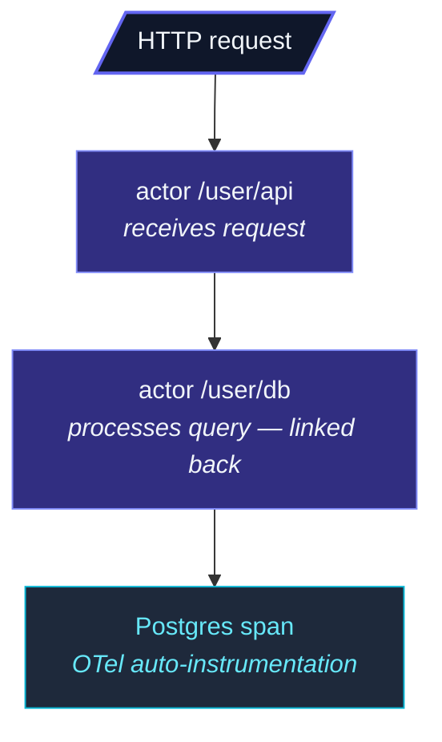

A production actor system needs three things to be observable from
the outside:

| Pillar | What it answers | Module |
| --- | --- | --- |
| **Metrics** | "What's the rate / count / latency right now?" | [`MetricsExtension`](/observability/metrics/core-metrics/) |
| **Tracing** | "What did this single request do?" | [`TracingExtension`](/observability/tracing/tracer-api/) |
| **Management** | "Is the system alive and healthy?" | [`managementRoutes`](/observability/management/overview/) |

All three are **extensions** — they don't run unless you reach for
them.  An app that ignores observability has no overhead from
unused metrics buffers or unstarted trace exporters.

## Metrics

```ts
import { ActorSystem, MetricsExtensionId } from 'actor-ts';

const system = ActorSystem.create('my-app');
const metrics = system.extension(MetricsExtensionId);

const requests = metrics.counter('http.requests.total', { route: '/orders' });
requests.inc();

const latency = metrics.histogram('http.requests.duration_ms', { route: '/orders' });
latency.observe(42);

const active = metrics.gauge('sessions.active');
active.set(123);
```

Four metric types:

- **Counter** — monotonically increasing.  Total requests, total
  errors.
- **Gauge** — point-in-time value.  Active sessions, current
  memory usage.
- **Histogram** — sampled distribution.  Request latency, payload
  size.  Lets you compute p50/p95/p99 at scrape time.
- **Timer** — `timer.start()` returns a stop function; built on
  top of histogram for timing-specific ergonomics.

Each metric has a name + labels (key-value pairs).  Labels let you
slice the same metric by dimension — `http.requests.total` by
`route` or `status`.

### Exporters

The metrics themselves are framework-internal; getting them out
to a metrics backend uses an **exporter**:

| Exporter | Backend |
| --- | --- |
| `PrometheusExporter` | Exposes a `/metrics` endpoint Prometheus scrapes. |
| `PromClientAdapter` | Pushes into the `prom-client` library if you're already using it. |

See [Prometheus exporter](/observability/metrics/prometheus-exporter/)
for the deep dive on each.

### Stock metrics

The framework auto-records a baseline of metrics when the
extension is started:

- **Actor metrics** — message counts per actor type, processing
  duration histograms, mailbox depth gauges.
- **Mailbox metrics** — enqueue rate, dequeue rate, dropped count
  for bounded mailboxes.
- **Cluster metrics** — member count by state, gossip lag,
  reachability flips.

See [Stock metrics](/observability/metrics/stock-metrics/)
for the full list.  These give you "are my actors processing
messages?" out of the box without writing any metric code.

## Tracing

```ts
import * as otel from '@opentelemetry/api';
import { ActorSystem, TracingExtensionId, otelTracer, OtelAdapterOptions } from 'actor-ts';

const system = ActorSystem.create('my-app');
const otelAdapterOptions = OtelAdapterOptions.create().withApi(otel);
system.extension(TracingExtensionId).enable(otelTracer(otelAdapterOptions));
```

With tracing enabled, **every actor message gets its own span**.
The span carries:

- The actor's path.
- The message's class / kind.
- Parent span context (from the sender's active span).
- Duration of the `onReceive`.

Spans **chain across tells** — an actor that processes a request
and tells another actor passes the current span context via the
envelope; the second actor's span links back to the first.



The end result: one trace per logical request, even when it hops
through 4-5 actors.

The tracer bridges to OpenTelemetry.  Use
[otelTracer](/observability/tracing/otel-adapter/)
in production; a [RecordingTracer](/observability/tracing/recording-tracer/)
exists for tests.

## Management endpoints

```ts
import { managementRoutes, ActorSystem } from 'actor-ts';

const system = ActorSystem.create('my-app');

// cluster is optional — pass null to skip the /cluster/* endpoints
const { routes, health } = managementRoutes(system, cluster);
await system.http(8558).bind(routes);
```

This spins up a small HTTP server (separate from your app's HTTP
server) that exposes endpoints for operations:

| Endpoint | What |
| --- | --- |
| `GET /health` | Liveness — is the process up? |
| `GET /ready` | Readiness — ready for traffic (cluster up + checks)? |
| `GET /cluster/members` | List of cluster members (when a cluster is passed). |
| `GET /cluster/shards?type=<name>` | Shard placement for a sharded type. |
| `GET /metrics` | Prometheus exposition (opt-in via `enableMetricsEndpoint`). |

Useful for K8s probes (liveness + readiness) and ad-hoc
operational debugging.  See
[HTTP endpoints](/observability/management/http-endpoints/)
for the full surface.

### Health checks

```ts
health.addReadiness(async () => {
  const ok = await db.ping();
  return { name: 'db', status: ok, detail: ok ? undefined : 'db unreachable' };
});
```

Custom checks plug into `/ready` — a failing check makes the
endpoint return 503, which K8s reads as "don't route to this pod."

See [Health checks](/observability/management/health-checks/)
for the configuration.

## What to wire up first

For a new production deployment:

1. **Metrics** — at least the stock ones, with a Prometheus
   exporter.  Counter and gauge dashboards give you
   "what's the system doing right now."
2. **Health checks** — liveness + readiness for K8s.  Even if your
   workload doesn't need fancy probes, K8s wants these endpoints.
3. **Tracing** — last.  Tracing is more involved (exporter
   configuration, sampling, cost) and gives diminishing returns
   for simple apps.  Add it when you have multi-actor requests and
   need to see end-to-end latency.

For a dev / staging environment, none of these are required —
console logs cover the basics.

## When NOT to enable observability

import { Aside } from '@astrojs/starlight/components';

<Aside type="caution" title="Local dev with no monitoring stack">
  The extensions cost very little when nothing exports their data,
  but they're not free.  In local dev / single-developer workflows,
  leaving them off until you actually have a monitoring backend
  is fine — `system.log.info('...')` is the simplest tool.
</Aside>

<Aside type="caution" title="Tracing every message in high-throughput systems">
  A million-messages-per-second actor system traced with no
  sampling means a million spans per second — enough to swamp
  most OTel collectors.  Configure sampling on the exporter; the
  framework records spans for every message regardless, but the
  exporter decides what to send.
</Aside>

<Aside type="caution" title="Exposing /metrics publicly">
  ```
  GET /metrics  ← contains exact request volumes, error counts, ...
  ```
  Metrics exporters are usually fine for an internal network, but
  exposing them on the internet leaks operational state.  Put the
  management server behind a private network / VPN / authenticated
  proxy.
</Aside>

## Where to next

### Metrics

- **[Core metrics](/observability/metrics/core-metrics/)** —
  counter / gauge / histogram / timer in detail.
- **[Prometheus exporter](/observability/metrics/prometheus-exporter/)** —
  scrape endpoint setup.
- **[Stock metrics](/observability/metrics/stock-metrics/)** —
  the out-of-the-box actor/mailbox/cluster metrics.

### Tracing

- **[Tracer API](/observability/tracing/tracer-api/)** —
  the tracer contract + recording.
- **[OTel adapter](/observability/tracing/otel-adapter/)** —
  OpenTelemetry integration.
- **[Actor tracing](/observability/tracing/actor-tracing/)** —
  per-actor span propagation.

### Management

- **[Health checks](/observability/management/health-checks/)** —
  liveness + readiness.
- **[HTTP endpoints](/observability/management/http-endpoints/)** —
  the management server's full endpoint set.
