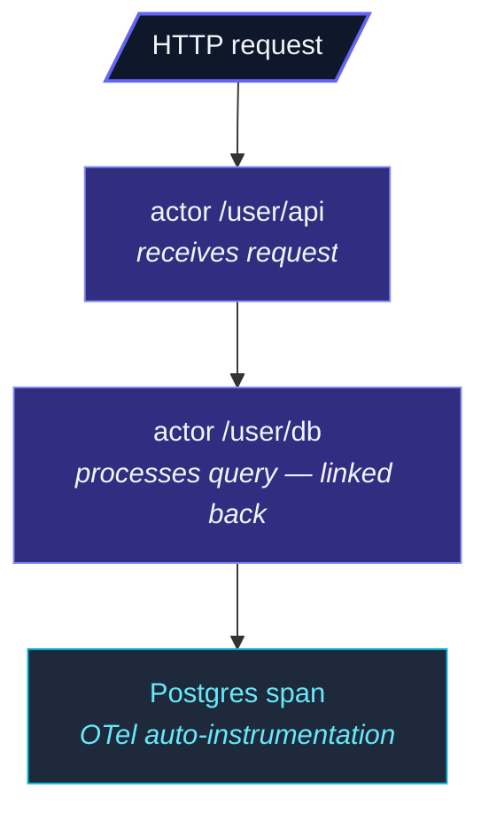

A production actor system needs four things to be observable from
the outside:

| Pillar | What it answers | Module |
| --- | --- | --- |
| **Logs** | "What happened, in order, and what was it carrying?" | [`MultiSinkLogger`](/observability/logging/multi-sink/) |
| **Metrics** | "What's the rate / count / latency right now?" | [`MetricsExtension`](/observability/metrics/core-metrics/) |
| **Tracing** | "What did this single request do?" | [`TracingExtension`](/observability/tracing/tracer-api/) |
| **Management** | "Is the system alive and healthy?" | [`managementRoutes`](/observability/management/overview/) |

Logging is always on — every actor has `this.log`, writing to the
console by default.  The other three are **extensions**: they don't run
unless you reach for them, so an app that ignores them has no overhead
from unused metrics buffers or unstarted trace exporters.

## Logs

The default logger writes to one place.  Point it at several at once —
each with its own minimum level — with `withLogSinks`:

```ts
import { ActorSystem, ActorSystemOptions, LogLevel } from 'actor-ts';
import { ConsoleSink, FileSink, FileSinkOptions } from 'actor-ts/logging';

const fileSinkOptions = FileSinkOptions.create()
  .withDirectory('/var/log/my-app')
  .withRotateInterval('daily');
const systemOptions = ActorSystemOptions.create()
  .withLogSinks([new ConsoleSink(), new FileSink(fileSinkOptions)]);
const system = ActorSystem.create('my-app', systemOptions);
```

Records are built once, fanned out to every sink whose level passes,
delivered on a bounded queue, and flushed when the system terminates.
A destination that breaks cannot take the others — or the application —
with it.

### Which sink?

**Start with OTLP.**  One endpoint format reaches Grafana Loki 3+,
Parseable, SigNoz, Datadog, Axiom, Honeycomb, New Relic and every
OpenTelemetry Collector, so a platform-specific sink only earns its
place where OTLP does not reach or loses something:

| You want | Use |
| --- | --- |
| a collector, or most SaaS platforms | [OTLP](/observability/logging/integrations/#otlp--opentelemetry-over-http) |
| log files on the machine | [File sink](/observability/logging/file-sink/) |
| Graylog | [GELF](/observability/logging/integrations/#graylog--gelf) — its OTLP input is gRPC-only |
| Sentry | [the Sentry sink](/observability/logging/integrations/#sentry) — grouping is the product |
| Loki with explicit label control | [Loki push](/observability/logging/integrations/#grafana-loki) |
| Seq, Splunk, Parseable | [their native sinks](/observability/logging/integrations/) |
| rsyslog, syslog-ng, an appliance | [Syslog](/observability/logging/integrations/#syslog-rfc-5424) |
| a container platform scraping stdout | nothing — `ConsoleSink` in `json` mode is already NDJSON |

Deliberately **not** shipped: `journald` and the Windows Event Log.  Both
are reached by writing NDJSON to stdout and letting the platform collect
it, which the console sink already does — a dedicated sink would add a
binary protocol for no reach.

## Metrics

```ts
import { ActorSystem } from 'actor-ts';
import { MetricsExtensionId } from 'actor-ts/metrics';

const system = ActorSystem.create('my-app');
const metrics = system.extension(MetricsExtensionId);

const requests = metrics.counter('http.requests.total', { route: '/orders' });
requests.inc();

const latency = metrics.histogram('http.requests.duration_ms', { route: '/orders' });
latency.observe(42);

const active = metrics.gauge('sessions.active');
active.set(123);
```

Four metric types:

- **Counter** — monotonically increasing.  Total requests, total
  errors.
- **Gauge** — point-in-time value.  Active sessions, current
  memory usage.
- **Histogram** — sampled distribution.  Request latency, payload
  size.  Lets you compute p50/p95/p99 at scrape time.
- **Timer** — `timer.start()` returns a stop function; built on
  top of histogram for timing-specific ergonomics.

Each metric has a name + labels (key-value pairs).  Labels let you
slice the same metric by dimension — `http.requests.total` by
`route` or `status`.

### Exporters

The metrics themselves are framework-internal; getting them out
to a metrics backend uses an **exporter**:

| Exporter | Backend |
| --- | --- |
| `PrometheusExporter` | Exposes a `/metrics` endpoint Prometheus scrapes. |
| `PromClientAdapter` | Pushes into the `prom-client` library if you're already using it. |

See [Prometheus exporter](/observability/metrics/prometheus-exporter/)
for the deep dive on each.

### Stock metrics

The framework auto-records a baseline of metrics when the
extension is started:

- **Actor metrics** — a counter of messages delivered to
  `onReceive` (`actor_messages_delivered_total`) and a
  handler-duration histogram (`actor_message_handler_seconds`).
- **Mailbox metrics** — a counter of messages dropped by a
  bounded mailbox's overflow policy (`actor_mailbox_dropped_total`).
- **Cluster metrics** — a gauge of members currently up
  (`cluster_members_up`) and a counter of gossip rounds
  (`cluster_gossip_rounds_total`).

See [Stock metrics](/observability/metrics/stock-metrics/)
for the full list.  These give you "are my actors processing
messages?" out of the box without writing any metric code.

## Tracing

```ts
import * as otel from '@opentelemetry/api';
import { ActorSystem } from 'actor-ts';
import { TracingExtensionId, otelTracer, OtelAdapterOptions } from 'actor-ts/tracing';

const system = ActorSystem.create('my-app');
const otelAdapterOptions = OtelAdapterOptions.create().withApi(otel);
system.extension(TracingExtensionId).enable(otelTracer(otelAdapterOptions));
```

With tracing enabled, **every actor message gets its own span**.
The span carries:

- The actor's path.
- The message's class / kind.
- Parent span context (from the sender's active span).
- Duration of the `onReceive`.

Spans **chain across tells** — an actor that processes a request
and tells another actor passes the current span context via the
envelope; the second actor's span links back to the first.


```mermaid
flowchart TB
  REQ[/"HTTP request"/]
  API["actor /user/api<br/><i>receives request</i>"]
  DB["actor /user/db<br/><i>processes query — linked back</i>"]
  PG["Postgres span<br/><i>OTel auto-instrumentation</i>"]
  REQ --> API --> DB --> PG
  classDef root  fill:#0f172a,stroke:#6366f1,stroke-width:2px,color:#f1f5f9;
  classDef actor fill:#312e81,stroke:#818cf8,color:#f1f5f9;
  classDef ext   fill:#1e293b,stroke:#06b6d4,color:#67e8f9;
  class REQ root
  class API,DB actor
  class PG ext
```

The end result: one trace per logical request, even when it hops
through 4-5 actors.

The tracer bridges to OpenTelemetry.  Use
[otelTracer](/observability/tracing/otel-adapter/)
in production; a [RecordingTracer](/observability/tracing/recording-tracer/)
exists for tests.

## Management endpoints

```ts
import { ActorSystem } from 'actor-ts';
import { managementRoutes } from 'actor-ts/management';

const system = ActorSystem.create('my-app');

// cluster is optional — pass null to skip the /cluster/* endpoints
const routes = managementRoutes(system, cluster);
await system.http(8558).bind(routes);
```

This spins up a small HTTP server (separate from your app's HTTP
server) that exposes endpoints for operations:

| Endpoint | What |
| --- | --- |
| `GET /health` | Liveness — is the process up? |
| `GET /ready` | Readiness — ready for traffic (framework + your checks)? |
| `GET /cluster/members` | List of cluster members (when a cluster is passed). |
| `GET /cluster/shards?type=<name>` | Shard placement for a sharded type. |
| `GET /metrics` | Prometheus exposition (opt-in via `enableMetricsEndpoint`). |

Useful for K8s probes (liveness + readiness) and ad-hoc
operational debugging.  See
[HTTP endpoints](/observability/management/http-endpoints/)
for the full surface.

### Health checks

```ts
health.addReadiness(async () => {
  const ok = await db.ping();
  return { name: 'db', status: ok, detail: ok ? undefined : 'db unreachable' };
});
```

Custom checks plug into `/ready` — a failing check makes the
endpoint return 503, which K8s reads as "don't route to this pod."

See [Health checks](/observability/management/health-checks/)
for the configuration.

## What to wire up first

For a new production deployment:

1. **Logs somewhere durable** — a file sink, or one platform sink.
   Cheapest to set up, and the first thing anybody asks for after an
   incident.
2. **Metrics** — at least the stock ones, with a Prometheus
   exporter.  Counter and gauge dashboards give you
   "what's the system doing right now."
3. **Health checks** — liveness + readiness for K8s.  Even if your
   workload doesn't need fancy probes, K8s wants these endpoints.
4. **Tracing** — last.  Tracing is more involved (exporter
   configuration, sampling, cost) and gives diminishing returns
   for simple apps.  Add it when you have multi-actor requests and
   need to see end-to-end latency.

For a dev / staging environment, none of these are required —
console logs cover the basics.

## When NOT to enable observability

import { Aside } from '@astrojs/starlight/components';

<Aside type="caution" title="Local dev with no monitoring stack">
  The extensions cost very little when nothing exports their data,
  but they're not free.  In local dev / single-developer workflows,
  leaving them off until you actually have a monitoring backend
  is fine — `system.log.info('...')` is the simplest tool.
</Aside>

<Aside type="caution" title="Tracing every message in high-throughput systems">
  A million-messages-per-second actor system traced with no
  sampling means a million spans per second — enough to swamp
  most OTel collectors.  Configure sampling on the exporter; the
  framework records spans for every message regardless, but the
  exporter decides what to send.
</Aside>

<Aside type="caution" title="Exposing /metrics publicly">
  ```
  GET /metrics  ← contains exact request volumes, error counts, ...
  ```
  Metrics exporters are usually fine for an internal network, but
  exposing them on the internet leaks operational state.  Put the
  management server behind a private network / VPN / authenticated
  proxy.
</Aside>

## Where to next

### Logs

- **[Multi-sink logging](/observability/logging/multi-sink/)** —
  the pipeline, per-sink levels, redaction, shutdown flush.
- **[File sink](/observability/logging/file-sink/)** —
  timestamped files, rotation, retention, gzip.
- **[Platform integrations](/observability/logging/integrations/)** —
  OTLP, Graylog, Loki, Seq, Splunk, Parseable, Sentry, syslog.
- **[Logging fundamentals](/fundamentals/logging/)** —
  levels, `withFields`, the MDC that rides along with every `tell`.

### Metrics

- **[Core metrics](/observability/metrics/core-metrics/)** —
  counter / gauge / histogram / timer in detail.
- **[Prometheus exporter](/observability/metrics/prometheus-exporter/)** —
  scrape endpoint setup.
- **[Stock metrics](/observability/metrics/stock-metrics/)** —
  the out-of-the-box actor/mailbox/cluster metrics.

### Tracing

- **[Tracer API](/observability/tracing/tracer-api/)** —
  the tracer contract + recording.
- **[OTel adapter](/observability/tracing/otel-adapter/)** —
  OpenTelemetry integration.
- **[Actor tracing](/observability/tracing/actor-tracing/)** —
  per-actor span propagation.

### Management

- **[Health checks](/observability/management/health-checks/)** —
  liveness + readiness.
- **[HTTP endpoints](/observability/management/http-endpoints/)** —
  the management server's full endpoint set.

### DevTools

The three pillars above are for watching a system from the outside, over
time.  When you want to *look inside* one right now — the actor tree,
the mailboxes, what a single actor has been doing — attach the
[DevTools](/observability/devtools/overview/) UI instead.  It is a
debugger, not a monitoring stack: loopback and unauthenticated by
default, and off until you reach for it.

- **[DevTools overview](/observability/devtools/overview/)** —
  attaching, the dashboard, per-panel switches, security.
- **[Tap protocol](/observability/devtools/protocol/)** —
  the versioned wire contract, if you want your own client.
