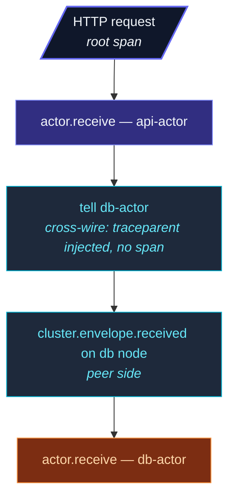

When the tracing extension is configured, the framework
**automatically creates one span per actor message** plus an
infrastructure span for inbound cluster-wire envelopes.  Spans
**chain across tells** — a message handler that `tell`s another
actor passes the active span context, so the receiver's span
links back to the sender's.

## Auto-instrumented spans

| Span name | When | Notable attributes |
| --- | --- | --- |
| `actor.receive` | Once per message delivered to `onReceive`. | `actor.path`, `actor.message.type` |
| `cluster.envelope.received` | Inbound cross-cluster envelope carrying a parent trace context. | `cluster.from`, `cluster.to.path` |

For a typical request flow:



Each span carries the trace ID — your tracing backend stitches
them into one trace.

## Causal chaining

```ts
// Within an actor:
override async onReceive(message) {
  // tracer.activeSpan() returns the actor.receive span
  // tell creates an envelope with traceparent set
  this.downstream.tell({ kind: 'derived', from: message.id });
  // The downstream actor's actor.receive span has THIS span as parent
}
```

`tell` snapshots the active span context onto the envelope (via
`tracer.injectContext()`).  On receive, the framework runs
`tracer.withActiveSpan(span, ...)` to make the actor's onReceive
see the chain.

Across cluster nodes, the same `traceparent` rides on the wire
envelope.  The receiving node extracts it; its
`actor.receive` span links back to the sender's.

## Span attributes

```ts
// actor.receive attributes:
{
  'actor.path':         'actor-ts://my-app/user/api/sessions/user-42',
  'actor.message.type': 'LoginMessage',
}
// On error the span records the exception and sets an error
// status (span.recordException(err) + span.setStatus('error', …)) —
// there is no error.message attribute.
```

For cluster envelopes:

```ts
// cluster.envelope.received attributes:
{
  'cluster.from':    'actor-ts://my-app@10.0.0.5:2552',
  'cluster.to.path': '/user/api/sessions/user-42',
}
```

These follow OpenTelemetry semantic conventions where
applicable, so off-the-shelf dashboards (Honeycomb, Datadog,
Grafana Tempo) work without customization.

## Controlling span volume

Auto-instrumentation is **all-or-nothing** — it's active whenever
you enable a non-Noop tracer, and off (zero overhead) when the
tracer is the default `NoopTracer`.  There are no per-category
toggles.

To reduce span volume in very-high-throughput systems, **sample at
the SDK level** (see
[OTel adapter → Sampling](/observability/tracing/otel-adapter/#sampling))
rather than turning categories off — the framework records at full
rate, but the SDK exports only a fraction.  Turning
auto-instrumentation off entirely means installing the
`NoopTracer`, which also disables your manual spans, since they
route through the same tracer.

## Adding application-level spans

```ts
override async onReceive(message) {
  const tracer = this.context.system.extension(TracingExtensionId).get();
  const span = tracer.startSpan('process-order', {
    attributes: {
      'order.id':     message.orderId,
      'order.amount': message.amount,
    },
  });
  try {
    await tracer.withActiveSpan(span, async () => {
      // ... processing ...
    });
    span.setStatus('ok');
  } catch (e) {
    span.recordException(e as Error);
    span.setStatus('error', (e as Error).message);
    throw e;
  } finally {
    span.end();
  }
}
```

Application spans appear **as children of the auto-generated
`actor.receive` span** — your custom logic sits naturally
inside the actor's processing.

## MDC integration

The framework does **not** automatically merge `traceId` /
`spanId` into the
[LogContext](/fundamentals/logging/) — log lines are **not**
stamped with the active span's IDs out of the box.  The MDC
fields you set yourself (e.g. `correlationId`) still flow into
every log line as usual; the trace IDs simply aren't among them
unless you add them.

To share IDs between logs and traces, copy them from the active
span into the MDC yourself:

```ts
const span = tracer.activeSpan();
if (span) {
  const { traceId, spanId } = span.context();
  LogContext.with({ traceId, spanId }, () => {
    // log lines emitted in here now carry traceId + spanId
  });
}
```

With the IDs in the MDC, your logs and traces share them — you
can pivot from a slow trace in Honeycomb to the matching log
lines in Loki.

## Performance

When tracing is **disabled** (NoopTracer), the auto-instrumentation
is **zero overhead** — the framework's hot paths short-circuit
without allocating spans or doing async-storage lookups.

When **enabled**, each message processed adds:

- One span allocation (small object).
- A few attribute writes.
- One AsyncLocalStorage scope.

Total cost per message: **~5-10 microseconds**.  Significant for
million-msg-per-second systems; negligible otherwise.

import { Aside } from '@astrojs/starlight/components';

<Aside type="caution" title="Trace volume in high-throughput systems">
  ```ts
  // 100,000 messages/sec × 1 span each = 100K spans/sec
  ```
  At this rate, **always sample**.  See the OTel adapter's
  sampling section for the typical 1-10 % production rate.
</Aside>

<Aside type="caution" title="Span attributes from message contents">
  ```ts
  // The framework includes actor.message.type by default
  // It does NOT auto-include message field values
  ```
  This is by design — message contents may contain PII or
  large payloads.  Add custom attributes manually where it's
  safe and useful.
</Aside>

<Aside type="caution" title="`pipeTo` doesn't propagate active span">
  ```ts
  pipeTo(externalCall(), target);
  // Target's onReceive doesn't see this caller's active span
  ```
  Manual workaround:
  ```ts
  const context = tracer.injectContext();
  pipeTo(externalCall(), target, { sender: this.self });
  // Then target reads its own carrier from message metadata if needed
  ```
  This is a known limitation; spans don't auto-chain through
  pipeTo currently.
</Aside>

## Where to next

- **[Tracer API](/observability/tracing/tracer-api/)** —
  the underlying interface.
- **[OTel adapter](/observability/tracing/otel-adapter/)** —
  pipe to your tracing backend.
- **[Recording tracer](/observability/tracing/recording-tracer/)** —
  for test assertions.
- **[Logging — LogContext](/fundamentals/logging/)** —
  the MDC you can stamp with trace IDs yourself.
