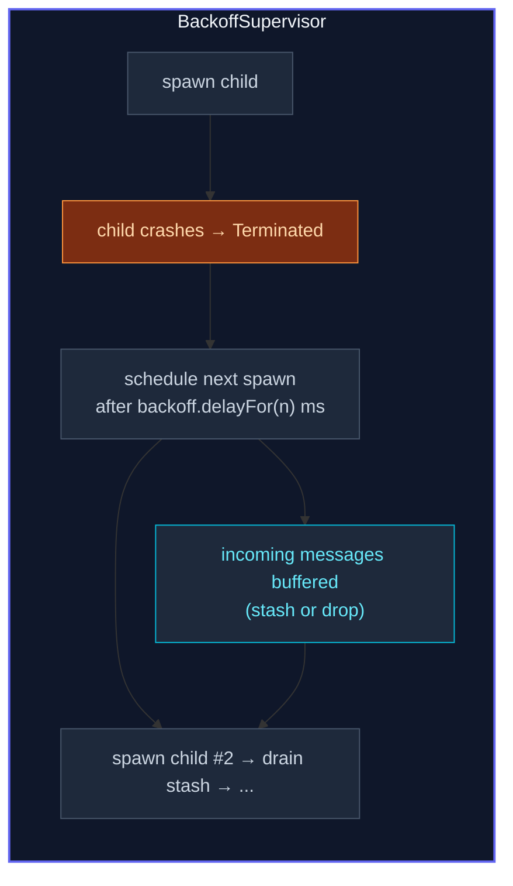

The framework's default supervisor strategy restarts a child up to
10 times a minute.  For transient failures, that can mean
**hammering a broken dependency** — a broker that's reconnecting,
a DB that's recovering — with restart-after-restart, each crashing
identically.

**`BackoffSupervisor`** is the alternative.  It wraps a single
child actor and reschedules its restart with an exponential
backoff (200 ms, 400, 800, …, clamped at a max), plus jitter so a
herd of clients doesn't synchronize.

## A minimal example

```ts
import { ActorSystem, Props, Actor, BackoffSupervisor } from 'actor-ts';

class Flaky extends Actor<{ kind: 'do-it' }> {
  override preStart(): void {
    if (Math.random() < 0.7) throw new Error('upstream not ready');
  }
  override onReceive(msg: { kind: 'do-it' }): void {
    this.log.info('ok');
  }
}

const system = ActorSystem.create('demo');

const supervisor = system.actorOf(
  BackoffSupervisor.props({
    childProps: Props.create(() => new Flaky()),
    minBackoff: 200,
    maxBackoff: 10_000,
    randomFactor: 0.2,
  }),
  'flaky-supervisor',
);

// Send messages to the supervisor — they're forwarded to the
// current child, or stashed during a backoff window.
supervisor.tell({ kind: 'do-it' });
```

The supervisor:

1. Spawns a `Flaky` child under `stoppingStrategy` (so a crash =
   a clean stop, not a default Restart).
2. Death-watches the child.
3. On `Terminated`, schedules a one-shot timer to spawn a fresh
   child after `policy.delayFor(restartCount)` ms.
4. Buffers messages arriving during the backoff window.

When the child eventually starts successfully and processes
messages, the buffered messages get flushed to it (with original
sender refs preserved for ask-style replies).

## The mechanism

Five steps, in execution order:



The framework names successive children `child-1`, `child-2`,
`child-3`, … so old terminations don't collide with new spawns.

## Configuration

The `BackoffOptions<T>` shape:

```ts
interface BackoffOptions<T> {
  childProps:        Props<T>;
  childName?:        string;
  minBackoff:        number;
  maxBackoff:        number;
  randomFactor?:     number;   // default 0.2
  policy?:           BackoffPolicy;
  resetCounter?:     ResetCounter;  // default 'after-min-stable'
  forward?:          ForwardStrategy;  // default 'stash'
  triggerOn?:        TerminationTrigger;  // default 'any'
  maxStashSize?:     number;  // default 1000
  drainGraceMs?:     number;  // default min(50, minBackoff)
  forwardDuringGrace?: boolean;  // default true
  clock?:            () => number;
}
```

The most interesting fields:

### `triggerOn`

| Value | When to respawn |
| --- | --- |
| `'any'` *(default)* | Respawn on every termination — both crashes and clean stops. |
| `'failure'` | Respawn only on crashes.  A clean `context.stopSelf()` means "this child is done"; the supervisor stops itself afterwards. |
| `'stop'` | Respawn only on clean stops (e.g. a transient connection actor that periodically tears itself down).  Crashes propagate up. |

`'failure'` is the right default if you're modelling "restart on
unexpected death" — a clean self-stop is a deliberate choice the
supervisor should honor.  `'any'` restarts on every termination —
the broadest possible policy, useful when the supervisor doesn't
care why the child stopped.

### `forward` — what to do with messages while the child is dead

```ts
forward: 'stash',   // buffer up to maxStashSize, drain after respawn
// or
forward: 'drop',    // discard silently (debug-logged)
```

Stashing preserves sender refs so ask-replies continue to work
after the respawn — a message asked while the child was down still
gets its reply once the new child handles it.

Dropping is the right call for "transient pings that aren't worth
keeping" — telemetry, heartbeats, where stale messages are worse
than lost ones.

### `resetCounter`

```ts
resetCounter: 'after-min-stable',          // reset when child alive >= minBackoff (default)
resetCounter: 'never',                     // never reset (counter grows monotonically)
resetCounter: { kind: 'after-time', ms: 60_000 },   // reset after 60s alive
```

Without resetting, a child that fails after a long-stable period
gets the *same* long backoff as after a recent crash — which is
usually wrong (the long-running success suggests the failure is
fresh).  `'after-min-stable'` resets the count when the child has
been alive for at least `minBackoff`, so a normal short backoff
restarts after a long-running success.

### `drainGraceMs` + `forwardDuringGrace`

After a respawn, the supervisor waits up to `drainGraceMs` (50 ms
default) before draining the stash to the new child.  This
protects against children that crash in `preStart`:

- If the child dies during the grace window, the stash is held
  back for the *next* incarnation — stashed messages aren't lost
  to dead-letters when the child keeps crashing on startup.

`forwardDuringGrace: true` (default) sends *new* messages
immediately during the grace; `forwardDuringGrace: false` stashes
them until grace expires.  The default trades a tiny risk of
dead-lettering during a preStart-crash for lower latency on the
happy path.

## Custom backoff policy

```ts
import { BackoffSupervisor, linearBackoff } from 'actor-ts';

BackoffSupervisor.props({
  childProps: ...,
  minBackoff: 500,
  maxBackoff: 10_000,
  policy: linearBackoff({ minMs: 500, maxMs: 10_000, stepMs: 500 }),
});
```

Override the default exponential backoff with any
[`BackoffPolicy`](/patterns/backoff-policy/) — linear,
fibonacci, custom.  `minBackoff` / `maxBackoff` are still
required (they're advisory caps; the framework uses them for the
`resetCounter` heuristic), but the `policy` controls the actual
delay computation.

## When to reach for BackoffSupervisor

Three good fits:

1. **Broker connections** (Kafka, NATS, AMQP) where a transient
   broker outage means the actor `connect()` fails for a few
   seconds before recovering.  Default `defaultStrategy` would
   restart aggressively; backoff smooths it out.
2. **Database actors** that hold a connection pool — when the
   DB hiccups, the actor crashes, and backoff buys time before
   re-establishing.
3. **Third-party API actors** with rate-limit-aware retries —
   when a vendor returns 429, the actor crashes; backoff waits
   before re-trying.

## When NOT to use it

import { Aside } from '@astrojs/starlight/components';

<Aside type="caution" title="Programmatic errors don't benefit from backoff">
  A child that throws on every message because of a bug in
  `onReceive` will crash the same way after every backoff delay.
  `BackoffSupervisor` is for *transient* failures — code bugs
  need a fix, not a longer wait.  Pair the supervisor with a max
  total-attempt cap (a parent that stops the supervisor after
  N respawns) so bugs surface as supervisor terminations.
</Aside>

<Aside type="caution" title="Don't put many backoff supervisors in series">
  ```ts
  // ✗ supervised supervisor supervised
  BackoffSupervisor wraps BackoffSupervisor wraps Actor
  ```
  Each level multiplies the perceived recovery delay.  Use one
  backoff supervisor at the layer where transient failures
  actually happen; have higher layers use plain supervision.
</Aside>

<Aside type="caution" title="Stash + restart in preStart">
  If the child throws in `preStart` and the stash drain hits
  immediately, every stashed message dead-letters with the dead
  child.  `drainGraceMs` and `forwardDuringGrace: false` are
  there exactly for this.  In production, leave them at defaults
  unless you've measured a problem.
</Aside>

## Compared to plain supervision

`OneForOneStrategy(decider, { maxRetries, withinTimeRangeMs })`
caps restarts at N per window but **doesn't delay between
them** — the framework restarts immediately after each crash.

`BackoffSupervisor` adds the delay-between-restarts piece plus a
message-buffering layer.  The two are complementary:

- For non-transient bugs, plain supervision with a low
  `maxRetries` is fine (give up after a few attempts and let the
  failure escalate).
- For transient infrastructure issues, backoff supervision is
  worth the extra moving parts.

You can combine them — wrap a `BackoffSupervisor`'s own
strategy with a `OneForOneStrategy(..., { maxRetries: 10 })` to
say "back off between restarts, but give up entirely after 10
attempts."

## Where to next

- **[Backoff policy](/patterns/backoff-policy/)** —
  the `exponentialBackoff` / `linearBackoff` primitives that
  produce the policy value.
- **[Supervision](/fundamentals/supervision/)** — the
  plain-supervision baseline this builds on.
- **[Circuit breaker](/patterns/circuit-breaker/)** —
  for backing off *before* a call fails (not after).
- **[Retry](/patterns/retry/)** — per-call retry with
  similar backoff math, but outside the actor world.

The [`BackoffSupervisor`](/api/classes/backoffsupervisor/)
API reference covers all options.
