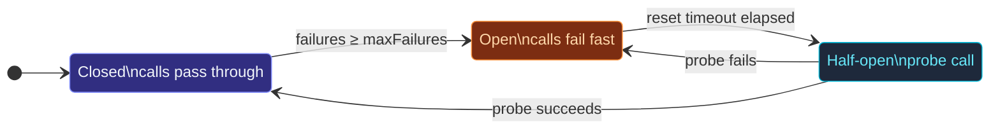

A **circuit breaker** wraps calls that might fail (a flaky HTTP
endpoint, a slow DB query, an ask to a struggling actor) and
short-circuits when failure is sustained.  Three states form a
simple state machine:



- **Closed** (start): calls pass through; failures are counted.
- **Open**: calls fail immediately with `CircuitBreakerOpenError`;
  no traffic reaches the downstream.
- **Half-open**: the first call after the reset timeout is allowed
  through.  Success → closed.  Failure → open again.

## A minimal example

```ts
import { CircuitBreaker, CircuitBreakerOpenError } from 'actor-ts';

const breaker = new CircuitBreaker({
  maxFailures:    5,        // open after 5 consecutive failures
  resetTimeoutMs: 30_000,   // try a probe after 30s
  callTimeoutMs:  2_000,    // any call > 2s counts as a failure
});

try {
  const data = await breaker.call(() => fetch('https://flaky.example/items'));
  // closed → call passed through
} catch (e) {
  if (e instanceof CircuitBreakerOpenError) {
    // breaker is open — don't even try the upstream
  } else {
    // either the call itself failed, or it timed out
  }
}
```

The breaker doesn't care *what* the call is — anywhere you have a
function returning a `Promise<T>`, you can wrap it.  For
actor-to-actor calls, wrap an `ask`:

```ts
const breaker = new CircuitBreaker({ maxFailures: 3, resetTimeoutMs: 10_000 });

async function askWithBreaker(): Promise<Reply> {
  return breaker.call(() => target.ask({ kind: 'q' }, 5_000));
}
```

## The state machine in detail

### Closed → open

Each call's outcome updates a counter:

- **Success** resets the failure counter to 0.
- **Failure** increments it.  When the counter reaches
  `maxFailures` *consecutively*, the breaker transitions to open
  and records when it next allows a probe (`now + resetTimeoutMs`).

What counts as a failure:

- The promise rejects.
- The call exceeds `callTimeoutMs` (if configured) — the breaker
  rejects with `CircuitBreakerTimeoutError` and counts it as a
  failure.
- *Optional:* if `isFailure(err)` returns `false`, the error
  bypasses counting (the promise still rejects to the caller, but
  the breaker doesn't increment).  Use this for "this isn't really
  a service failure" errors — 404s, validation failures, etc.

```ts
new CircuitBreaker({
  maxFailures: 5,
  resetTimeoutMs: 30_000,
  isFailure: (err) => !(err instanceof ValidationError),
});
```

The options are validated at construction: a missing or non-positive
`maxFailures`, a negative `resetTimeoutMs`, or a non-positive
`callTimeoutMs` throws `OptionsError` (omit `callTimeoutMs` entirely to
disable the per-call timeout).

### Open → half-open

Once open, every call rejects with `CircuitBreakerOpenError`
immediately.  The breaker stays open until `Date.now() >= nextProbeAt`.
At that point, the *next* call transitions to **half-open** and is
allowed through.  This isn't a scheduled wake-up — the breaker
checks lazily on the next `call()`.

### Half-open → closed (or back to open)

The probe call either:

- **Succeeds** → breaker closes.  Counter resets.  Normal operation.
- **Fails** → breaker re-opens with a fresh `nextProbeAt`.

While in half-open, only the *one* probe is in flight.  Concurrent
calls during half-open *also* go through (the breaker doesn't
serialize), but the breaker's state transitions are driven by the
first one to complete.

## Observability

```ts
const breaker = new CircuitBreaker({ /* ... */ });

const unsubscribe = breaker.onStateChange((state) => {
  metrics.gauge('circuit_breaker.state', state);
  log.info(`circuit breaker → ${state}`);
});

// Later: `unsubscribe()` to remove.
```

Use this to wire state transitions into your logging or metrics
pipeline.  The listener fires on every transition, including
forced ones via `breaker.setState(...)`.

`breaker.state` reads the current state synchronously.

## Manual overrides

```ts
breaker.setState('open');     // force open — useful for admin "drain this dep"
breaker.setState('closed');   // force close — manual recovery
```

`setState` is mostly for tests and admin endpoints.  Production
code should rely on the natural transition path; reaching for
`setState` from regular code usually means the breaker isn't
configured right.

## Picking the numbers

Three parameters; here's how to think about them:

- **`maxFailures`** — high enough that a single transient blip
  doesn't open the breaker, low enough that a real outage opens it
  before too much traffic piles up.  3-10 is typical.  Lower for
  critical paths (open fast); higher for paths where false trips
  are expensive.
- **`resetTimeoutMs`** — long enough for the downstream to recover
  but short enough that you notice when it has.  10-60 seconds for
  typical HTTP / DB calls; sub-second only if the breaker fronts a
  truly local resource.
- **`callTimeoutMs`** — the longest the *individual call* should
  take.  If the upstream's p99 is 800 ms, set this to 2-3 s.
  Setting it lower than the upstream's normal latency means
  you're declaring everything a timeout.

## Compared to retry

A breaker and a retry helper are **complementary**, not
substitutes:

- **Retry** says "try again after a delay if this call fails."  It
  treats each call independently and burns its budget on the
  current operation.
- **Breaker** says "after enough recent failures, stop trying for
  a while."  It carries state across calls.

The right combination is **retry inside a breaker call**:

```ts
breaker.call(() => retry(
  () => fetch('https://flaky.example'),
  { attempts: 3, delayMs: 100, factor: 2 },
));
```

The retry handles the per-call resilience; the breaker handles the
"stop hammering the broken dep" coordination.  Don't put the retry
*outside* the breaker — you'd be retrying through the
`CircuitBreakerOpenError`s, which is pointless.

import { Aside } from '@astrojs/starlight/components';

<Aside type="caution" title="One breaker per logical dependency">
  ```ts
  const breaker = new CircuitBreaker(options);
  // Used for both /payments and /shipping...
  ```
  A single breaker for two unrelated dependencies trips on *either's*
  failures and locks out *both*.  Spin up one breaker per logical
  upstream — one for payments, one for shipping — and let them
  trip independently.
</Aside>

<Aside type="caution" title="Don't share a breaker across an actor restart">
  ```ts
  class MyActor extends Actor<...> {
    private readonly breaker = new CircuitBreaker(options);
    // ↑ resets on every restart
  }
  ```
  Putting the breaker on the actor means it survives only as long
  as the actor.  If you need the breaker's state to persist across
  restarts, hoist it to an extension or a parent actor and inject
  it into the constructor.
</Aside>

<Aside type="caution" title="`half-open` doesn't queue">
  Concurrent calls during half-open all go through — the breaker
  isn't a semaphore.  If "only one probe at a time" matters,
  serialize calls yourself at a layer above the breaker.
</Aside>

## Where to next

- **[Retry](/patterns/retry/)** — the complementary
  per-call retry helper.
- **[Backoff supervisor](/patterns/backoff-supervisor/)** —
  exponential-backoff restarts for an actor child.
- **[Ask pattern](/fundamentals/ask-pattern/)** — what
  you'd typically wrap when the call is actor-to-actor.

The [`CircuitBreaker`](/api/classes/circuitbreaker/) API
reference covers the full surface.
