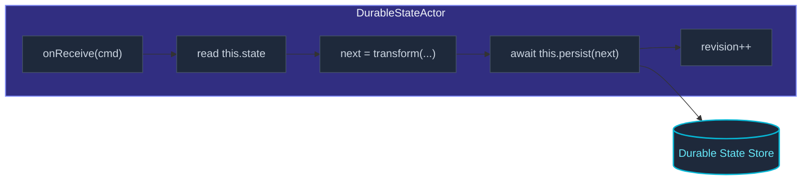

`DurableStateActor<Command, S>` is the "I just want the current value
to survive" persistence model.  No event log, no replay — just a
snapshot of the state, overwritten on each `persist(newState)`.



Compared to [`PersistentActor`](/persistence/persistent-actor/):

| Aspect | `PersistentActor` | `DurableStateActor` |
| --- | --- | --- |
| What's stored | Every event ever | The current state snapshot |
| Recovery | Replay events | Load the snapshot |
| Storage cost | Grows with events | Constant per actor |
| History | Yes | No |
| Audit / time travel | Yes | No |
| Concurrent writes | Sequential | Optimistic (revision check) |

Pick durable state when history isn't useful — feature flags,
last-known configs, "current cart contents" without the audit
trail.

## A minimal example

```ts
import { DurableStateActor, DurableStateOptions, ActorSystem, Props } from 'actor-ts';
import { InMemoryDurableStateStore } from 'actor-ts';
import { match } from 'ts-pattern';

type CartCommand =
  | { kind: 'add';    sku: string }
  | { kind: 'remove'; sku: string }
  | { kind: 'view';   replyTo: ActorRef<State> };

interface State { items: string[]; }

class Cart extends DurableStateActor<CartCommand, State> {
  constructor(options: DurableStateOptions<State>) { super(options); }

  override async onReceive(cmd: CartCommand): Promise<void> {
    await match(cmd)
      .with({ kind: 'add' },    (c) => this.persist({ items: [...this.state.items, c.sku] }))
      .with({ kind: 'remove' }, (c) => this.persist({ items: this.state.items.filter(s => s !== c.sku) }))
      .with({ kind: 'view' },   (c) => { c.replyTo.tell(this.state); })
      .exhaustive();
  }
}

// Setup:
const system = ActorSystem.create('demo');
const store  = new InMemoryDurableStateStore();

const durableStateOptions = DurableStateOptions.create<State>()
  .withPersistenceId('cart-user-42')
  .withStore(store)
  .withEmptyState(() => ({ items: [] }));
const cart = system.spawn(
  Props.create(() => new Cart(durableStateOptions)),
  'cart',
);

cart.tell({ kind: 'add', sku: 'book-1' });
cart.tell({ kind: 'add', sku: 'book-2' });
// After restart: `this.state.items` is ['book-1', 'book-2'] again.
```

## The settings

```ts
interface DurableStateOptionsType<S> {
  persistenceId: string;
  store:         DurableStateStore;
  emptyState:    () => S;
}
```

Three fields:

- **`persistenceId`** — the key under which the state is stored.
  Like `PersistentActor`, one ID per logical entity (`cart-user-42`,
  `flags-region-eu`, …).
- **`store`** — the `DurableStateStore` implementation
  (in-memory, SQLite, object-storage, custom).
- **`emptyState()`** — factory invoked when no record exists yet
  (first run, deleted state).  Provides the initial value.

Pass them through the `Props.create(() => new Cart({...}))` factory.
The settings can vary per actor incarnation (different IDs for
different users, same store).

## State access + persistence

Inside the actor's handlers:

```ts
this.state       // current state value — read anywhere
this.revision    // monotonic counter, bumped on every persist
this.persist(s)  // overwrite the stored state with `s`, returns Promise<void>
```

`this.state` is **synchronous** — the framework loads the state in
`preStart`, and `state` returns whatever's currently set in memory.
Before the first persist (or load), it returns `emptyState()`.

`this.persist(next)` writes the new state to the store with the
current revision + 1.  Returns once the store acknowledges.  Inside
`onReceive`, `await` it before treating the next state as
authoritative.

## Optimistic concurrency

```ts
try {
  await this.persist(next);
} catch (e) {
  if (e instanceof DurableStateConcurrencyError) {
    // Another writer beat us — reload and retry, or surface to the user.
  }
}
```

When two writers update the same `persistenceId` concurrently, the
store's revision check rejects the second one with
`DurableStateConcurrencyError`.  Strategies:

- **Avoid the problem** — make sure only one actor at a time writes
  to a given `persistenceId`.  This is usually trivial: each `cart-user-42`
  has one actor, on one node (via sharding or singleton).
- **Reload and retry** — catch the error, reload state, recompute
  the new value, persist again.  Works when the operation is
  idempotent.
- **Surface to caller** — reply with an error; let the caller decide
  whether to retry.

For most actor-system patterns, concurrent writes shouldn't happen
— one entity per `persistenceId`, addressed via routing or sharding.
If you see concurrency errors in production, that usually means
two actors are writing the same key, which is a routing bug.

## When durable state wins over persistent actor

Three signals you've picked the right tool:

- **The state shape is simple** (a single object, a small map).
  Overwriting the whole thing is cheap.
- **You don't need an event stream** — no projections, no audit
  log, no "show me how we got here" requirements.
- **Reads dominate writes** — every read is a synchronous
  `this.state`, no replay.

Three signals you should reach for `PersistentActor` instead:

- **History matters** — auditing, regulatory, "show the user a
  changelog."
- **State is large and changes are small** — writing the whole
  state on every change is wasteful; appending small events is
  cheaper.
- **You want projections** — read-side views that need the event
  stream.

## State migration

Like `PersistentActor`, durable state supports schema evolution
through an adapter:

```ts
import { StateAdapter } from 'actor-ts';

class V1ToV2Adapter implements StateAdapter<StateV2> {
  upcast(stored: unknown, version: number): StateV2 {
    if (version === 1) return migrate(stored as StateV1);
    return stored as StateV2;
  }
}

class Cart extends DurableStateActor<...> {
  protected stateAdapter() { return new V1ToV2Adapter(); }
}
```

The persisted record gets wrapped in a `{ _v, _t, _e }` envelope;
on load, the adapter's `upcast` runs to migrate older versions.
See [Migration overview](/persistence/migration/overview/)
for the full story.

## Encryption + compression

Per-actor overrides are available:

```ts
class Sensitive extends DurableStateActor<...> {
  protected encryption() { return { algorithm: 'aes-gcm', keyId: 'k1' }; }
  protected compression() { return { algorithm: 'gzip' }; }
}
```

Honored by stores that implement them (object-storage with
encryption, etc.); ignored by stores that don't (in-memory,
SQLite).  See
[Object storage encryption](/persistence/object-storage/encryption/)
for the durable-state encryption story.

## Common pitfalls

import { Aside } from '@astrojs/starlight/components';

<Aside type="caution" title="Forgetting to `await` persist">
  ```ts
  override onReceive(cmd) {
    this.persist(next);            // ✗ no await
    cmd.replyTo.tell('done');      // replies "done" before write completes
  }
  ```
  Without `await`, the reply happens before the state is durable.
  If the process crashes between the reply and the actual write,
  the user thinks the change was applied but it wasn't.  Always
  `await` before acknowledging a write.
</Aside>

<Aside type="caution" title="Mutating `this.state` directly">
  ```ts
  this.state.items.push(cmd.sku);    // ✗ mutates the stored reference
  await this.persist(this.state);    // persists the mutated value
  ```
  This works *accidentally* in some store implementations, but
  it's a footgun: the state object that's already loaded might
  be passed around (e.g. into a reply), and you've mutated it
  before the persist confirmed.  Build a *new* state object and
  pass it to `persist`.
</Aside>

<Aside type="caution" title="Large state, frequent updates">
  ```ts
  // 10 MB state, persisted on every keypress — bad shape.
  ```
  Durable state writes the **whole** state on every update.  For
  large states that change small amounts often, event sourcing
  is more efficient — each change is a small event appended,
  not a megabyte rewritten.
</Aside>

## Where to next

- **[Persistence overview](/persistence/overview/)** —
  the durable-state vs event-sourcing decision.
- **[PersistentActor](/persistence/persistent-actor/)** —
  when history matters.
- **[Migration overview](/persistence/migration/overview/)** —
  evolving state schemas.
- **[Object storage](/persistence/object-storage/overview/)** —
  S3 + filesystem backends for durable state.

The [`DurableStateActor`](/api/classes/durablestateactor/)
API reference covers the full surface.
