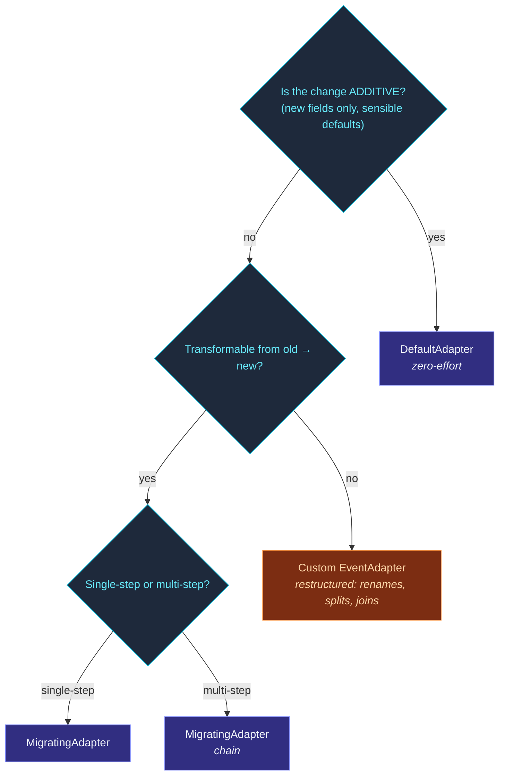

Event-sourced systems keep events **forever**.  An event written
in v1 of your code stays in the journal when v3 ships.  When v3
reads that event, the shape may be wrong: a field was renamed,
an enum gained a variant, a value was split into two.

The framework's migration toolkit answers: **"How do I evolve
event / state shapes without breaking recovery?"**

Four cooperating tools:

| Tool | When |
| --- | --- |
| **[Envelope format](/persistence/migration/envelope-format/)** | Every persisted event carries a version tag.  Enables migrating. |
| **[Schema registry](/persistence/migration/schema-registry/)** | Optional — declares known schemas + their versions. |
| **[DefaultAdapter](/persistence/migration/default-adapter/)** | Auto-fill defaults for fields added in a newer version. |
| **[MigratingAdapter](/persistence/migration/migrating-adapter/)** | Chain transformations from v1 → v2 → v3. |
| **[WrapLegacy](/persistence/migration/wrap-legacy/)** | Upgrade un-envelope'd legacy events to versioned envelopes. |

Plus a more focused page: [Recipes](/persistence/migration/recipes/)
— the cookbook of common migrations.

## The envelope

Without migration, persisted events are raw payloads:

```json
{ "kind": "deposited", "amount": 100 }
```

When you attach an adapter to the actor, the framework wraps the
event in an **envelope** at persist time:

```json
{
  "_v": 1,                                    // version
  "_t": "deposited",                          // type tag
  "_e": { "kind": "deposited", "amount": 100 } // payload
}
```

On read, the adapter sees the version + payload and **upcasts** to
the current shape before the actor's `onEvent` sees it.

See [Envelope format](/persistence/migration/envelope-format/)
for the details.

## A worked example

You ship v1:

```ts
type EventV1 = { kind: 'deposited'; amount: number };
```

The journal accumulates V1 events.  In v2, you add a `currency`:

```ts
type EventV2 = { kind: 'deposited'; amount: number; currency: string };
```

Adding `currency` to the type breaks recovery for V1 events
(which don't have the field).  Three options:

### Option A — Default

Set up a `DefaultAdapter` that fills missing fields:

```ts
class Account extends PersistentActor<...> {
  override eventAdapter() {
    return new DefaultAdapter<EventV2>({
      defaults: { currency: 'USD' },
    });
  }
}
```

V1 events read back as `{ kind: 'deposited', amount: 100, currency: 'USD' }`.
Cheap, automatic, **only works for additive changes**.

### Option B — Migrate

```ts
class Account extends PersistentActor<...> {
  override eventAdapter() {
    return new MigratingAdapter<EventV2>({
      chain: [
        // v0 → v1: identity (no change)
        // v1 → v2: add currency from a backed-out lookup
        { from: 1, to: 2, fn: (v1) => ({ ...v1, currency: lookupCurrency(v1) }) },
      ],
    });
  }
}
```

The chain runs sequentially.  V1 events flow through the `1 → 2`
step; V2 events skip it.

### Option C — Custom

For complex migrations (renaming, restructuring, splitting),
implement `EventAdapter<E>` directly:

```ts
class V1ToV2Adapter implements EventAdapter<EventV2> {
  upcast(stored: unknown, version: number): EventV2 {
    if (version === 1) return migrateV1ToV2(stored as EventV1);
    return stored as EventV2;
  }
}
```

Full control; no constraints on shape transformations.

## Picking a strategy



## State adapters

`DurableStateActor` has the same machinery via `StateAdapter`:

```ts
class Cart extends DurableStateActor<...> {
  protected stateAdapter() {
    return new DefaultAdapter<StateV2>({ defaults: { ... } });
  }
}
```

Persisted states are wrapped in the same envelope (`_v` /
`_t` / `_e`).  The same migration tools work for either kind of
persistence.

## Schema registry

For larger codebases with many event types, the **schema registry**
gives a typed registry of all known event shapes + their
versions:

```ts
import { SchemaRegistry } from 'actor-ts';

const registry = new SchemaRegistry()
  .add('Deposited', 2)
  .add('Withdrawn', 1)
  .add('AccountClosed', 1);
```

Optional — adapters work without it.  Useful when:

- You want a single source of truth for "what versions exist."
- You want runtime validation that events match a registered
  schema.
- You're building tooling that introspects schemas
  (admin dashboards, migration scripts).

See [Schema registry](/persistence/migration/schema-registry/).

## Legacy events

If your journal has events from before adapters were enabled,
they don't have envelopes — they're raw payloads.  The
**WrapLegacy** helper bridges:

```ts
import { wrapLegacy } from 'actor-ts';

const adapter = wrapLegacy<EventV2>({
  legacyVersion: 1,
  baseAdapter: new MigratingAdapter<EventV2>({ chain: [...] }),
});
```

This treats every unwrapped (raw) event as version 1, lets the
migration chain run from there.  See
[WrapLegacy](/persistence/migration/wrap-legacy/).

## Operational rollout

Migrations are usually rolled out in phases:

1. **Code change** — add the adapter, deploy with the new version
   able to read old + new.
2. **Verify** — recover several persistenceIds; ensure no errors
   on either old or new events.
3. **Start writing v2 events** — your `onCommand` produces V2-shaped
   events (the adapter doesn't get involved on the write path).
4. **(Optional) Schema cleanup** — once enough V2 events
   accumulate and snapshots cover the V1 events, you can simplify
   the chain by removing very-old version steps if you've
   confirmed no V1 events remain.

For rolling deployments without downtime, see
[Rolling migration](/operations/upgrades/rolling-migration/)
and [Recipes](/persistence/migration/recipes/).

## Where to next

- **[Envelope format](/persistence/migration/envelope-format/)** —
  the on-disk format.
- **[DefaultAdapter](/persistence/migration/default-adapter/)** —
  zero-config additive migrations.
- **[MigratingAdapter](/persistence/migration/migrating-adapter/)** —
  chained version transformations.
- **[WrapLegacy](/persistence/migration/wrap-legacy/)** —
  bring pre-envelope events into the system.
- **[Schema registry](/persistence/migration/schema-registry/)** —
  the typed schema catalog.
- **[Recipes](/persistence/migration/recipes/)** — the
  decision-tree cookbook.
- **[Rolling migration](/operations/upgrades/rolling-migration/)** —
  deploying these changes without downtime.
