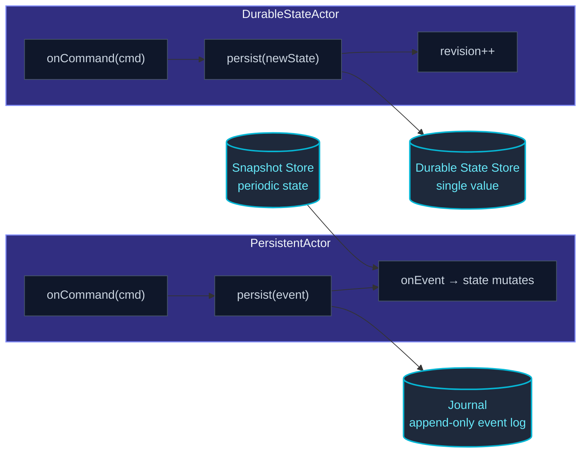

By default, actor state lives in memory.  When an actor crashes
and restarts, every field starts fresh.  For state that should
survive — user accounts, shopping carts, order workflows, anything
beyond the current request — you need **persistence**.

actor-ts offers two complementary models:

| Model | What you persist | When |
| --- | --- | --- |
| **Event sourcing** (`PersistentActor`) | A **log of events** — every state-changing fact ever observed. | Audit trails, time travel, projections, when "how did we get here" matters. |
| **Durable state** (`DurableStateActor`) | A **single snapshot** — the current state, overwritten on each update. | When the current value is all you need and history isn't useful. |

Both replay or restore on actor startup, so the resurrected actor
picks up where the last one left off.

## The big picture



The journal and the durable-state store are **pluggable**.  The
framework ships:

| Backend | Journal | Durable state | Snapshot store |
| --- | --- | --- | --- |
| In-memory | ✓ | ✓ | ✓ |
| SQLite (Bun + better-sqlite3) | ✓ | ✓ | ✓ |
| Cassandra | ✓ | — | — |
| Filesystem / S3 (object storage) | — | ✓ | ✓ |

Plus an extension point — implement the `Journal` /
`DurableStateStore` / `SnapshotStore` interfaces for your own
storage.

## Event sourcing in five minutes

```ts
import { Actor, PersistentActor, ActorSystem } from 'actor-ts';

type Cmd =
  | { kind: 'deposit'; amount: number }
  | { kind: 'withdraw'; amount: number };

type Event =
  | { kind: 'deposited'; amount: number; ts: number }
  | { kind: 'withdrawn'; amount: number; ts: number };

interface State { balance: number; }

class Account extends PersistentActor<Cmd, Event, State> {
  readonly persistenceId = 'account-42';

  initialState(): State { return { balance: 0 }; }

  // Pure: state + event → new state.  Replayed during recovery.
  onEvent(state: State, e: Event): State {
    if (e.kind === 'deposited') return { balance: state.balance + e.amount };
    if (e.kind === 'withdrawn') return { balance: state.balance - e.amount };
    return state;
  }

  // Validates command, persists event, runs side effects post-persist.
  onCommand(state: State, cmd: Cmd): void {
    if (cmd.kind === 'deposit') {
      this.persist({ kind: 'deposited', amount: cmd.amount, ts: Date.now() },
        (next) => { /* side effects with the persisted-and-applied state */ });
    } else if (cmd.kind === 'withdraw') {
      if (state.balance < cmd.amount) {
        // Reject — don't persist anything.
        return;
      }
      this.persist({ kind: 'withdrawn', amount: cmd.amount, ts: Date.now() },
        () => {});
    }
  }
}
```

Three methods do all the work:

- **`onCommand`** — validates the request.  Decides what event(s) to
  persist via `this.persist(event, cb)`.  Side effects go in `cb`.
- **`onEvent`** — pure function from state + event to new state.
  **No side effects** here — this function runs during recovery to
  replay the journal, possibly many times.
- **`initialState`** — what the state looks like before any events.

On startup, the framework reads every event for `account-42`
from the journal, replays them through `onEvent`, and the
resulting state is what `onCommand` sees.  Commands aren't
processed until recovery completes.

See [PersistentActor](/persistence/persistent-actor/) for
the full surface.

## Durable state in five minutes

```ts
import { DurableStateActor } from 'actor-ts';

interface State { items: string[]; }

class Cart extends DurableStateActor<CartCmd, State> {
  constructor(settings: DurableStateSettings<State>) { super(settings); }

  override async onReceive(cmd: CartCmd): Promise<void> {
    if (cmd.kind === 'add') {
      const next: State = { items: [...this.state.items, cmd.sku] };
      await this.persist(next);   // overwrites the stored state
    } else if (cmd.kind === 'view') {
      cmd.replyTo.tell(this.state);
    }
  }
}
```

`persist(newState)` overwrites the stored snapshot.  On restart,
`preStart` loads it back; `this.state` reflects the loaded value.
No event log; no replay; just "save the current state."

See [DurableStateActor](/persistence/durable-state/) for
the full API.

## Event sourcing vs durable state — picking one

The honest decision tree:

```
Do you need a history of state changes (audit, undo, projections)?
├── Yes → PersistentActor.
└── No.
    Is the state shape simple and the volume small enough that
    "rewrite the full thing on every change" is fine?
    ├── Yes → DurableStateActor.
    └── No → PersistentActor anyway (only changes get appended).
```

Event sourcing wins when:

- **History matters** — auditing, regulatory compliance, "show me
  how we got here," projections.
- **State is large** but changes are small — appending a 100-byte
  event is cheaper than writing the whole state.
- **You want projections** — read-side views over the event
  stream, see [Projections](/persistence/projections/).
- **Schema evolution is a long game** — event types can be
  migrated independently from current state.

Durable state wins when:

- **History isn't useful** — the current value is all you need.
- **State is small and simple** — overwriting is cheap.
- **You want optimistic concurrency** — durable state stores have
  a revision counter; concurrent writes raise
  `DurableStateConcurrencyError`.

Many production systems mix them — durable state for the
configuration-style "single current value" things, event-sourcing
for the workflow-style "history-of-decisions" things.

## Snapshots

Replaying 100 000 events at startup is slow.  Snapshots cut the
replay window:

```ts
class Account extends PersistentActor<Cmd, Event, State> {
  // ...
  override snapshotPolicy() { return everyNEvents(100); }
  // After every 100 events, the current state is written as a snapshot.
}
```

On startup, the framework:

1. Loads the latest snapshot (if any).
2. Replays events *from after that snapshot's seqNr onward*.

A 100-event window is fast.  Pick the snapshot interval based on
your event rate and acceptable startup time.

See [Snapshots](/persistence/snapshots/) for the
configuration and per-actor policy options.

## Projections — read-side views

A `PersistentActor` writes events.  A **projection** consumes
them, building a derived view tailored for queries:

```ts
import { ProjectionActor } from 'actor-ts';

class CartView extends ProjectionActor<CartEvent> {
  readonly persistenceId = 'view-cart-summary';
  readonly tag = 'cart';

  async handleEvent(event: CartEvent, seqNr: number): Promise<void> {
    if (event.kind === 'added') {
      await this.db.execute('INSERT INTO cart_items ...');
    }
    // ...
  }
}
```

The projection subscribes to events tagged `'cart'` from the
journal, processes them in order, persists its own progress
(so a restart resumes from the right offset).

This decouples writes (the `PersistentActor`'s journal) from
reads (the projection's view) — the read side can be denormalized
for the query patterns it serves.

See [Projections](/persistence/projections/) for the
full pattern.

## Pluggable backends

The framework defines three interfaces:

```ts
interface Journal {
  // append events, read events, query by tag
}

interface DurableStateStore {
  // load, persist with revision, delete
}

interface SnapshotStore {
  // save snapshot, load latest, delete older
}
```

Built-in implementations live under
[`persistence/journals/*`](/persistence/journals/in-memory/)
and [`persistence/snapshot-stores/*`](/persistence/snapshot-stores/in-memory/).

For production, the **SQLite** journal+snapshot+state combo
covers single-node deployments; the **Cassandra** journal covers
multi-node clusters where the journal must be shared.

## When NOT to persist

import { Aside } from '@astrojs/starlight/components';

<Aside type="caution" title="Cache-like actors">
  ```ts
  class Cache extends PersistentActor<...> {
    // ✗ if the cache is rebuildable, don't persist it
  }
  ```
  A cache by definition can be rebuilt from a source of truth.
  Persisting the cache means you've doubled the storage cost
  with no recovery benefit beyond "warm restart."  Use plain
  Actor + an external cache (Redis, Memcached) for that.
</Aside>

<Aside type="caution" title="Tiny state with no failover requirement">
  An actor that holds 100 bytes of state in a process you control
  the restart of (e.g. a CLI tool) probably doesn't need
  persistence.  Persistence has setup cost (journal config, store
  selection, schema management); skip it when the state's
  recovery requirement is "user re-runs the command."
</Aside>

<Aside type="caution" title="Pure transformation actors">
  An actor whose job is "take input, transform, send output" with
  no persistent internal state has nothing to persist.  Plain
  `Actor` is the right base; `PersistentActor` adds machinery
  you'd never use.
</Aside>

## Where to next

- **[PersistentActor](/persistence/persistent-actor/)** —
  the event-sourcing API in depth.
- **[Durable state](/persistence/durable-state/)** —
  the simpler snapshot-style alternative.
- **[Snapshots](/persistence/snapshots/)** — replay-window
  reduction for event-sourced actors.
- **[Projections](/persistence/projections/)** — read-side
  views built from event streams.
- **[Journals — In-memory](/persistence/journals/in-memory/)** —
  the tests/dev default.
- **[Journals — SQLite](/persistence/journals/sqlite/)** —
  single-node production default.
- **[Migration overview](/persistence/migration/overview/)** —
  evolving event/state schemas over time.

The [`PersistentActor`](/api/classes/persistentactor/) and
[`DurableStateActor`](/api/classes/durablestateactor/) API
references cover the full base-class surface.
