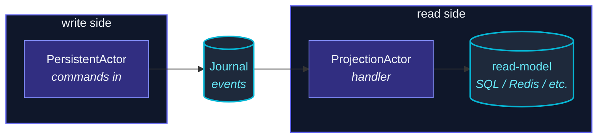

A `PersistentActor` writes events.  A **projection** consumes
them, building a **read-side view** tailored for queries:



The journal is **append-only and authoritative**.  Projections
are derived — they can be rebuilt from scratch by replaying the
journal.  This decouples write throughput (durable, append-only)
from read throughput (denormalized, query-optimized).

## A minimal example

```ts
import { ProjectionActor, ByTagProjectionOptions } from 'actor-ts';
import { SqliteQuery } from 'actor-ts';

type AccountEvent =
  | { kind: 'deposited'; amount: number }
  | { kind: 'withdrawn'; amount: number };

const projection = ProjectionActor.byTag<AccountEvent>(system, ByTagProjectionOptions.create<AccountEvent>()
  .withName('account-balance-view')
  .withTag('account')
  .withQuery(new SqliteQuery({ path: '/var/lib/events.db' }))
  .withOffsetStore(new SqliteOffsetStore({ path: '/var/lib/offsets.db' }))
  .withHandle(async (event) => {
    if (event.event.kind === 'deposited') {
      await viewDb.execute(
        'UPDATE balances SET balance = balance + ? WHERE pid = ?',
        [event.event.amount, event.persistenceId],
      );
    }
  }));
```

The actor:

1. Loads its **offset cursor** from the offset store on
   `preStart`.
2. Polls the **query layer** for events matching `tag` from the
   cursor onwards.
3. Calls `handle` for each event.
4. Persists the new cursor.
5. Repeats.

## Two query shapes

| Factory | Cursor type | Use |
| --- | --- | --- |
| **`ProjectionActor.byPersistenceId(...)`** | sequenceNr (per pid) | Read one entity's full history. |
| **`ProjectionActor.byTag(...)`** | Offset (timestamp + tiebreaker) | Read everything tagged `<tag>` across the journal. |

Tag-based is the common case — the `PersistentActor` calls
`tagsFor(event)` to label events; the projection subscribes to
the tag.  Per-pid is useful for narrow views (one user's
activity).

## At-least-once delivery

```ts
// Crash recovery sequence:
//   1. Save offset cursor at value N.
//   2. Handler processes event N+1.
//   3. Crash before saving cursor.
//   4. On restart: cursor is still N → handler re-receives event N+1.
```

If the handler runs but the cursor isn't persisted, the projection
**re-processes the same event** on restart.  This is **at-least-once
delivery** — the framework guarantees no event is missed, but
duplicates are possible.

Handlers must be **idempotent**:

- **UPSERT** into the read model (not blind `INSERT`).
- **Track processed event IDs** in the read model itself for dedup.
- **Use the event's `sequenceNr` as a per-pid dedup key** — never
  decreases, monotonic per persistenceId.

If you can't make the handler idempotent, the projection has to
participate in a 2-phase commit with the offset save — much more
complex, not provided out of the box.

## OffsetStore

```ts
import { InMemoryOffsetStore, SqliteOffsetStore } from 'actor-ts';

// Default (lost on restart):
new InMemoryOffsetStore();

// Production (single-node):
new SqliteOffsetStore({ path: '/var/lib/offsets.db' });
```

The cursor is just a number (or compound offset) — stored per
projection name + scope.  Implementations:

- `InMemoryOffsetStore` — fine for tests, useless in production
  (every restart re-processes from the beginning).
- `SqliteOffsetStore` — single-file durable offsets.
- Custom — implement `OffsetStore` against your own store (Redis,
  Postgres, whatever your read-model uses).

For real production setups, **co-locate the offset store with
the read model** so they crash together — that minimizes the
re-processing window.

## Polling

```ts
ProjectionActor.byTag(system, ByTagProjectionOptions.create()
  .withName('...')
  .withTag('...')
  .withLiveOptions({
    pollIntervalMs: 500,    // default 1000 ms
  })
  /* .withQuery(...).withOffsetStore(...).withHandle(...) */);
```

The projection polls.  At idle, polling cost is one journal query
per `pollIntervalMs`.  Tuning:

- Lower (250-500 ms) → faster end-to-end propagation, more
  database load.
- Higher (5-10 s) → slow visibility but cheap.

For very-low-latency read-model updates, see
[Push-based query](/persistence/push-based-query/) which
gets sub-poll-interval delivery via the in-process event bus.

## Per-pid projections

```ts
const projection = ProjectionActor.byPersistenceId<AccountEvent>(system, ByPidProjectionOptions.create<AccountEvent>()
  .withName('account-42-view')
  .withPersistenceId('account-42')
  .withQuery(query)
  .withOffsetStore(offsetStore)
  .withHandle(async (event) => {
    // ... handle just this account's events
  }));
```

One actor per persistenceId.  Useful for **per-entity views**:

- A "user activity timeline" projection per user.
- A "per-order audit trail" projection per order.

For large numbers of pids, this is **not** how to scale —
spawning a projection per pid doesn't scale to millions of users.
For that, use a single tag-based projection that hashes by pid.

## Multiple projections, same journal

```ts
// Three projections, three offset cursors, three independent views:
ProjectionActor.byTag<E>(system, ByTagProjectionOptions.create<E>().withName('balance') /* .withTag(...).withQuery(...).withHandle(...) */);
ProjectionActor.byTag<E>(system, ByTagProjectionOptions.create<E>().withName('audit-log') /* .withTag(...).withQuery(...).withHandle(...) */);
ProjectionActor.byTag<E>(system, ByTagProjectionOptions.create<E>().withName('monthly-stats') /* .withTag(...).withQuery(...).withHandle(...) */);
```

Each has its own offset cursor; they read independently from the
journal.  This is the **strength** of event sourcing — one event
stream, many derived views, none coupled to the other.

import { Aside } from '@astrojs/starlight/components';

<Aside type="caution" title="Idempotency is not optional">
  ```ts
  await db.execute('INSERT INTO events (...) VALUES (...)');   // ✗ duplicates on retry
  ```
  Without idempotency, **at-least-once becomes "occasionally
  duplicate."**  The retry happens on every restart that has a
  pending handler.  Use UPSERT, or include the event's sequenceNr
  in the row and dedup at write time.
</Aside>

<Aside type="caution" title="Rebuilding from scratch">
  ```bash
  # To rebuild a projection from the start:
  DELETE FROM offsets WHERE projection_name = 'balance';
  # Or pass a fresh OffsetStore on next start.
  ```
  Resetting the offset replays every event for that tag.  For
  large journals, this can take a while.  Sometimes intentional
  (schema migration of the read model); usually not what you
  want at random.
</Aside>

<Aside type="caution" title="Slow handlers stall the projection">
  ```ts
  async handle(event) {
    await callSlowExternalService();   // 500ms per event
  }
  ```
  Handler latency directly limits throughput.  At 500 ms/event,
  the projection processes 2 events/sec.  For high-throughput
  journals, parallelize inside the handler (Promise.all) or split
  the work into multiple projections.
</Aside>

## Where to next

- **[Persistence overview](/persistence/overview/)** —
  the bigger picture.
- **[PersistentActor](/persistence/persistent-actor/)** —
  what produces the events.
- **[Persistence query](/persistence/persistence-query/)** —
  the read-side API the projection uses.
- **[Push-based query](/persistence/push-based-query/)** —
  sub-poll-interval delivery via the event bus.

The [`ProjectionActor`](/api/classes/projectionactor/) API
reference covers all settings.
