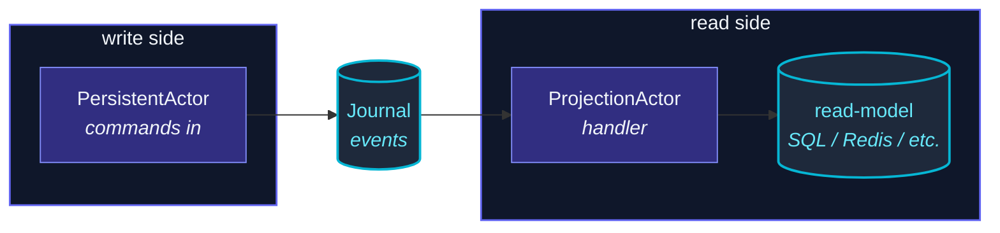

A `PersistentActor` writes events.  A **projection** consumes
them, building a **read-side view** tailored for queries:


```mermaid
flowchart LR
  subgraph WRITE["write side"]
    direction LR
    PA["PersistentActor<br/><i>commands in</i>"]
  end
  JOURNAL[("Journal<br/><i>events</i>")]
  subgraph READ["read side"]
    direction LR
    PROJ["ProjectionActor<br/><i>handler</i>"]
    MODEL[("read-model<br/><i>SQL / Redis / etc.</i>")]
  end
  PA --> JOURNAL --> PROJ --> MODEL
  classDef section fill:#0f172a,stroke:#6366f1,stroke-width:1.5px,color:#f1f5f9;
  classDef actor   fill:#312e81,stroke:#818cf8,color:#f1f5f9;
  classDef store   fill:#1e293b,stroke:#06b6d4,stroke-width:2px,color:#67e8f9;
  class WRITE,READ section
  class PA,PROJ actor
  class JOURNAL,MODEL store
```

The journal is **append-only and authoritative**.  Projections
are derived — they can be rebuilt from scratch by replaying the
journal.  This decouples write throughput (durable, append-only)
from read throughput (denormalized, query-optimized).

## A minimal example

```ts
import { match } from 'ts-pattern';
import { ProjectionActor, ByTagProjectionOptions } from 'actor-ts/persistence';
import { SqliteJournal, SqliteJournalOptions, SqliteQuery, InMemoryOffsetStore } from 'actor-ts/persistence';

type AccountEvent =
  | { kind: 'deposited'; amount: number }
  | { kind: 'withdrawn'; amount: number };

// The read side queries the SAME journal your PersistentActors write to —
// SqliteQuery wraps a SqliteJournal instance (not a path).
const eventsJournal = new SqliteJournal(SqliteJournalOptions.create().withPath('/var/lib/events.db'));

const byTagProjectionOptions = ByTagProjectionOptions.create<AccountEvent>()
  .withName('account-balance-view')
  .withTag('account')
  .withQuery(new SqliteQuery(eventsJournal))
  .withOffsetStore(new InMemoryOffsetStore())
  .withHandle(async (event) => {
    await match(event.event)
      .with({ kind: 'deposited' }, (e) => viewDb.execute(
        'UPDATE balances SET balance = balance + ? WHERE pid = ?',
        [e.amount, event.persistenceId],
      ))
      .otherwise(() => Promise.resolve());
  });
const projection = ProjectionActor.byTag<AccountEvent>(system, byTagProjectionOptions);
```

The actor:

1. Loads its **offset cursor** from the offset store on
   `preStart`.
2. Polls the **query layer** for events matching `tag` from the
   cursor onwards.
3. Calls `handle` for each event.
4. Persists the new cursor.
5. Repeats.

## Two query shapes

| Factory | Cursor type | Use |
| --- | --- | --- |
| **`ProjectionActor.byPersistenceId(...)`** | sequenceNr (per pid) | Read one entity's full history. |
| **`ProjectionActor.byTag(...)`** | Offset (timestamp + tiebreaker) | Read everything tagged `<tag>` across the journal. |

Tag-based is the common case — the `PersistentActor` calls
`tagsFor(event)` to label events; the projection subscribes to
the tag.  Per-pid is useful for narrow views (one user's
activity).

`tagsFor` is asked **per event**, so a projection filtering on a tag
sees exactly the events that carry it — including when the events
were written together by one `persistAll`.

### Filtering on more than one tag

`withTag` accepts a **`TagFilter`**, so a projection is not limited to a
single tag:

```ts
import type { TagFilter } from 'actor-ts/persistence';

const eitherOne: TagFilter = { any: ['debit', 'credit'] };
const bothOfThem: TagFilter = { all: ['account', 'production'] };
const allButCancelled: TagFilter = { all: ['orders'], not: ['cancelled'] };

const byTagProjectionOptions = ByTagProjectionOptions.create<AccountEvent>()
  .withName('open-orders-view')
  .withTag(allButCancelled);
```

Each operator is optional and they combine with AND.  An empty `{}`
matches every event.

**The filter is part of the cursor identity.**  A bare string keeps the
cursor it already has, but the two spellings do not share one:
`.withTag('orders')` stores its offset under `orders`, while
`.withTag({ all: ['orders'] })` stores it under `all(orders)`.  Both
select the same events, so rewriting one as the other looks harmless —
and it silently replays the projection from the beginning.  Pick a
spelling before the projection first runs, and keep it.

## At-least-once delivery

```ts
// Crash recovery sequence:
//   1. Save offset cursor at value N.
//   2. Handler processes event N+1.
//   3. Crash before saving cursor.
//   4. On restart: cursor is still N → handler re-receives event N+1.
```

If the handler runs but the cursor isn't persisted, the projection
**re-processes the same event** on restart.  This is **at-least-once
delivery** — the framework guarantees no event is missed, but
duplicates are possible.

Handlers must be **idempotent**:

- **UPSERT** into the read model (not blind `INSERT`).
- **Track processed event IDs** in the read model itself for dedup.
- **Use the event's `sequenceNr` as a per-pid dedup key** — never
  decreases, monotonic per persistenceId.

If you can't make the handler idempotent, the projection has to
participate in a 2-phase commit with the offset save — much more
complex, not provided out of the box.

## When the handler throws

The cursor only advances after `handle` returns, so a failing
handler is **head-of-line blocking** by construction: every later
event waits behind the one that failed.  `recoveryStrategy` decides
how long that lasts.

| Strategy | Retries | Then | Pick it when |
| --- | --- | --- | --- |
| **`retry-and-fail`** *(default)* | yes | stops the projection | A silently stale view is worse than an obviously stopped one. |
| **`retry-and-skip`** | yes | steps past the event | Liveness beats completeness — a dashboard, a search index. |
| **`fail`** | no | stops immediately | The handler already retries internally. |
| **`skip`** | no | steps past immediately | Some events are simply expected to be undeliverable. |

```ts
const byTagProjectionOptions = ByTagProjectionOptions.create<AccountEvent>()
  .withName('account-balance-view')
  .withTag('account')
  .withRecoveryStrategy('retry-and-skip')
  .withMaxRetries(5)
  .withRetryBackoffMs(2_000)
  .withMaxRetryBackoffMs(60_000)
  .withOnFailure((failure) => {
    console.error(
      `${failure.projection}: ${failure.event.persistenceId}#${failure.event.sequenceNr} `
      + `→ ${failure.action} (attempt ${failure.attempt})`,
      failure.error,
    );
  });
```

Retries are **not immediate**.  The next attempt is deferred by
`retryBackoffMs`, doubling each time up to `maxRetryBackoffMs`.
`maxRetries` counts attempts *after* the first, so the default of 3
means a bad event reaches the handler four times before the
projection gives up on it.

### What a failure produces

- **`onFailure`** — called on every attempt with the offending
  `PersistentEvent`, the error, the attempt number, and the action
  taken (`retry` / `skip` / `stop`).  This is the structured signal;
  wire it to your alerting.  A hook that throws is logged and
  swallowed — a broken reporter cannot take the projection with it.
- **A dead letter** — a skipped event is published on the system
  event stream wrapped in a `DeadLetter` naming the projection as its
  recipient, so nothing vanishes without a trace:

  ```ts
  import { DeadLetter } from 'actor-ts';

  system.eventStream.subscribe(auditRef, DeadLetter);
  ```

  Publishing is all that happens by default — with no subscriber the
  event is gone.  Turning on the
  [dead-letter queue](/operations/dead-letters/) keeps skipped events
  instead, filterable by the projection that skipped them and
  replayable once the handler is fixed.

- **Metrics** — `persistence_projection_stalled`,
  `persistence_projection_failures_total` and
  `persistence_projection_events_skipped_total`; see
  [Stock metrics](/observability/metrics/stock-metrics/).
- **Logs** — one error line when a failure streak opens and one when
  it ends.  The retries in between go to `debug`, so a projection
  stuck for a day costs two error lines instead of one per poll.

`fail` **stops the actor** rather than letting the error escape the
tick.  That is deliberate: the projection group's supervisor
restarts its children, so an escaping error would reload the same
cursor and fail on the same event — a restart loop, which is louder
than the spin it replaced and no more useful.

A stopped projection keeps its cursor, so fixing the cause and
starting it again resumes at exactly the event that failed.

## OffsetStore

```ts
import { InMemoryOffsetStore, DurableStateOffsetStore } from 'actor-ts/persistence';

// Default (lost on restart):
new InMemoryOffsetStore();

// Durable — persist the cursor in any DurableStateStore (Postgres,
// MariaDB, libSQL, SQL Server, MongoDB, DynamoDB, object-storage), so a restart resumes:
new DurableStateOffsetStore(durableStateStore);
```

The cursor is just a number (or compound offset) — stored per
projection name + scope.  Implementations:

- `InMemoryOffsetStore` — fine for tests, useless in production
  (every restart re-processes from the beginning).
- `DurableStateOffsetStore` — wraps any `DurableStateStore` (Postgres,
  MariaDB, libSQL, SQL Server, MongoDB, DynamoDB, object-storage) so offsets survive restarts.
- Custom — implement `OffsetStore` against your own store (Redis,
  whatever your read-model uses).

For real production setups, **co-locate the offset store with
the read model** so they crash together — that minimizes the
re-processing window.

## Polling

```ts
const byTagProjectionOptions = ByTagProjectionOptions.create()
  .withName('...')
  .withTag('...')
  .withLiveOptions({
    pollIntervalMs: 500,    // default 1000 ms
  });
ProjectionActor.byTag(system, byTagProjectionOptions
  /* .withQuery(...).withOffsetStore(...).withHandle(...) */);
```

The projection polls.  At idle, polling cost is one journal query
per `pollIntervalMs`.  Tuning:

- Lower (250-500 ms) → faster end-to-end propagation, more
  database load.
- Higher (5-10 s) → slow visibility but cheap.

For very-low-latency read-model updates, see
[Push-based query](/persistence/push-based-query/) which
gets sub-poll-interval delivery via the in-process event bus.

## Per-pid projections

```ts
const byPidProjectionOptions = ByPersistenceIdProjectionOptions.create<AccountEvent>()
  .withName('account-42-view')
  .withPersistenceId('account-42')
  .withQuery(query)
  .withOffsetStore(offsetStore)
  .withHandle(async (event) => {
    // ... handle just this account's events
  });
const projection = ProjectionActor.byPersistenceId<AccountEvent>(system, byPidProjectionOptions);
```

One actor per persistenceId.  Useful for **per-entity views**:

- A "user activity timeline" projection per user.
- A "per-order audit trail" projection per order.

For large numbers of pids, this is **not** how to scale —
spawning a projection per pid doesn't scale to millions of users.
For that, use a single tag-based projection that hashes by pid.

### Fan-out: starting one as each entity appears

A per-pid projection has to know its pid up front, which is fine
for a fixed set and useless for a growing one.  `allPersistenceIds`
closes that gap — it is a live stream of every id the journal has
seen, plus each new one as it first appears:

```ts
for await (const persistenceId of query.allPersistenceIds()) {
  const options = ByPersistenceIdProjectionOptions.create<AccountEvent>()
    .withName(`view-${persistenceId}`)
    .withPersistenceId(persistenceId)
    .withQuery(query)
    .withOffsetStore(offsetStore)
    .withHandle(async (event) => { /* ... */ });
  ProjectionActor.byPersistenceId<AccountEvent>(system, options);
}
```

Two caveats, and they are the same ones the per-pid shape already
had, just made visible:

- The loop **never ends**, so run it in its own task and break out
  on shutdown.
- One actor per entity is still one actor per entity.  Fan-out is
  for hundreds or thousands of long-lived entities, not for
  millions of short-lived ones — there, a tag projection is the
  answer.

For a **one-shot** sweep instead of a live one — a backfill over
the entities that exist right now — use
`currentPersistenceIdsPaginated`, which completes when the journal
is exhausted and holds one page at a time rather than the whole id
list.  See [Persistence query](/persistence/persistence-query/).

## Multiple projections, same journal

```ts
// Three projections, three offset cursors, three independent views:
const byTagProjectionOptions = ByTagProjectionOptions.create<E>().withName('balance');
ProjectionActor.byTag<E>(system, byTagProjectionOptions /* .withTag(...).withQuery(...).withHandle(...) */);
const byTagProjection2Options = ByTagProjectionOptions.create<E>().withName('audit-log');
ProjectionActor.byTag<E>(system, byTagProjection2Options /* .withTag(...).withQuery(...).withHandle(...) */);
const byTagProjection3Options = ByTagProjectionOptions.create<E>().withName('monthly-stats');
ProjectionActor.byTag<E>(system, byTagProjection3Options /* .withTag(...).withQuery(...).withHandle(...) */);
```

Each has its own offset cursor; they read independently from the
journal.  This is the **strength** of event sourcing — one event
stream, many derived views, none coupled to the other.

import { Aside } from '@astrojs/starlight/components';

<Aside type="caution" title="Idempotency is not optional">
  ```ts
  await db.execute('INSERT INTO events (...) VALUES (...)');   // ✗ duplicates on retry
  ```
  Without idempotency, **at-least-once becomes "occasionally
  duplicate."**  The retry happens on every restart that has a
  pending handler.  Use UPSERT, or include the event's sequenceNr
  in the row and dedup at write time.
</Aside>

<Aside type="caution" title="Rebuilding from scratch">
  ```bash
  # To rebuild a projection from the start:
  DELETE FROM offsets WHERE projection_name = 'balance';
  # Or pass a fresh OffsetStore on next start.
  ```
  Resetting the offset replays every event for that tag.  For
  large journals, this can take a while.  Sometimes intentional
  (schema migration of the read model); usually not what you
  want at random.
</Aside>

<Aside type="caution" title="Slow handlers stall the projection">
  ```ts
  async handle(event) {
    await callSlowExternalService();   // 500ms per event
  }
  ```
  Handler latency directly limits throughput.  At 500 ms/event,
  the projection processes 2 events/sec.  For high-throughput
  journals, parallelize inside the handler (Promise.all) or split
  the work into multiple projections.
</Aside>

## Where to next

- **[Persistence overview](/persistence/overview/)** —
  the bigger picture.
- **[PersistentActor](/persistence/persistent-actor/)** —
  what produces the events.
- **[Persistence query](/persistence/persistence-query/)** —
  the read-side API the projection uses.
- **[Push-based query](/persistence/push-based-query/)** —
  sub-poll-interval delivery via the event bus.

The [`ProjectionActor`](/api/classes/projectionactor/) API
reference covers all settings.
