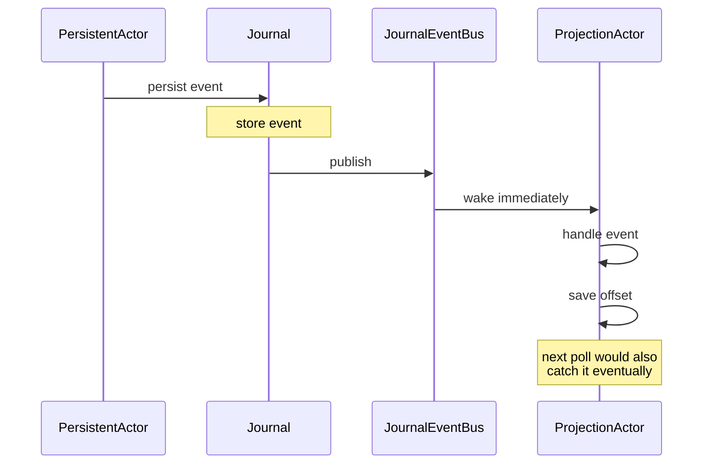

The default
[`PersistenceQuery`](/persistence/persistence-query/) is
**poll-based**: live streams check the journal every
`pollIntervalMs` (default 1 s) for new events.  Fine for most
projections, but introduces up to 1 second of latency per event.

For lower latency, the framework adds **push delivery** via an
in-process **`JournalEventBus`**:



The bus delivers in **single-digit milliseconds** instead of the
poll interval.  At-least-once semantics are preserved — if the
subscriber misses a publication (start-up race, crash), the next
poll picks it up.

## When this matters

Sub-poll-interval delivery is **only valuable in one specific
case**:

- The `PersistentActor` and the `ProjectionActor` are **on the
  same node**.
- The latency from `persist()` to projection handler is
  user-visible.

Across nodes (writer on node-A, projection on node-B), the bus
doesn't help — it's an in-process bus.  Across nodes, you're
bounded by either polling cadence or the journal's own
replication / pub/sub layer (Cassandra's CDC, Postgres logical
replication, etc.).

For most apps, **the default polling is fine** — 1-second
projection lag is rarely a problem.  Reach for push-based when:

- A real-time UI subscribes to a projection.
- A cluster-singleton-coordinator needs to react to its own
  persistence events in real-time.
- The projection drives compensating actions in a saga, where
  poll lag stacks across steps.

## How to enable it

```ts
const projection = ProjectionActor.byTag<E>({
  name:  'realtime-balance',
  tag:   'account',
  query: new SqliteQuery({ path: '...' }),
  liveOptions: {
    push: true,                  // enable bus subscription
    pollIntervalMs: 5_000,       // fallback poll cadence — can be high
  },
  async handle(event) { /* ... */ },
});
```

With `push: true`:

- The projection **also** subscribes to the journal's in-process
  bus.
- On bus delivery, the projection wakes immediately, queries the
  journal for the new event(s), and processes them.
- The poll still runs as a safety net at `pollIntervalMs` — set
  to 5-30 seconds since push handles the hot path.

The fallback poll catches:

- Events the bus missed (rare — subscription races at start-up).
- Events from cross-process writers (not delivered via the
  in-process bus).
- Events your handler crashed on and needs to retry on restart.

## The mechanism

```ts
// Inside the journal, on each successful append:
this.events.publish(persistentEvent);

// Inside the projection, on each subscription:
this.events.subscribe((event) => {
  if (matchesFilter(event)) wakeUpAndProcess();
});
```

The bus is a simple in-process pub/sub — no network, no
serialization.  Publish is synchronous; subscribers fire on the
same tick.

For the SQLite + in-memory journals, the bus is wired up
automatically.  For custom journals, your `Journal` implementation
should call `this.events.publish(...)` on each successful append
to enable push delivery to in-process consumers.

## Out of scope

Push delivery is **strictly in-process**.  For cross-node push
delivery:

- The framework's
  [DistributedPubSub](/cluster/pubsub/) handles
  general-purpose cluster pub/sub.  You'd manually publish on
  events you want streamed cluster-wide.
- The Cassandra journal has the option of using **CDC** for
  cross-cluster delivery, but it's not wired in by default.

For "real-time projections across nodes," the simplest pattern
is:

- The `PersistentActor` (on whichever node hosts it) **also
  publishes via DistributedPubSub** when persisting (custom
  code on top of the per-persist callback).
- Subscribers on any node receive the notification and trigger
  their projections.

## When NOT to use it

import { Aside } from '@astrojs/starlight/components';

<Aside type="caution" title="Cross-process writer/projection">
  ```ts
  // Writer on node-A, projection on node-B
  liveOptions: { push: true };   // useless — bus is in-process
  ```
  Push delivery happens only when writer and reader share an
  ActorSystem.  Cross-node delivery is bounded by polling or by
  a manual cluster-pubsub layer.
</Aside>

<Aside type="caution" title="High event-rate publishers">
  ```ts
  // 10 000 events/sec — bus fires synchronously each time
  ```
  At high rates, the bus's synchronous-publish path can stall the
  writer's persist callback.  For very-high-throughput
  scenarios, lower the projection's batch size and accept poll-only.
</Aside>

<Aside type="caution" title="Bus delivery is a wake-up, not a delivery">
  ```ts
  // Subscriber gets "something happened" → queries journal → handles
  ```
  The bus signals "check the journal."  The actual event is still
  read from the journal.  This means the bus can fire after the
  event has already been read by a recent poll — that's fine; the
  query returns no new events and the projection idles.
</Aside>

## Where to next

- **[Persistence overview](/persistence/overview/)** —
  the bigger picture.
- **[Persistence query](/persistence/persistence-query/)** —
  the underlying API.
- **[Projections](/persistence/projections/)** — what
  consumes the bus.
- **[DistributedPubSub](/cluster/pubsub/)** — for
  cross-node real-time fan-out.
