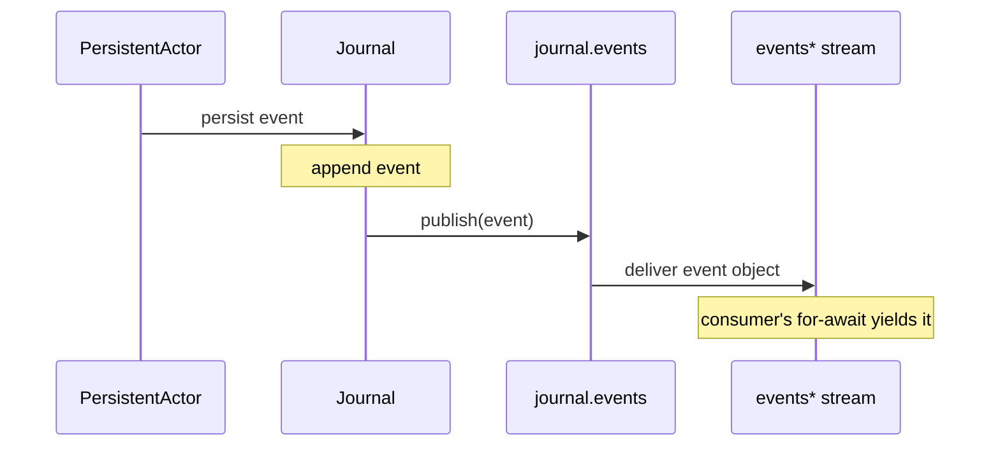

The live [`PersistenceQuery`](/persistence/persistence-query/)
streams — `eventsByPersistenceId` and `eventsByTag` — are
**poll-based by default**: they re-read the journal every
`pollIntervalMs` (default 1 s) for new events.  Fine for most
projections, but up to a second of latency per event.

When the underlying journal exposes an in-process **event bus**
(`journal.events`), those same live streams **automatically**
switch to **push delivery** — they subscribe to the bus and yield
each new event within milliseconds, keeping the poll only as a
safety net.  There is **no opt-in flag**; it happens whenever the
journal has a bus.


```mermaid
sequenceDiagram
  participant PA as PersistentActor
  participant J as Journal
  participant BUS as journal.events
  participant Q as events* stream
  PA->>J: persist event
  Note over J: append event
  J->>BUS: publish(event)
  BUS->>Q: deliver event object
  Note over Q: consumer's for-await yields it
```

## Which journals push

The in-memory and SQLite journals wire up `journal.events`
automatically, so their live streams push.  A journal without a
bus simply polls.  A custom `Journal` opts in by exposing an
`events` bus and publishing on each successful append.

## Consuming a live stream

Push applies to the **live** streams (`eventsByTag` /
`eventsByPersistenceId`), which return an `AsyncIterable`:

```ts
import { offsetStart } from 'actor-ts';
// `query` is a PersistenceQuery (SqliteQuery / InMemoryQuery / …) — see Persistence query.

for await (const tagged of query.eventsByTag<AccountEvent>('account', offsetStart())) {
  handle(tagged.event);   // delivered by the bus in ~ms when available,
                          // otherwise by the next poll
}
```

`LiveQueryOptions` tunes the fallback poll — `{ pollIntervalMs,
batchSize, clock }`.  There is **no `push` field**: push is
automatic when the bus exists, so you can set a *higher*
`pollIntervalMs` (the poll is only a backstop).

## The bus delivers the event, not just a wake-up

The push stream subscribes to the bus **first**, does the
catch-up read for history, then drains buffered bus events — so
there's no start-up gap.  Each publication carries the **event
object itself**, so the stream yields it directly; it does not
re-query the journal on every notification.

At-least-once is preserved: if a subscription misses a
publication (start-up race, crash), the fallback poll picks it up.

## ProjectionActor polls — it does not use the bus

[`ProjectionActor`](/persistence/projections/) drives itself by
**polling** the one-shot `currentEventsByTag` /
`currentEventsByPersistenceId` on a timer (`pollIntervalMs`); it
does **not** subscribe to the journal bus.  So a projection's
latency is bounded by its poll interval.  For true push latency,
consume the live `events*` stream directly (as above) rather than
going through `ProjectionActor`.

## In-process only

`journal.events` is an in-process bus — push works only when the
writer and the stream consumer share an `ActorSystem` (same
node).  Across nodes you're bounded by polling, by the journal's
own replication / CDC, or by publishing on
[DistributedPubSub](/cluster/pubsub/) yourself.

import { Aside } from '@astrojs/starlight/components';

<Aside type="caution" title="Cross-node: the bus doesn't reach">
  ```ts
  // Writer on node-A, stream consumer on node-B
  ```
  The event bus is in-process.  Cross-node real-time delivery is
  bounded by polling or a manual DistributedPubSub layer.
</Aside>

<Aside type="caution" title="Synchronous publish on the hot path">
  ```ts
  // The journal publishes synchronously on each append
  ```
  The bus fires synchronously on the writer's append path.  At
  very high event rates this adds work to the persist path; keep
  bus subscribers light (yield the event; do heavy work
  downstream).
</Aside>

## Where to next

- **[Persistence query](/persistence/persistence-query/)** — the underlying `events*` API.
- **[Projections](/persistence/projections/)** — the poll-based projection actor.
- **[DistributedPubSub](/cluster/pubsub/)** — cross-node real-time fan-out.
