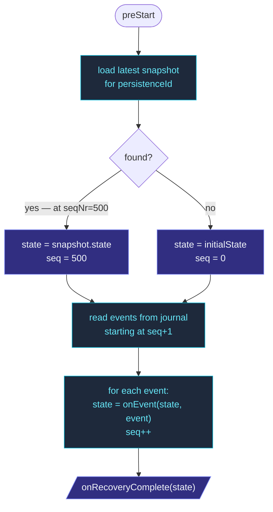

A `PersistentActor` reads its entire event log to recover.  For an
actor that's lived for years and emitted 100 000 events, that's a
slow startup.  **Snapshots** are a periodic dump of the current
state — on recovery, the framework loads the latest snapshot and
only replays events *after* it.

```
journal:   E1  E2  E3  E4  E5 ... E150 ... E1000  ← all events ever
           ↑                              ↑
           recovery                       latest snapshot stored
           starts here                    at seqNr=500

           Without snapshots: replay 1000 events.
           With snapshot @500: load snapshot, then replay E501..E1000.
```

The trade-off: snapshots cost disk space and write throughput, but
buy bounded recovery time.

## Configuring a snapshot policy

The actor declares **when** to snapshot via `snapshotPolicy()`:

```ts
import { PersistentActor, everyNEvents } from 'actor-ts/persistence';

class Account extends PersistentActor<Command, Event, State> {
  // ...
  override snapshotPolicy() {
    return everyNEvents(100);   // snapshot every 100 events
  }
}
```

`everyNEvents(N)` is the most common policy.  The framework calls
the policy function after every event apply; returning `true`
triggers a snapshot of the current state to the snapshot store.

For custom policies:

```ts
override snapshotPolicy() {
  return (seqNr, state, event) => {
    // Snapshot on a specific event kind:
    if (event.kind === 'finalized') return true;
    // Or on a state property:
    if (state.balance > 1_000_000) return true;
    return false;
  };
}
```

The signature: `(seqNr, state, event) => boolean`.  `seqNr` is
the just-applied event's sequence number, `state` is the state
*after* applying it, `event` is the event that triggered the call.

## Picking the snapshot interval

```ts
everyNEvents(N)
```

The numbers that matter:

- **Recovery time** — how long replay-from-snapshot takes.  Lower N
  means faster recovery.
- **Snapshot write cost** — every snapshot serializes the *full*
  state.  For large states, this is non-trivial work.  Higher N
  amortizes that cost across more events.
- **Storage** — snapshots take space, even with the "delete older"
  policy.

Typical numbers:

- **Small state, low write rate** — `everyNEvents(1000)`.  A
  thousand-event replay is still fast; snapshots are rare.
- **Medium state, moderate write rate** — `everyNEvents(100)`.
  Sensible default.
- **Large state, high write rate** — `everyNEvents(1000)` with
  fast journal, OR consider switching to `DurableStateActor` if
  events aren't useful.

Don't over-tune.  `everyNEvents(100)` is a reasonable starting
point; measure recovery latency in production before changing.

## Where snapshots live

Snapshots are stored in a **separate** snapshot store, wired at
system creation via `withPersistence`:

```ts
import { ActorSystemOptions } from 'actor-ts';
import { InMemoryJournal, InMemorySnapshotStore } from 'actor-ts/persistence';

const actorSystemOptions = ActorSystemOptions.create().withPersistence({
  journal:       new InMemoryJournal(),
  snapshotStore: new InMemorySnapshotStore(),
});
```

Built-in snapshot stores.  The third column is the store's own
`persistenceOptionSupport` declaration — whether it acts on the
`compression()` / `encryption()` / `integrity()` hooks, or merely
accepts them:

| Store | When | Honours the three hooks |
| --- | --- | --- |
| `InMemorySnapshotStore` | Tests, dev. | No. |
| `SqliteSnapshotStore` | Single-node production. | No. |
| `PostgresSnapshotStore` | PostgreSQL-backed production. | No. |
| `MariaDbSnapshotStore` | MariaDB / MySQL-backed production. | No. |
| `LibSqlSnapshotStore` | libSQL / Turso — remote SQLite over HTTP. | No. |
| `MsSqlSnapshotStore` | Microsoft SQL Server-backed production. | No. |
| `MongoSnapshotStore` | MongoDB-backed production. | No. |
| `DynamoDbSnapshotStore` | DynamoDB-backed production. | No. |
| `D1SnapshotStore` | Cloudflare D1 — SQLite at the edge. | No. |
| `CassandraSnapshotStore` | Distributed — Cassandra / ScyllaDB. | No. |
| `ObjectStorageSnapshotStore` | Filesystem / S3 with optional encryption. | Yes — all three, on write and on read. |
| `CachedSnapshotStore` | Wraps another store with a read-through cache. | Whatever the wrapped store declares. |

A `No` in that column is enforced, not just documented.  Setting
`encryption()` or `integrity()` on an actor backed by one of those
stores **refuses the actor at start** with an
`UnsupportedPersistenceOptionError` naming the store and the field —
these are security controls, and writing plaintext instead of
reporting the gap is the failure that refusal exists to prevent.
`compression()` is a performance hint, so it logs one warning naming
the store and the snapshot is written uncompressed.  `{ mode: 'none' }`
is accepted everywhere: it is how you say "deliberately unprotected".

A store that declares nothing at all — a third-party implementation
predating the declaration — is treated as *unknown* and is never
refused, on the same reasoning as `storageLocality`: a store must not
be misjudged by a default it did not choose.

The journal and the snapshot store are independent; you can mix
them (e.g., Cassandra journal + object-storage snapshot store).

## What gets stored

A snapshot is `{ persistenceId, sequenceNr, state }`.  The store
typically retains:

- The **latest** snapshot per `persistenceId`.
- Optionally a few **older** ones, in case the latest is corrupt
  (configurable per store).

When the actor recovers, the store returns the **latest** snapshot
for the actor's `persistenceId`.  Older snapshots aren't loaded
unless you explicitly ask via the store's lower-level API.

State is stored in the tagged JSON tree format on every backend, so
`Date` / `Map` / `Set` / `bigint` / `Uint8Array` inside a snapshot
recover as real instances — see
[what events and state may contain](/persistence/persistent-actor/#what-events-and-state-may-contain).

## Retention is best-effort; the write is not

Stores that bound retention (`keepN`) prune on each save.  That
retention pass is **best-effort across every backend**: once the
snapshot itself is durable, `save` resolves, and a prune that fails
afterwards is swallowed rather than surfaced.

The two halves have opposite failure meanings, which is why they
are not reported the same way:

- A failed **write** means your snapshot does not exist.  Retrying
  is the right response, and `save` rejects so you can.
- A failed **prune** means one row too many exists.  It is
  harmless, `loadLatest` cannot see it, and the next save tries
  again.

Reporting the second as the first would tell a caller to retry a
write that already succeeded — and an actor that treats a snapshot
failure as fatal would then die over a housekeeping error.  If you
implement a custom `SnapshotStore`, run the prune outside the
write's error handling.

## Recovery flow with snapshots



`onEvent` is still pure — same rule as without snapshots.  The
snapshot is just where replay *starts*; everything after is event
replay as usual.

## Snapshot adapters — schema evolution

When the **state shape** changes (a field is renamed, a value
is restructured), old snapshots can't be deserialized into the new
shape.  Two options:

1. **Delete old snapshots** — the next recovery replays from
   scratch, building the new state shape from the (still-current)
   event log.
2. **Use a snapshot adapter** to upcast old snapshots on load:

   ```ts
   class V1ToV2SnapshotAdapter implements SnapshotAdapter<StateV2> {
     manifest(_state: StateV2): string { return 'Account.State'; }

     toJournal(state: StateV2): OutboundFrame<StateV2> {
       return { manifest: 'Account.State', version: 2, payload: state };
     }

     fromJournal(stored: StoredFrame): StateV2 {
       if (stored.version === 1) return migrateSnapshot(stored.payload as StateV1);
       return stored.payload as StateV2;
     }
   }

   class Account extends PersistentActor<...> {
     override snapshotAdapter() { return new V1ToV2SnapshotAdapter(); }
   }
   ```

With an adapter set, snapshots are persisted in a `{ _v, _t, _e }`
envelope; on load, the adapter migrates older versions before
returning the state.

See [Migration overview](/persistence/migration/overview/)
for the broader migration strategy (event adapters + snapshot
adapters together).

## Without snapshots

A `PersistentActor` without a snapshot policy never snapshots —
recovery replays every event from the beginning of time.  For an
actor that emits 10 events total, that's fine; for an
event-sourced cart that accumulates 10 000 events over a user's
lifetime, that's a recovery-time problem.

The framework doesn't auto-snapshot.  If you don't set a policy,
you don't get snapshots — `snapshotPolicy()` defaults to
`() => false`.

## Common pitfalls

import { Aside } from '@astrojs/starlight/components';

<Aside type="caution" title="Snapshot adapters must match the journal's adapter">
  ```ts
  override eventAdapter()    { return new V1ToV2EventAdapter();    }
  override snapshotAdapter() { /* (none) */ }
  ```
  If your events have an adapter (so old events upcast to current
  shape on load), but your snapshots **don't**, recovery loads a
  V1 snapshot and tries to apply V2 events to it — wrong shape,
  silently broken state.  Either both have adapters or neither
  does; consistent versioning is the rule.
</Aside>

<Aside type="caution" title="`onRecoveryComplete` doesn't fire if no events">
  ```ts
  override onRecoveryComplete(state) {
    this.fetchSubscribers();   // runs after recovery
  }
  ```
  Actually, `onRecoveryComplete` **does** fire — once, after the
  initial state is set up, even if there are no events / no
  snapshot.  Use it freely.  The trap is *when* it fires: after
  `preStart`, before the first command.  Mailbox processing
  resumes after `onRecoveryComplete` returns.
</Aside>

<Aside type="caution" title="Snapshots after every event">
  ```ts
  override snapshotPolicy() { return () => true; }
  // → snapshots on every event
  ```
  Snapshot-on-every-event means every persist also writes the
  full state.  For non-trivial states, this doubles or triples
  write cost.  If you want this behavior, you probably want
  `DurableStateActor` instead — it's designed for "always
  current."
</Aside>

## Where to next

- **[PersistentActor](/persistence/persistent-actor/)** —
  the base class whose `snapshotPolicy()` you override.
- **[Snapshot stores — In-memory](/persistence/snapshot-stores/in-memory/)** —
  the dev / test store.
- **[Snapshot stores — SQLite](/persistence/snapshot-stores/sqlite/)** —
  single-node production.
- **[Snapshot stores — Cached](/persistence/snapshot-stores/cached-snapshot-store/)** —
  read-through cache over another store.
- **[Migration overview](/persistence/migration/overview/)** —
  state + event schema evolution.

The [`SnapshotStore`](/api/interfaces/snapshotstore/) and
[`SnapshotPolicy`](/api/types/snapshotpolicy/) API
references cover the full surface.
