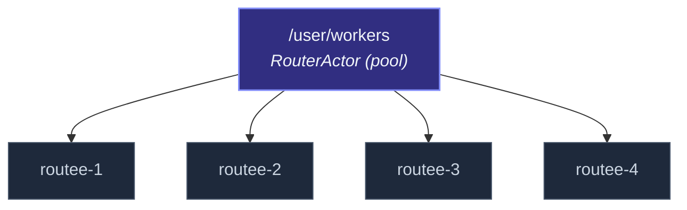

A router needs **routees** to forward messages to.  Two ways to
get them, encoding very different lifecycle relationships:

| Model | Who owns the routees? | Discovery |
| --- | --- | --- |
| **Pool** | The router — it spawns the routees from a `Props`. | Static at spawn time; size doesn't change without a router restart. |
| **Group** | Someone else — the routees already exist. | Dynamic (group routers re-discover when needed). |

The local `Router` is **always a pool**.  The cluster `ClusterRouter`
is **always a group** (routees are derived from cluster up-members
at a well-known path).  Knowing which you have shapes how you
think about lifecycle, supervision, and resize.

## Pool router

```ts
import { Router, Props } from 'actor-ts';

const pool = system.spawn(
  Router.roundRobin(4, Props.create(() => new Worker())),
  'workers',
);
```

What this creates:



The router *owns* its routees — they're its children.
Consequences:

- **Lifecycle is coupled.**  Stop the router → all routees stop.
  No leftover orphans.
- **Supervision is straightforward.**  The router supervises its
  routees with whatever strategy the routee `Props` declares (or
  the default).
- **Failures are recoverable.**  A crashed routee is restarted by
  the supervisor; the router keeps routing.

But it also means:

- **Routees are stateless from the router's perspective.**  A
  restarted routee has nothing left from the previous instance.
  If routees hold state that should survive routing-pool
  restarts, persist it (see
  [PersistentActor](/persistence/persistent-actor/)).
- **Size is fixed at spawn time.**  `Router.roundRobin(4, ...)`
  always has 4 routees.  To resize, stop and re-spawn.
- **Routees don't have names you'd recognize.**  They're
  `routee-1` through `routee-N`, auto-named by the router.

Right shape for **homogeneous worker pools** — N stateless
workers, all the same, parallelizing one stream of work.

## Group router *(cluster only)*

```ts
import { ClusterRouter } from 'actor-ts';

const router = system.spawn(
  ClusterRouter.props({
    cluster,
    routerType: 'round-robin',
    routeePath: '/user/worker',
    role: 'compute',   // optional: only routees on this role
  }),
  'compute-router',
);
```

What this creates:

```
/user/compute-router    ← the cluster router
  (no children — routees live on other nodes already)
```

The router *finds* its routees rather than creating them.  Each
node carrying the role `'compute'` is assumed to have an actor at
`/user/worker`; the router constructs a `RemoteActorRef` for each
and routes to those.

Consequences:

- **Lifecycle is independent.**  Stop the router → routees keep
  running.  Stop a routee → the router stops sending to it
  (after cluster membership notices), but the rest of the pool
  is unaffected.
- **Topology-driven sizing.**  Add a node → the router picks it
  up automatically.  Remove a node → the router stops sending.
  No restart needed.
- **Routees have meaningful identities.**  They live at known
  paths and can hold per-node state.

But also:

- **You're responsible for spawning the routees.**  Each node
  must have created `/user/worker` somewhere in its startup.  The
  cluster router *doesn't* spawn them.
- **An empty pool drops messages with a warning.**  If no node
  matches the role, every `tell` to the router lands in dead
  letters.  See the
  [Cluster router](/cluster/cluster-router/) docs for
  the exact semantics.
- **Supervision is per-node.**  Each routee is supervised by its
  own parent on its own node — the cluster router has no
  authority over them.

Right shape for **fixed-name workers across a cluster** —
one (or a fixed set of) named actor(s) per node, each holding
per-node state, all collectively serving a fan-out workload.

## Three concrete questions to decide between them

1. **Do the routees hold per-instance state that matters?**
   - No, they're interchangeable workers → **pool**.
   - Yes, restart-survival-relevant state → **group** (with each
     routee being a `PersistentActor` or holding the state via
     some external store).

2. **Does the pool size need to change at runtime?**
   - No, fixed pool size for the duration → **pool**.
   - Yes, the size follows cluster membership → **group**.

3. **Should stopping the router cascade-stop the routees?**
   - Yes, they have no purpose without the router → **pool**.
   - No, they exist independently → **group**.

If two of the three answers point to one model, that's the right
model.  If they conflict, you're probably mid-design — the
mismatch is telling you something about how the routees should
relate to the router.

## A common confusion: cluster-aware *pool* routers

The pool/group distinction is sometimes muddied by the
"cluster-pool" pattern in other actor toolkits, which spawns its
own routees but *across* cluster nodes (one routee per node).
actor-ts doesn't expose that — the cluster router is always
group-shaped.  If you want a fixed pool
that happens to span a cluster, you'd write a top-level
"deployment" actor per node that spawns the local routees, plus a
`ClusterRouter` that targets them by path.  See
[Sharded daemon process](/cluster/sharding/sharded-daemon-process/)
for the pattern that comes closest to "spawn N global workers."

## Stopping behavior, compared

| You stop... | Pool router | Group router |
| --- | --- | --- |
| The router | All routees stop (children cascade). | Routees keep running. |
| One routee | Supervisor restarts it (default) or pool shrinks. | Router stops sending to it (after cluster notices), siblings unaffected. |
| The actor system | Everything stops normally. | Everything stops on this node; routees on other nodes continue. |

The asymmetry matters for **graceful shutdown** — a pool router
folds cleanly when the system terminates; a group router leaves
behind routees on other nodes that don't know this caller is gone.
Use coordinated shutdown to do the right thing (see
[Coordinated shutdown](/fundamentals/coordinated-shutdown/)).

## Where to next

- **[Router](/routing/router/)** — the local pool-router
  API.
- **[Cluster router](/cluster/cluster-router/)** — the
  group-router API.
- **[Sharded daemon process](/cluster/sharding/sharded-daemon-process/)** —
  cluster-wide background workers, the closest thing to a
  "cluster pool."
- **[Strategies](/routing/strategies/)** — the routing
  decisions apply identically to both models; the difference is
  what's on the routees list, not how the strategy picks.
