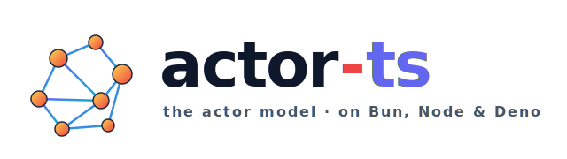

<p align="center">
  
</p>

# Chat — multi-frontend sample for actor-ts

A chat web application that demonstrates the framework working as
a real distributed system: a clustered backend with persisted history
and live-broadcast across nodes, paired with **six different
frontends** that all speak the same WebSocket protocol so you can
compare their feel side-by-side.

## What it shows

- **TCP cluster** of three Bun processes joined via gossip.
- **`ChatRoomActor`** — one per room, **sharded** across the cluster
  via `ClusterSharding` and **persistent** via `SqliteJournal`.  Every
  posted message is appended to the journal; messages survive a full
  cluster restart.
- **HTTP front door = `ClusterSingleton`** — exactly one node binds
  the public port (`8080`) at any time.  When that node dies a
  surviving node takes over the bind automatically.  Same URL for
  the user, no per-node ports to remember.
- **`DistributedPubSub`** with one topic per room
  (`chat.room.<roomName>`) for cross-node fan-out — a message posted
  by Alice on node 1 reaches Bob on node 3 with no routing code in
  the middle.
- **`DistributedData`** with an `ORSet<string>` per room (key
  `online-users.<roomName>`) tracking who's currently connected.
- **HTTP layer through the framework's directive DSL** — no manual
  Fastify setup.  `@fastify/static` and `@fastify/websocket` are
  wired in via `FastifyBackend.withPlugin(...)` exclusively.
- **All client traffic is WebSocket-based.**  No REST.  Login, room
  list, history, presence and chat messages all flow through one
  `/ws` endpoint.
- **Six frontend variants** for direct comparison: Plain HTML,
  Angular, React + Vite, Next.js, SvelteKit, Lit.

## Architecture

```
┌────────────────────────────────────────────────────────────┐
│  Browser (any of 6 frontends, all same WS protocol)        │
└──────────────────┬─────────────────────────────────────────┘
                   │ HTTP + WS  (always :8080)
                   ▼
          ┌──────────────────┐
          │ http-ingress     │  ← ClusterSingleton; binds :8080
          │   (singleton)    │     on whichever node holds it
          └─────────┬────────┘
                    │ runs on one of:
        ┌───────────┼──────────┐
        ▼           ▼          ▼
   ┌─────────┐ ┌─────────┐ ┌─────────┐
   │ Node 1  │ │ Node 2  │ │ Node 3  │
   │ :2551   │ │ :2552   │ │ :2553   │   ← cluster ports, internal
   └─────────┘ └─────────┘ └─────────┘
        │           │           │
        └── ClusterSharding[ChatRoomActor] ──┘
              entityId = roomName
                       │
                       ▼ persist
               ./data/chat.db (SQLite Journal)
        │                     │              │
        └── DistributedPubSub topics: "chat.room.<name>" ──┘
        └── DD ORSet "online-users.<name>" per room ──────┘
```

Each node runs the same code (`backend/main.ts`).  The first node
starts without seeds; additional nodes pass `--seeds localhost:2551`
to join.  Once converged, the cluster spreads room entities across
nodes via the `HashAllocationStrategy` — kill any node and the rest
take over its rooms.

## Run it

### Prerequisites

```bash
bun install
```

The chat sample depends on `@fastify/static` and `@fastify/websocket`,
both already in the project's `devDependencies`.

### Three-node cluster

Open **three terminals**, run the same command in each — no
ports, no seeds, no flags:

```bash
bun examples/chat/backend/main.ts
bun examples/chat/backend/main.ts
bun examples/chat/backend/main.ts
```

Each node walks the cluster-port range starting at `2551`, claims
the first free one, and treats every occupied port below it as a
seed.  So the three terminals end up at `2551 / 2552 / 2553`
without anyone telling them so:

```
node 1: cluster=127.0.0.1:2551 · bootstrap (no seeds)
node 2: cluster=127.0.0.1:2552 · seeds=[127.0.0.1:2551]
node 3: cluster=127.0.0.1:2553 · seeds=[127.0.0.1:2551,127.0.0.1:2552]
```

Each node logs `[+] chat-cluster@... is UP` events as the cluster
forms.  Exactly one of them logs

```
[ingress] this node won the singleton — binding 127.0.0.1:8080
```

— that node currently owns the public port.  The other two stay
warm: they still run the persistence layer, the sharded chat
rooms, the pubsub mediator and presence tracking, but they don't
serve HTTP until the singleton fails over.

For cross-machine deployments (where same-host port-scan doesn't
work) you can pin things explicitly:

```bash
bun examples/chat/backend/main.ts --port 2551
bun examples/chat/backend/main.ts --port 2552 --seeds host-a:2551
bun examples/chat/backend/main.ts --port 2553 --seeds host-a:2551,host-b:2552
```

### Open the chat

Visit a single URL no matter which node holds the singleton:

<http://localhost:8080/>

The selector lists all six frontends.  Pick one, log in with any
of the test credentials below, and start chatting.  Open multiple
browser windows + frontends and watch messages converge.

### Failover

Find the node logging `[ingress] this node won the singleton` and
`Ctrl+C` it.  Within a few seconds (failure-detector timeout
+ singleton election) one of the survivors logs the same line and
re-binds `:8080`.  Browser sessions reconnect automatically and
the persisted history is still there — you just lose the in-flight
WebSocket frames during the brief outage.

For real zero-downtime active/active deployments you'd put a
proper load balancer in front of the cluster (nginx, HAProxy, K8s
Service); the singleton model is a self-contained fallback that
doesn't need any external infrastructure.

### Test credentials

| Username  | Password    |
|-----------|-------------|
| `alice`   | `wonderland`|
| `bob`     | `builder`   |
| `charlie` | `chaplin`   |
| `diana`   | `prince`    |

Plain-text passwords are intentional — this is a demo.  The
credentials are also printed under each frontend's login form.

## Layout

After login each frontend renders the same three-column layout:

```
┌──────────────────────────────────────────────────────┐
│            Header (User: alice • Logout)             │
├──────────────┬─────────────────────────┬─────────────┤
│  ROOMS       │      CHAT WINDOW        │ ONLINE      │
│  (left)      │      (center)           │ USERS       │
│              │                         │ (right)     │
│  # general*  │  [scrollable history]   │ • alice     │
│  # random    │                         │ • bob       │
│  # tech      │                         │             │
│  # announce  │  [input.......] [Send]  │             │
└──────────────┴─────────────────────────┴─────────────┘
```

Aktiver Room is highlighted with `*` in the menu.  Clicking another
room switches the chat window + users panel; unread badges
accumulate on inactive rooms.

## Frontends

Built output goes to `examples/chat/static/<framework>/` and is
served by `@fastify/static` under `/static/<framework>/`.

| Path                  | Stack                          | Build command                              |
|-----------------------|--------------------------------|---------------------------------------------|
| `frontend-plain/`     | Vanilla HTML/CSS/JS            | (none — copy `index.html` to `static/plain/`) |
| `frontend-angular/`   | Angular standalone + Signals   | `ng build --output-path=../static/angular`  |
| `frontend-react/`     | React + Vite (SPA)             | `vite build --outDir ../static/react`       |
| `frontend-next/`      | Next.js (App Router, RSC)      | `next build && cp -r out ../static/next`    |
| `frontend-svelte/`    | SvelteKit + Svelte 5 Runes     | `vite build` (adapter-static → `../static/svelte`) |
| `frontend-lit/`       | Lit Web Components + Vite      | `vite build --outDir ../static/lit`         |

Plain HTML is shipped pre-built; the other five each carry their own
`package.json` and follow standard create-* scaffolding.  See each
subdirectory's `README.md` for details.

## Verifying it works

Two scripts ship for verification — pick the one that matches what
you want to check.

### `smoke-test.ts` — single-node messaging round-trip

```bash
# Start a single bootstrap node first:
bun examples/chat/backend/main.ts --port 2551
# In another terminal:
bun examples/chat/smoke-test.ts
```

Logs Alice in, sends three messages, waits for the broadcast
echoes, then logs Bob in on a fresh connection and verifies Bob
sees Alice's history.  Single-node by design — the smoke test
isolates the protocol round-trip from the cluster's lazy shard-
allocation timing, so it stays deterministic.

### `failover-test.ts` — HTTP-singleton fail-over

```bash
# Spawns + tears down a 3-node cluster on its own:
bun examples/chat/failover-test.ts
```

Spawns three nodes, identifies which one currently owns `:8080`
via the OS-level port table, kills it, then verifies that a
different PID picks up `:8080` within a few seconds and that the
new owner serves HTTP.  This is the test that exercises the
ClusterSingleton + HttpIngressActor fail-over end to end.

### Manual cross-node demo

1. Run the three-terminal cluster from the *Run it* section above.
2. Open <http://localhost:8080/static/plain/> in window 1, log in
   as alice.
3. Open <http://localhost:8080/static/plain/> in window 2 (same
   URL — the singleton answers), log in as bob.
4. Type a message in alice's window — it appears in bob's instantly,
   even though the chat-room entity is sharded onto a node that
   isn't necessarily the same as the singleton-holder.
5. Find the terminal that logged `[ingress] this node won the
   singleton` and `Ctrl+C` it.  Watch a survivor pick up the bind
   within a few seconds.  Reconnect from the browser — alice's
   messages are still there because the SQLite journal survived.

## Out of scope (followup issues opened)

- Private DMs (multi-room global chat only).
- User-created rooms at runtime (default list is hardcoded).
- File uploads, emojis, typing indicators.
- TLS / WSS (plain HTTP for local demo).
- Production-grade auth (no bcrypt, no session expiry, no CSRF).
- Reconnect-resume after network blip.
- Snapshot-based recovery — pure event replay today.
- Read-receipts.

## Files

```
examples/chat/
├── README.md              ← this file
├── application.conf       ← HOCON: log level, gossip cadence
├── data/                  ← SQLite journal (.gitignore)
├── backend/
│   ├── main.ts                      ← entry point (wiring only)
│   ├── config.ts                    ← CLI args
│   ├── routes.ts                    ← HTTP-DSL route (selector)
│   ├── auth/credentials.ts          ← validateCredentials()
│   ├── plugins/
│   │   ├── staticFilesPlugin.ts     ← @fastify/static wrapper
│   │   └── webSocketPlugin.ts       ← @fastify/websocket + /ws route
│   └── actors/
│       ├── ChatRoomActor.ts         ← sharded PersistentActor (per room)
│       ├── UserSessionActor.ts      ← per-WS-connection session
│       ├── OnlineUsersActor.ts      ← DistributedData ORSet wrapper
│       └── HttpIngressActor.ts      ← ClusterSingleton: owns the :8080 bind
├── shared/
│   ├── protocol.ts        ← shared TS types for WS messages
│   ├── users.ts           ← test credentials (TEST_USERS)
│   └── rooms.ts           ← default room list (DEFAULT_ROOMS)
├── static/                ← built frontend assets (served by @fastify/static)
│   └── plain/index.html
├── frontend-plain/        ← source for plain HTML
├── frontend-angular/
├── frontend-react/
├── frontend-next/
├── frontend-svelte/
├── frontend-lit/
└── smoke-test.ts          ← end-to-end smoke test
```
